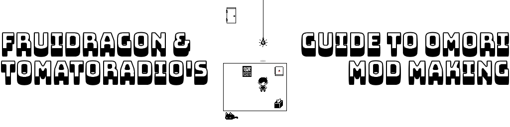

.. _h.t3t6iqspe359:

Welcome!
========

If you’re here to give feedback, please leave your name because we’d
like to give Special Thanks to anyone providing feedback that we end up
including.

Currently, I've been working on modding OMORI. But I've noticed
something— and that's that there's a lack of tutorials teaching one
about RPG Maker MV through the lens of OMORI modding.

So together we,
\ `FruitDragon <https://www.google.com/url?q=https://mods.one/author/fruitdragon&sa=D&source=editors&ust=1782966892262891&usg=AOvVaw31WM2FvZy0xwsy_pO83PG6>`__\  &
\ `TomatoRadio <https://www.google.com/url?q=https://mods.one/author/tomatoradio&sa=D&source=editors&ust=1782966892263006&usg=AOvVaw0tbsnKZn1Xd9N2k8PHIa92>`__\ ,
have compiled this Guide for nearly all aspects of creating an OMORI
mod!

Click on one of these to take you to the section about it! They are
designed to be read from top to bottom, with repeating concepts
directing you back to what you learned above.

If you are on Desktop you can also use the Document Tabs feature on the
left side of the document. You may have to double-click on “The Actual
Guide” to expand it to show all chapters and their subdivisions.

`0. Setup <#h.rjhfwp4up45e>`__

`0.1 GitHub [WIP] <#h.qjubav589atl>`__

`1. YAML Files & Dialogue <#h.eyo0h7t5nx1p>`__

`2. Events <#h.3ek5unxwrmmt>`__

`3. Maps <#h.uhf8h4xswr8>`__

`4. Sprites & Art <#h.gsbdya7y8lgi>`__

`5. States <#h.g7yzgvnqi3cb>`__

`6. Weapons & Charms <#h.fxyhekvcpn5l>`__

`7. Skills & Items <#h.yiwxubneaidf>`__

`8. Party Members <#h.qw460trh7jcv>`__

`9. Enemies <#h.nkup6138v2ly>`__

`10. Plugins <#h.rxmxx9evltp>`__

`11. Common Errors & Other Misc. Tips <#h.ymgqck7cib0v>`__

`12. Thank You For Reading! <#h.y4naka5n9es6>`__

Note 1: This is written as a tutorial for beginners. This is not meant
for learning advanced RPG Maker MV stuff. TomatoRadio plans to make her
own wiki to document as many possible things in relation to modding
OMORI.

Note 2: This is also written around what we (FruitDragon and
TomatoRadio) know about RPG Maker MV and OMORI. If you are a seasoned
modder who knows other ways to do things, that’s why, but if you think
you have some insight that would be good for this guide, feel free to DM
either of us and we’ll see if it would be good to include here.

.. _h.rjhfwp4up45e:

Setup
=====

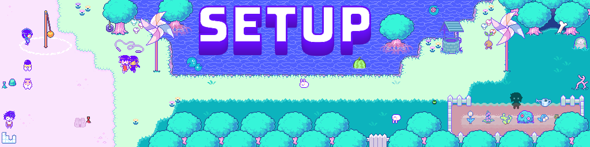

(All Banners by TomatoRadio using Tiled for the terrain and Photopea for
the characters and text. Sprites: Basegame, Font: Bungee)

Now, before we can get to making the mods of our dreams, we have to know
what we need, and how to get what we need. Like the title suggests, this
is a Step 0 towards getting your mod setup for making. I’ll go over what
you need for all the different aspects of modding.

.. _h.4ibyr1mds7j8:

Basic Requirements
------------------

These are all the things you will need for making any mod in OMORI.

- `OMORI <https://www.google.com/url?q=https://store.steampowered.com/app/1150690/OMORI/&sa=D&source=editors&ust=1782966892265904&usg=AOvVaw3frXOIkkTZEsL37D0r-wyf>`__\ .
  This should be obvious. But to be specific, you’ll want a fully
  updated (v1.08) Steam release of the game in English. You’ll also need
  to know where it is installed, for which you can easily google the
  location of Steam installations.

- Through Steam, you can also locate game files by going to the
  gear-shaped “Manage” icon on OMORI’s Steam page in your library,
  hovering over “Manage” in the dropdown, and clicking “Browse Local
  Files.”

- `OneLoader <https://www.google.com/url?q=https://mods.one/mod/oneloader&sa=D&source=editors&ust=1782966892266468&usg=AOvVaw30WF27pObBtJ9Ic0q77A7G>`__\ .
  That page has detailed explanations on how to install it.
- `BundleTool <https://www.google.com/url?q=https://mods.one/mod/bt&sa=D&source=editors&ust=1782966892266607&usg=AOvVaw3JaAF34DPrNhyL7Tk-yW1A>`__\ .
  This is not technically required, but it is a tool to compile your
  mods, which is much easier than doing manually. Also, don’t put this
  in the “mods” folder. This is for much later, when you’re ready to
  export your finished mod for others to play.

Now all you need to do is load up OMORI and go to the Decrypt section of
the mod menu. Then set the decrypt settings to “basegame” (If you want
any loaded mods embedded in your mod you can put “Everything”) and
select yes for generating an RPG Maker MV project. Then start the
decryption. You’ll now have a decompiled project file for your mod,
usually called a Playtest Folder.

.. _h.95hpuxn5q12c:

Specific Requirements
---------------------

“Okay. So I have my folder. Now what? What does this do? I bet I need
more, don’t I?” Right on, aspiring mod maker! However, what exactly
you’ll need depends on the mod you’re making. Here’s a list to give you
a decent idea of what you’d
need\ `[a] <#cmnt1>`__\ :sup:`\ `\ `[b] <#cmnt2>`__\ .

- Asset Replacement: Just your own talent. There are plenty of free
  programs for image, text, and audio editing/making.

- I (FruitDragon) use
  \ `Procreate <https://www.google.com/url?q=https://procreate.com/procreate&sa=D&source=editors&ust=1782966892267984&usg=AOvVaw3Ur3OXXOMuHPf06lSgQGye>`__\  and
  \ `Aseprite <https://www.google.com/url?q=https://www.aseprite.org&sa=D&source=editors&ust=1782966892268045&usg=AOvVaw2DhF3h-RLlj-udEiR_diCj>`__\  (single
  payment) for images,
  \ `Notepad++ <https://www.google.com/url?q=https://notepad-plus-plus.org/&sa=D&source=editors&ust=1782966892268131&usg=AOvVaw37pzgGUGdm9SOTKQ0fgY4m>`__\  and
  \ `Visual Studio
  Code <https://www.google.com/url?q=https://code.visualstudio.com&sa=D&source=editors&ust=1782966892268196&usg=AOvVaw1z9TfcmaII1i_bzDIqoRAI>`__\  (depending
  on my purpose) for text/dialogue, and
  \ `GarageBand <https://www.google.com/url?q=https://www.apple.com/mac/garageband/&sa=D&source=editors&ust=1782966892268302&usg=AOvVaw0gC4t_FSyLBATkb82I2Qi3>`__\ /\ `MuseScore
  4 <https://www.google.com/url?q=https://musescore.org/en/download&sa=D&source=editors&ust=1782966892268366&usg=AOvVaw21sEykxp39g9jkKaGBtPxc>`__\ /\ `Audacity <https://www.google.com/url?q=https://www.audacityteam.org/&sa=D&source=editors&ust=1782966892268429&usg=AOvVaw0XgaLwe5xqKP5ccK3JtBwb>`__\  for
  audio. Don’t ask why I use so many…
- I (TomatoRadio) use
  \ `Photopea <https://www.google.com/url?q=http://photopea.com&sa=D&source=editors&ust=1782966892268584&usg=AOvVaw1D9S8UBg-PaHQs4HYYD-4z>`__\ , \ `Piskel <https://www.google.com/url?q=https://www.piskelapp.com/&sa=D&source=editors&ust=1782966892268646&usg=AOvVaw3krMXSBykuJMxHNzhcWonW>`__\ ,
  and
  \ `Aseprite <https://www.google.com/url?q=https://www.aseprite.org&sa=D&source=editors&ust=1782966892268695&usg=AOvVaw10rAVRBkJ5zeS1MFGHpRaM>`__\  for
  images, \ `Visual Studio
  Code <https://www.google.com/url?q=https://code.visualstudio.com&sa=D&source=editors&ust=1782966892268766&usg=AOvVaw3pmH6R_xdY9WjdiSM3veX6>`__\  for
  text, and
  \ `Audacity <https://www.google.com/url?q=https://www.audacityteam.org/&sa=D&source=editors&ust=1782966892268836&usg=AOvVaw3SyENUUaO1egkF86-PRWc5>`__\  for
  audio. Also I run RPG Maker MV in dark mode, which is why my
  screenshots look different from FruitDragon, who uses light mode. What
  a weirdo…

- haha jokes on you i use dark mode now - fd

- The answer of what you should use, though, is whatever you like. This
  also applies to light and dark modes (lol).

- Editing Skills, States, Events, etc.: You’ll need \ `RPG Maker
  MV <https://www.google.com/url?q=https://store.steampowered.com/app/363890/RPG_Maker_MV/&sa=D&source=editors&ust=1782966892269503&usg=AOvVaw30wEPaNfRRCEG06ocqrSoQ>`__\ .
  It’s usually $79.99, but it often goes on sale for about $7.99-$12.99
  during any seasonal Steam Sale. (Hell, it’s on sale as I’m writing
  this).
- Mapping: You’ll need RPG Maker MV and
  \ `Tiled <https://www.google.com/url?q=https://github.com/mapeditor/tiled/releases/tag/v1.0.3&sa=D&source=editors&ust=1782966892269865&usg=AOvVaw15gvToVsepaNspJuWdyRvr>`__\ ,
  specifically v1.0.3 (NO OTHER VERSION WILL WORK WITHOUT MODS). More on
  this in the post about making maps.

- There is actually a plugin that enables you to use more recent
  versions of Tiled, which is recommended for improved user features and
  stability; however, it is a much more in-depth process to install than
  just downloading v1.0.3.

- Plugins: You gotta know JavaScript, or at least be able to understand
  it. It helps if you have knowledge of another coding language, even if
  you don’t know JavaScript specifically. With plugin programming, any
  IDE will work, though a personal preference of a lot of modders is
  \ `Visual Studio
  Code <https://www.google.com/url?q=https://code.visualstudio.com&sa=D&source=editors&ust=1782966892270607&usg=AOvVaw1CYWvn0yLrPJEnVVyy3eXf>`__\ .
  Other options include
  \ `Notepad++ <https://www.google.com/url?q=https://notepad-plus-plus.org/&sa=D&source=editors&ust=1782966892270684&usg=AOvVaw2Y_prhUUZdFqYte-ZXCxpA>`__\ ,
  \ `Xcode <https://www.google.com/url?q=https://developer.apple.com/xcode/&sa=D&source=editors&ust=1782966892270733&usg=AOvVaw1W8Bh5_pwxx8itkKWc9y2u>`__\  (for
  Apple Mac), \ `Sublime
  Text <https://www.google.com/url?q=https://www.sublimetext.com/&sa=D&source=editors&ust=1782966892270799&usg=AOvVaw3QKmrDWffSMxbSZOhmsCVj>`__\ ,
  and more.

- If you want to learn Javascript, there’s a ton of free tutorials
  online. Other resources include \ `the official
  documentation <https://www.google.com/url?q=https://developer.mozilla.org/en-US/docs/Web/JavaScript&sa=D&source=editors&ust=1782966892271008&usg=AOvVaw0nxu48McrNHD4kODX8ij0A>`__\ ,
  \ `W3Schools <https://www.google.com/url?q=https://www.w3schools.com/js/&sa=D&source=editors&ust=1782966892271070&usg=AOvVaw3YveMbdd2OzYn5gLSzL0Sp>`__\ ,
  and
  \ `GeeksforGeeks <https://www.google.com/url?q=https://www.geeksforgeeks.org/javascript/&sa=D&source=editors&ust=1782966892271141&usg=AOvVaw3UpQLCBAjsohb0GpJIjYj3>`__\ ,
  especially if you’re just looking up how to do something specific
  (such as syntax or a certain method). The internet is your friend when
  it comes to code!

.. _h.g05fgsmvymnu:

How do I collaborate with my friends?
-------------------------------------

Unfortunately, RPG Maker MV doesn’t have an in-built collaboration
feature. Instead, we have to use an external source control software
(like
\ `GitHub <https://www.google.com/url?q=https://github.com/&sa=D&source=editors&ust=1782966892271648&usg=AOvVaw3zTAUvu0avbhaLOwWnwlUl>`__\ ) to
work with other people.

This is recommended to do even if you aren’t working with other
people. GitHub (or other source control softwares) allow you to back up
your work, revert changes, work on multiple devices, and more. It
functions like a secondary save button with the “undo” button thrown in!
However, this tutorial isn’t about setting up GitHub and the many
benefits of using it. If that’s something you would like to know,
though, let me (FruitDragon) know! I already have some stuff written up
on GitHub for something else; it wouldn’t take much to adapt it for
this.

Edit: This has now been asked for, so now I’m writing something up for
it.

.. _h.qjubav589atl:

GitHub
======

So. GitHub. What is it, exactly?

GitHub is a source control software and development platform that is
used for a variety of reasons. It has a lot of tools to make development
easier for programmers, it enables software developers to collaborate on
tools (such as RPGMaker MV) that don’t have built-in collaboration
features, and it saves your edit history— almost like snapshots— of your
code so that you can do things like trace bugs back to their sources.

Also, GitHub increases visibility into every aspect of what you’re
actually doing when you mod. You can literally see exactly what you
changed when you commit to a repository. This is called a diff.

Here’s an example of one:

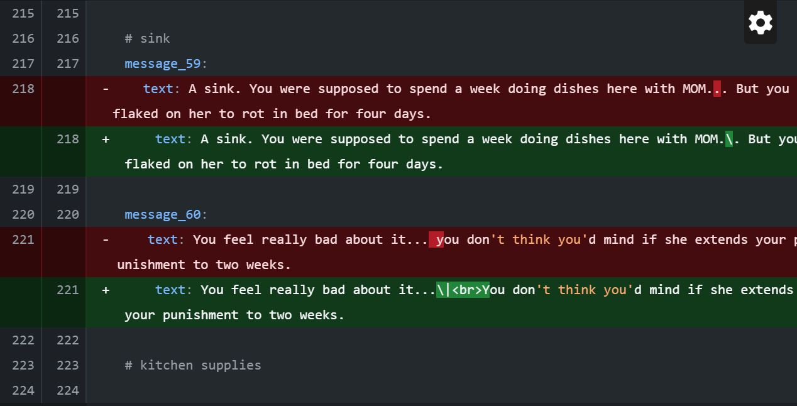

(Source, parallels diff, courtesy of FruitDragon)

The red is the old change, the green is the new change.

I know I’m throwing a lot of new words out, so here’s a brief dictionary
for GitHub terms.

- Repository: Short form “repo”, it's a folder that basically acts like
  a project folder. It can be compared to a Google Drive folder.
- Local Repository: The repository where it is located on your computer.
- Source Control: Also known as version control, it’s a system or
  software used to track changes to files (such as code files) over
  time.
- Diff: Short for ‘difference’, it’s basically a summary or overview of
  the changes that have occurred to a file.
- Origin: The online copy of your repository hosted by GitHub.
- Commit: Saving your changes to the repository, essentially creating a
  snapshot of the changes at the time of committing.
- Push: Uploading your commits to the origin, so that they can be
  downloaded (or pulled) by other collaborators or devices.
- Pull: Downloading new commits from the origin, so that your local
  repository is updated to the most recent version.
- Main: The main branch of your repository.
- Branch: A controlled environment to test certain changes before
  committing to the main branch, where the majority of the code resides.
  Can also be used to save a previous version, especially if you have an
  old release you want to keep. (Such as a demo release.)

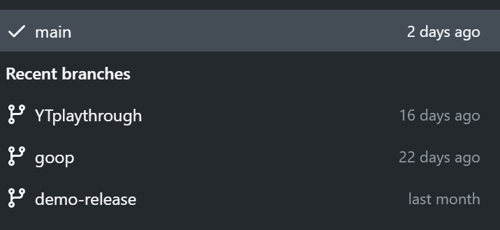

Here’s an example of the branches in the parallels repository.

And now here’s a handy link to a
\ `slideshow <https://www.google.com/url?q=https://docs.google.com/presentation/d/19Bi-uSRFUoT2zRqaMCeWgNKQf5VjvmUBXRWGg6CesrI/edit%23slide%3Did.g2dc6bc93425_4_1783&sa=D&source=editors&ust=1782966892275538&usg=AOvVaw3taLx3fEz8JrRFw9D1ZDkx>`__\  that
talks more about the terms I just defined.

(Note: GitHub isn’t the only type of source control software out there.
If you’d rather use something else, that’s up to you. OMORI itself was
made using DropBox as a source control software (somehow…?), which goes
to show that you could probably use just about anything. However, GitHub
is definitely one of the most versatile and powerful tools out there for
source control and collaboration, and a lot of OMORI modders use it.
Once you understand what to do, it’s also easy to use. So this tutorial
will be talking only about GitHub specifically.)

Now let’s get into how to use GitHub for OMORI modding.

.. _h.44ppgi9hcyvp:

Creation
--------

To start, we’re going to need a GitHub account.

Go to the \ `GitHub
website <https://www.google.com/url?q=https://github.com/&sa=D&source=editors&ust=1782966892276528&usg=AOvVaw1oB_kesom6Bt-P_xWdm_w_>`__\  and
create one. It’s free, and it’ll only take a few minutes. You don’t need
two-factor authentication, but feel free to add it to your account—
it’ll ensure that your repository is the most protected that it can be
from hackers.

Once you have an account, you’ll need to download \ `GitHub
Desktop <https://www.google.com/url?q=https://desktop.github.com/download/&sa=D&source=editors&ust=1782966892276877&usg=AOvVaw33zpyhufzrEcGF8RTUu9r0>`__\ .
Install it, then open it.

You’ll end up with a screen that looks something like this.

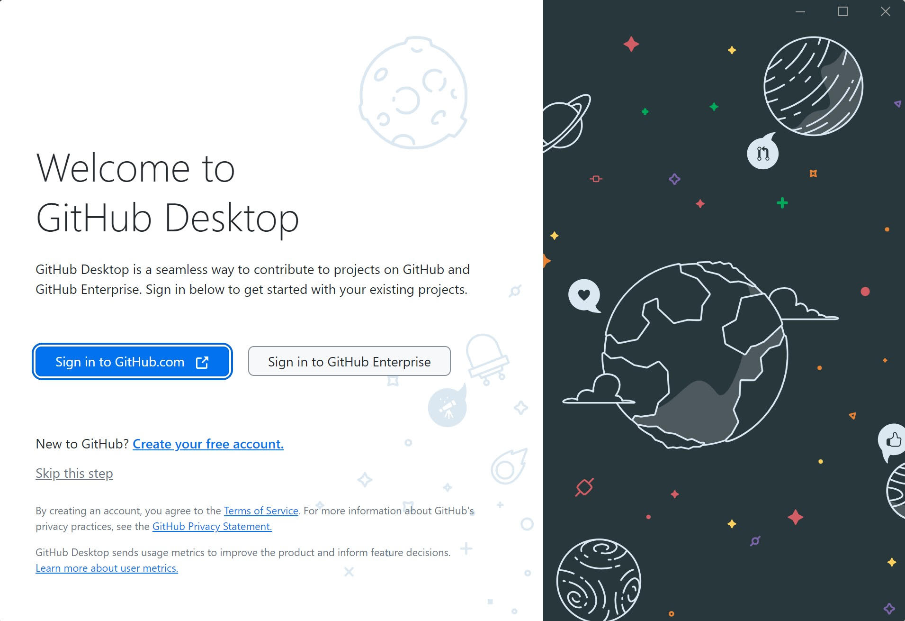

(source: zoewillowz)

Click “Sign in with GitHub.com” and log into your account. Make sure to
click “Authorize Desktop”. Return to GitHub Desktop.

Then you’ll get a screen that looks something like this.

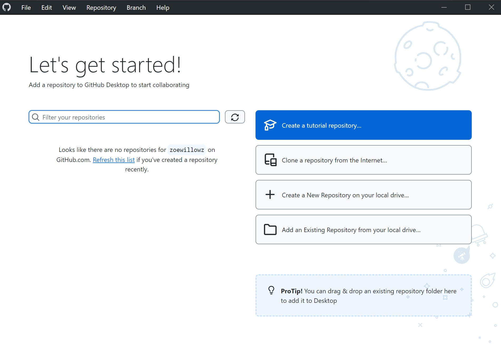

(source: zoewillowz)

Here’s where we’ll have to make the repository or clone a repository
from the internet.

.. _h.m7k5oo19ojkl:

Making a new Repository
~~~~~~~~~~~~~~~~~~~~~~~

If you don’t already have a repository for your project folder, it’s
fairly straightforward to make one.

First, locate your playtest folder in your hard drive. I’ve named mine
“repo practice”.

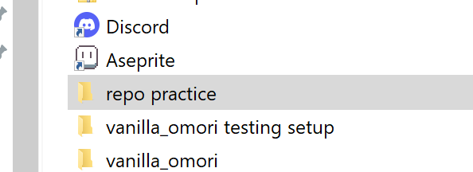

Next, go to GitHub Desktop and select “Add an Existing Repository from
your local drive… ”

(source: zoewillowz)

Select your repository.

You’ll get the following alert:

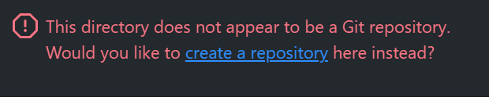

Click “create a repository”.

You’ll get the following window. (Your filepath will be grayed out).
Fill it out. You don’t need to initialize a README, select a license, or
add a Git ignore.

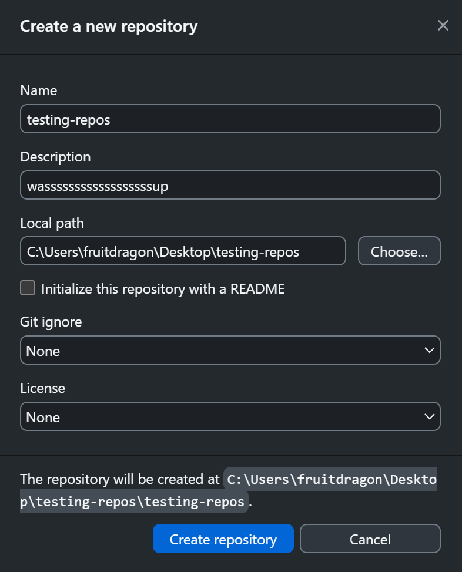

Then click “Create repository”! After a while of loading, you’ll get the
following window.

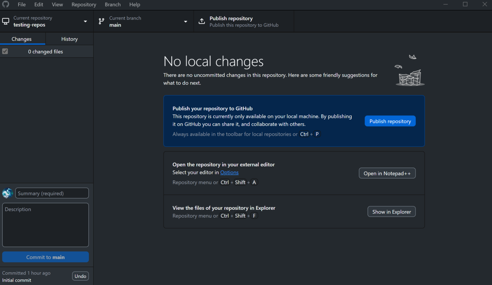

Now all you need to do is publish this repository to GitHub, which
enables you to share it with others and back it up. To do that, simply
click the button at the top!

.. _h.3bcj251z8z1q:

Cloning a Repository
~~~~~~~~~~~~~~~~~~~~

If instead of making your own repository, you’re being added to someone
else’s repository, you’re going to need to clone a repository from the
internet.

If you’ve already been added to the repository (see the \ `Collaboration
section <#h.e8eze2higkg0>`__\  for how to do that) adding your new
repository should be a breeze.

On the GitHub Desktop main page, click “Clone a repository from the
Internet…”

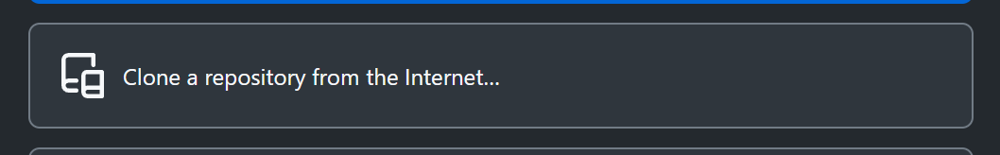

The following window will pop up.

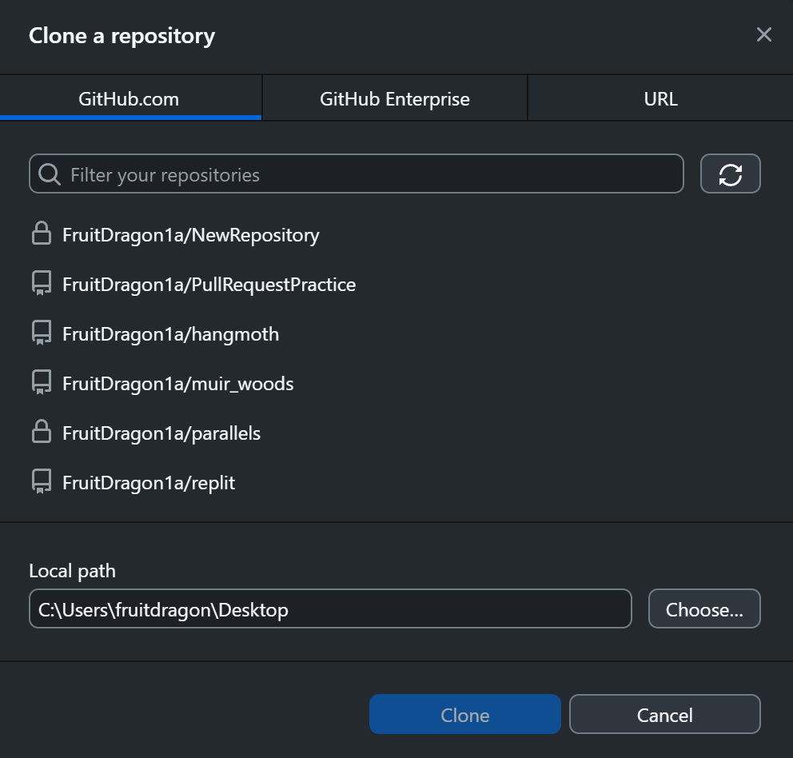

Select the repository that you want to clone from the list (if your
GitHub account is new, the list shouldn’t be that long haha), then set
your local path to wherever you want the folder to be and click “Clone.”

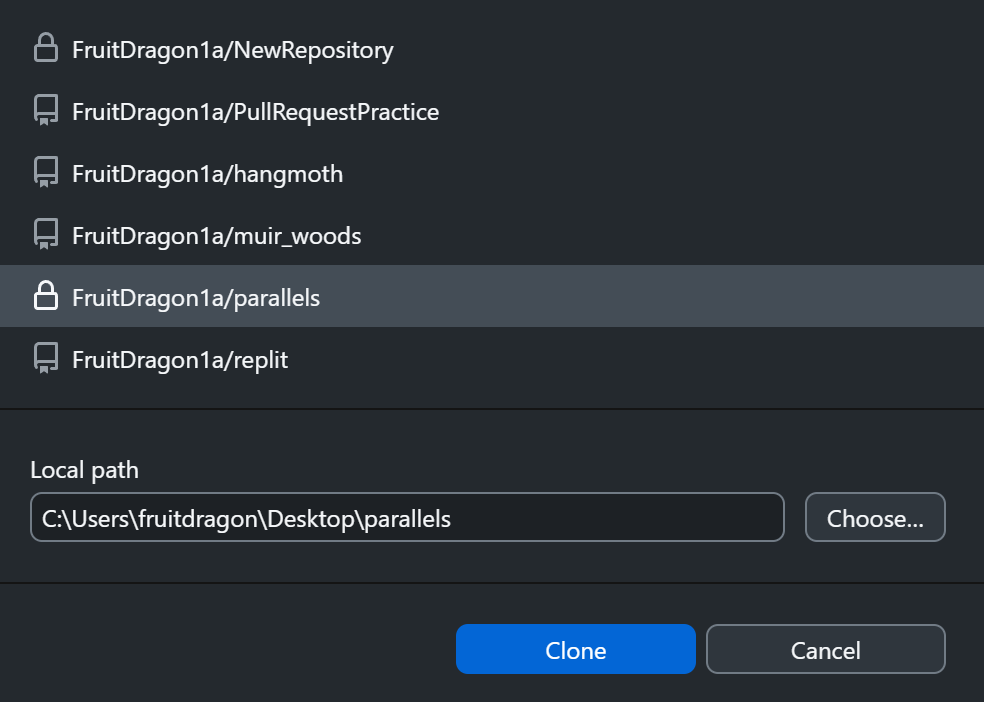

If, for some reason, the repository is not visible in the selection
window, open it in your browser and copy the link. The repository page
will look something like this:

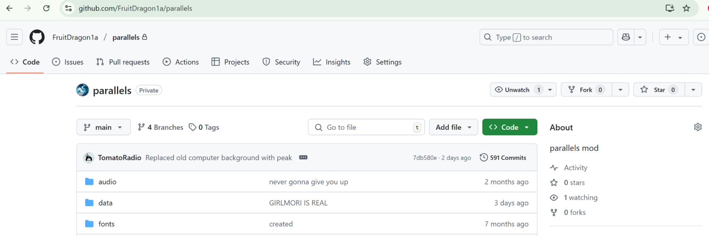
  

Copy the link from the search bar.

In the repository selection window, click the “URL” tab. Then, paste in
the repository link and click “Clone”.

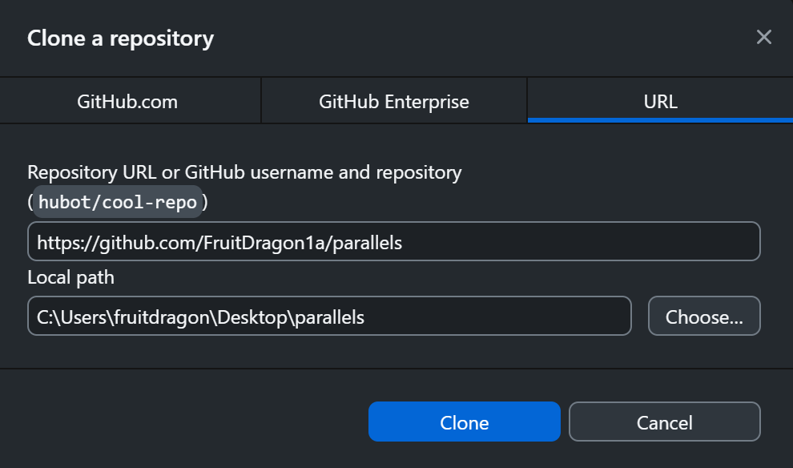

(Note: Putting the parallels repo link in your GitHub and trying to
clone it won’t work. Even by URL, GitHub checks to make sure that the
repository you’re trying to clone is one you have access to. You still
need to have it shared with you or accessible to you if you’re trying to
clone it by URL.)

Once you click “Clone”, it’ll redirect you to the following window.

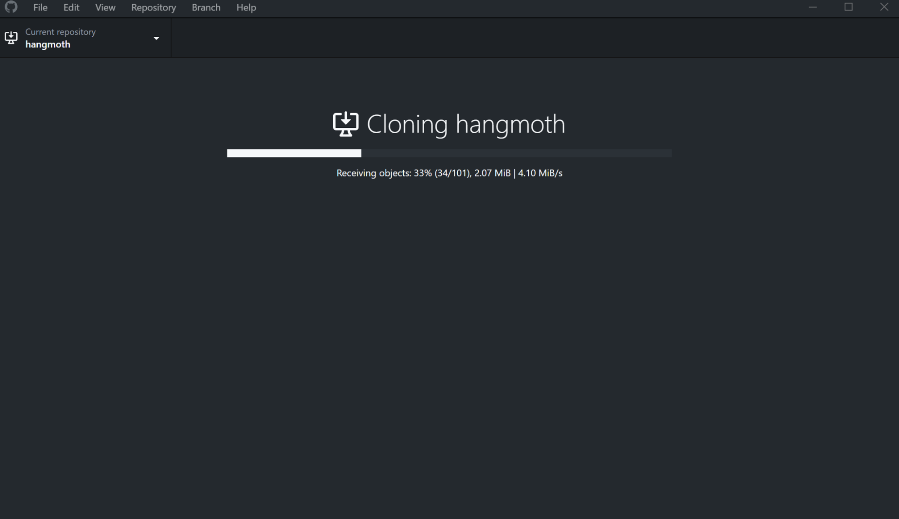

(I didn’t clone the parallels repository because I already have it
downloaded to my computer.)

Ensure that you have a stable internet connection, because what this is
essentially doing is downloading the entire project from online, where
GitHub hosts it.

Wait for the entire repository to download. One it’s done, it’ll take
you to the following window:

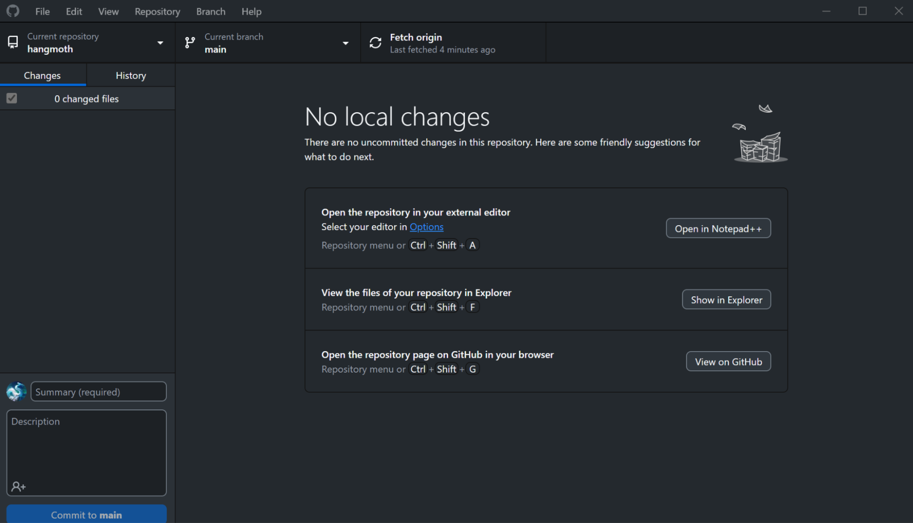

And that’s it! This is the main window in GitHub Desktop, and you can
access your repository, commit, push, pull, and more from here.

But what do you do now? How do you use GitHub?

.. _h.bti29u1ruwzs:

Source Control
--------------

First, let’s practice pushing to our repository. I’m going to do
something simple: add a new image file to the img/characters folder.
Let’s see what that looks like in GitHub Desktop.

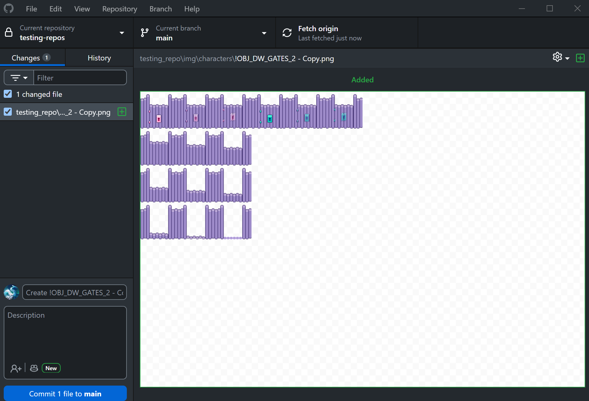

It shows me a preview of what I’ve added! This is super helpful when I’m
trying to see what I’ve added without having to navigate the folder.

GitHub does the same thing for most file types (pretty much all file
types you’ll work with in basic OMORI modding). In the sidebar, it shows
you what files you’ve added and their file paths, and once selected,
shows you a preview of what you’ve added into the repository.

The icon next to the filename indicates whether the file was created,
edited, or removed. A green plus sign indicates a file addition, yellow
dot indicates a change, and a red minus sign indicates a file removal.

When the file is a text-based file, such as a .js plugin file or a .yaml
dialogue file, individual line changes will display in the window.
Green-highlighted text or lines indicate add changes, and
red-highlighted text or lines indicate subtract changes.

When the file is an image-based file, such as a .png, you will get
several options for how to view the changes.

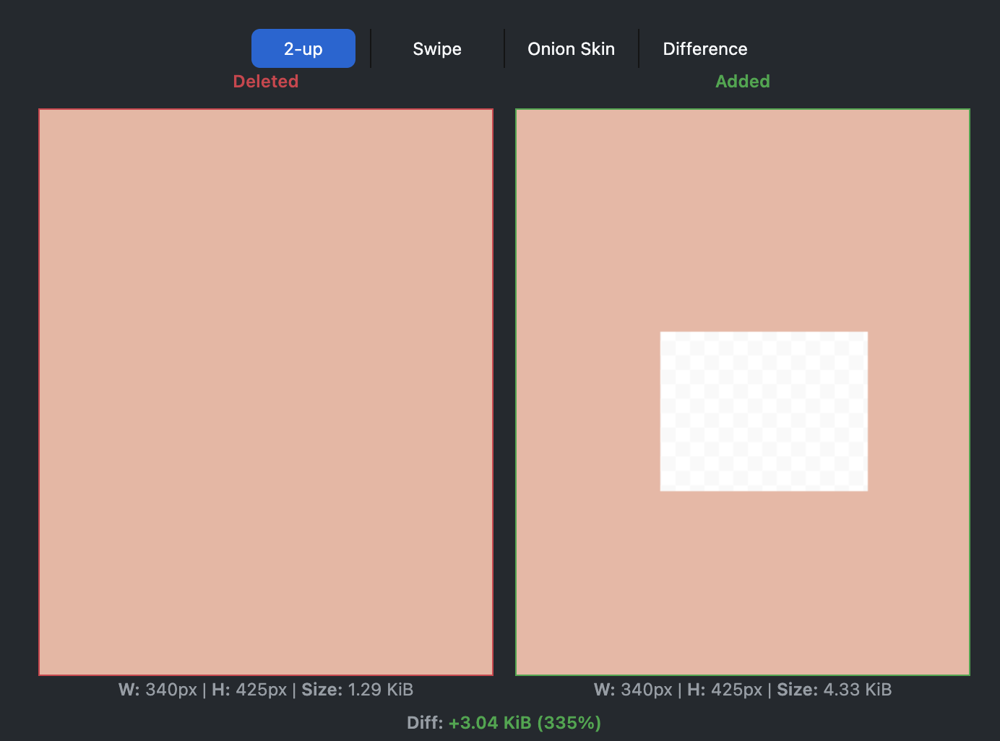

2-up will display the previous version and the current version
side-by-side.

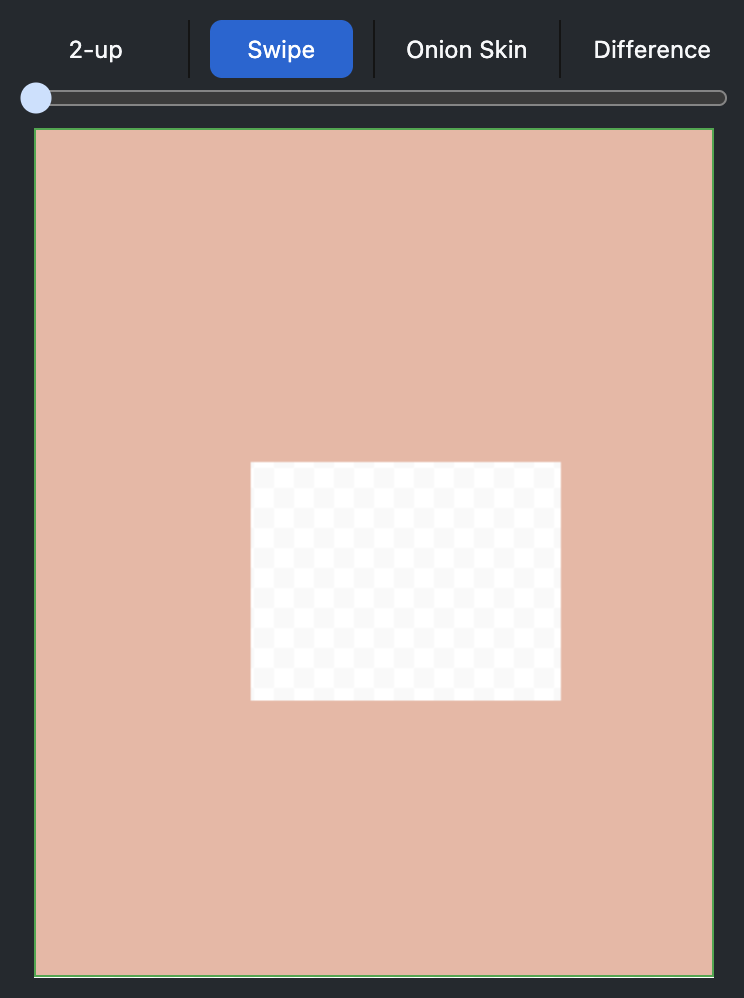
  

Swipe will swipe through the change, as though you are dragging a
curtain over the previous version.

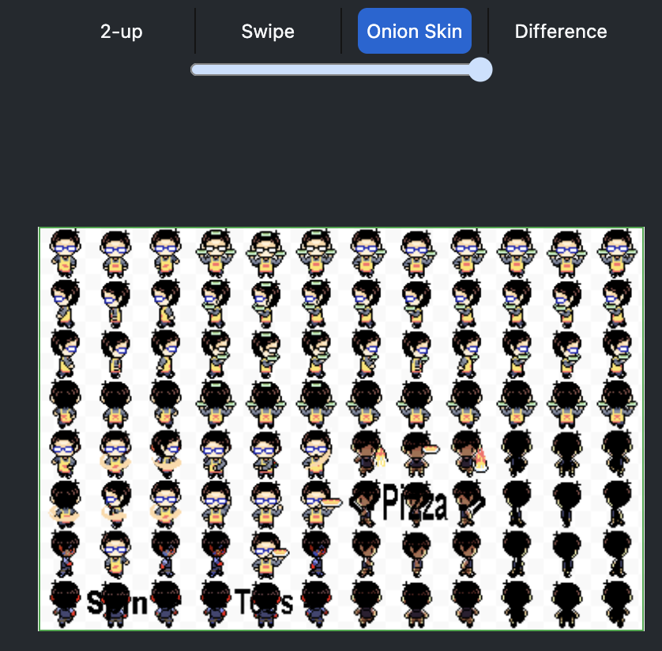

Onion Skin will give you a slider bar to show the change overlaid on top
of each other. This is especially helpful when the change is small, as
you can see it change by sliding the bar back and forth.

And finally, my favorite, the Difference tab.

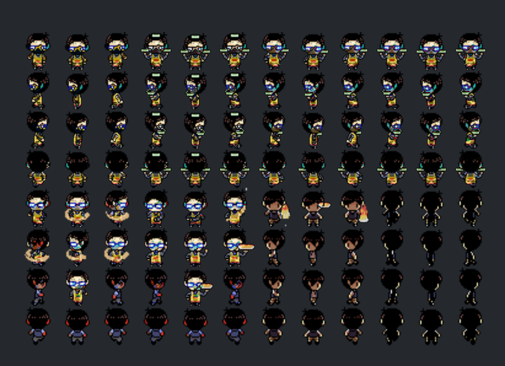

This tab overlays one version on top of the other and sets the blend
mode to Difference, showing the exact pixel color change for each pixel.
It can lead to some very hilarious results!

.. _h.e8eze2higkg0:

Collaboration
-------------

Probably the number one reason OMORI modders use GitHub is for
collaboration. In mod projects that require more than one person, you
need a way to collaborate with the other members of the team.

.. _h.uo1es89od7de:

Personal Stories
----------------

To finish it off, I’m going to share some personal stories from OMORI
modders that have used GitHub, just to show how amazing a tool this is
to use. (That is, if the rest of this section hasn’t sold you on using
it, hopefully this section will.)

.. _h.eyo0h7t5nx1p:

YAML Files & Dialogue
=====================

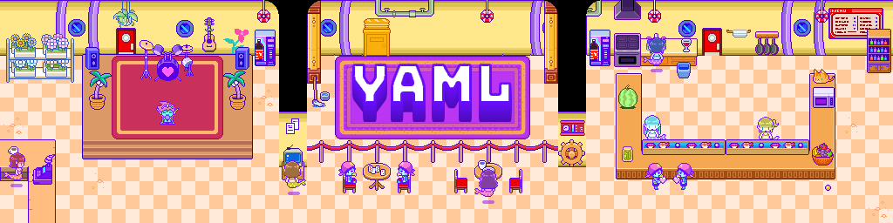

A good way to start is by looking at the existing .yaml files in the
vanilla game. Those can be located in the Playtest Folder provided
by OneLoader, with the following filepath:

.. _h.on4cnbrrktnj:

Location
--------

playtest_folder/languages/en

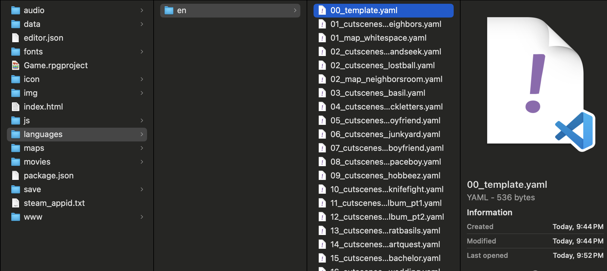

(Source, FruitDragon)

In this folder is most of the written text in the game. Basically unless
it’s battle text (barring dialogue), it’s likely stored in one of these
yamls. This folder is also where you will have to put any new .yaml
files that you create.

.. _h.2oe8c7v0nxky:

Syntax
------

When we open the 00_template.yaml, we’re shown the following code:

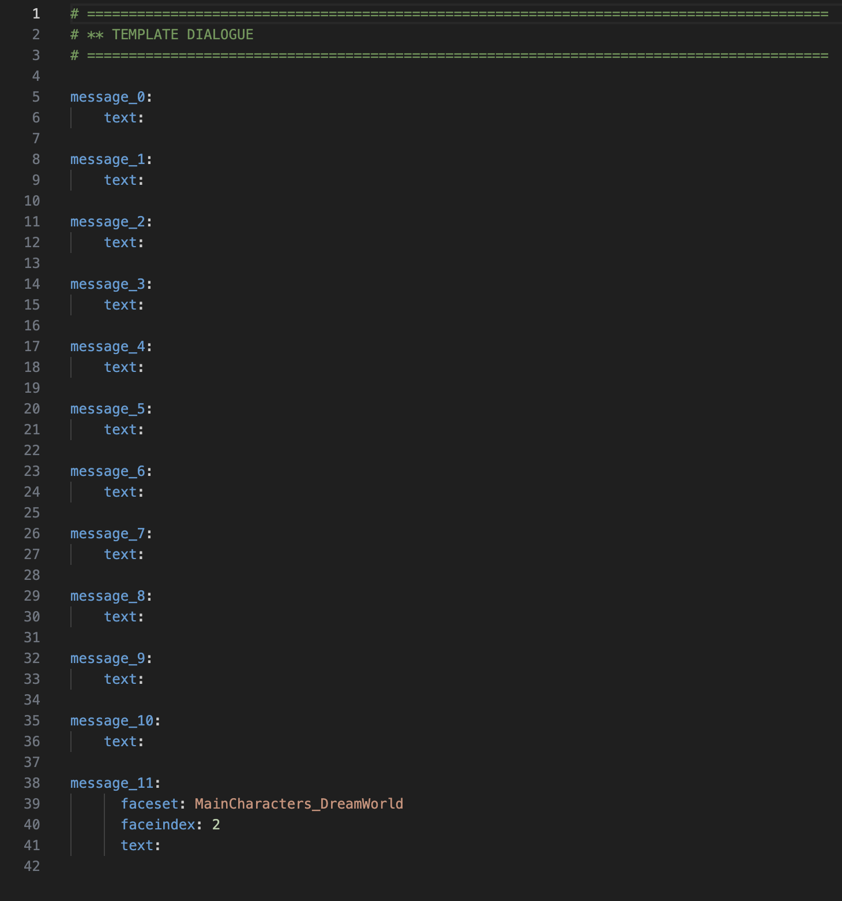

(Source, 00_template.yaml, basegame)

The meaning of this is pretty basic. Each message without a face
attached (so all dialogues not involving Omori/Sunny, Aubrey, Kel, Hero,
Mari, or Basil/Stranger) is defined as a single line of text following
“message\_XX” (where XX is some number) and messages with a face get two
additional values that must be defined— the faceset, aka the file in
which the face you want belongs, and the faceindex, aka which of the
faces on the file. More on that later.

Note: message\_XX is convention, not requirement. Any string of text
could work in this place. And in many cases, it could make it easier to
remember certain dialogue choices if you give it a name other than
convention. An example of a mod that uses this feature is
\ `Reverie <https://www.google.com/url?q=https://mods.one/mod/reverie&sa=D&source=editors&ust=1782966892287534&usg=AOvVaw3zUUz8zUFX2W2LRkSPi6GD>`__\ .

.. _h.jkwhfutwca8h:

Examples
~~~~~~~~

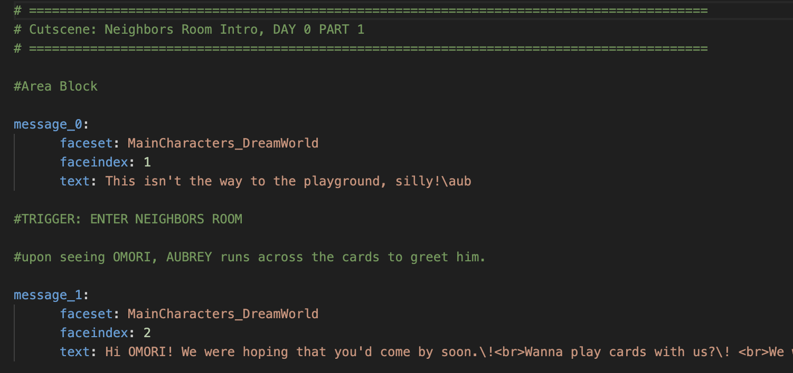

(source: 01_cutscenes_neighbors.yaml, basegame)

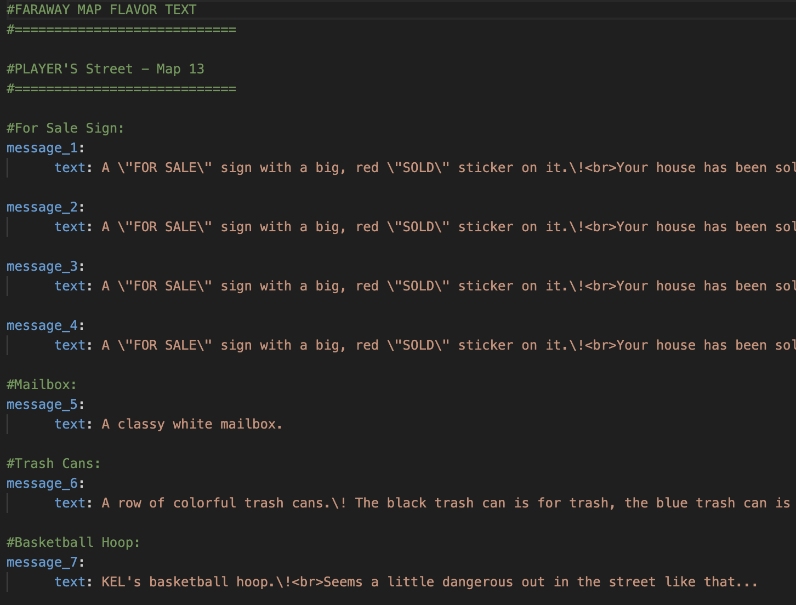

(source: fa_map_flavor.yaml, basegame)

As you can see here, flavor text (text that pops up when you interact
with objects) is defined in much the same way as cutscene dialogue,
shown in the first example.

.. _h.xdrvpi4i3661:

Comments
--------

Also, comments! The green lines of text, denoted with a # symbol at the
beginning of the line are ignored by the file and are a great way of
making your .yaml file easier to read, usually to show information that
you can’t glean with just the messages such as character movement or
dialogue options.

Without these comments, you will end up with something like this:

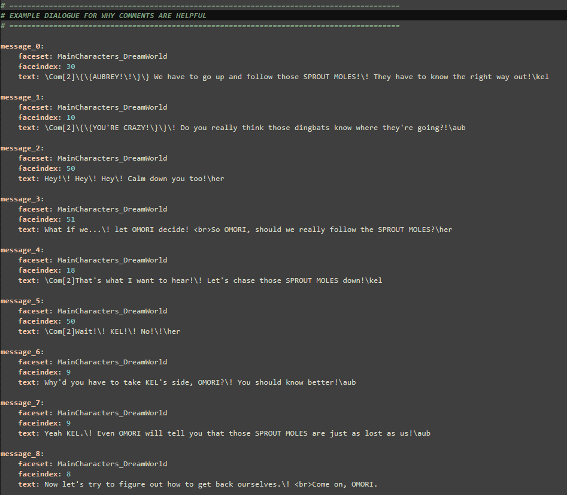

(source: curated example, courtesy of TomatoRadio)

It’s a lot more difficult to tell what anything is for if you’re looking
at the files and are trying to figure out what each line is for. What
does Kel do? What happens if you say no? Can you say no? You can’t tell.

Now look at the same .yaml file with comments added in:

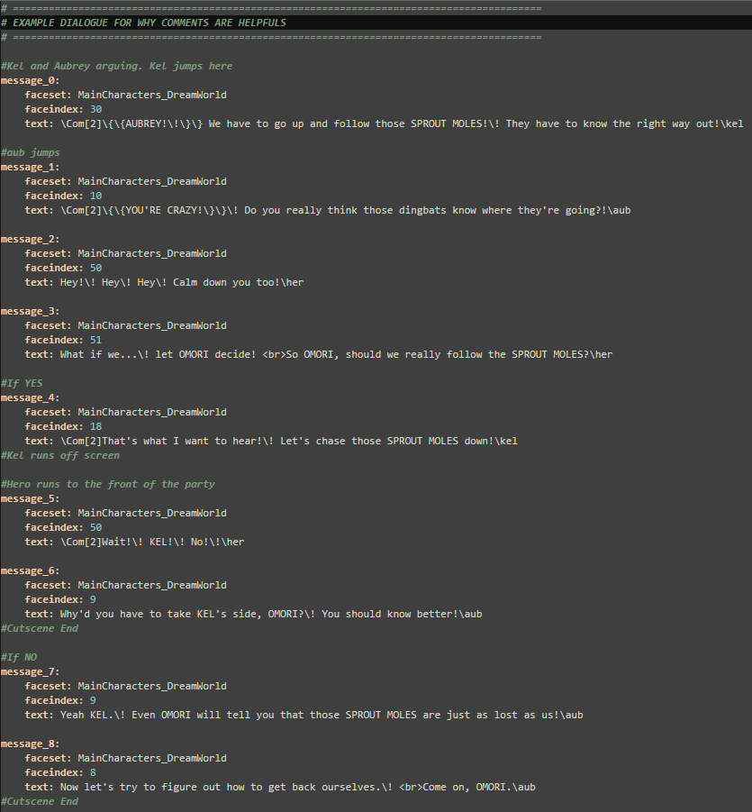

(source: curated example, courtesy of TomatoRadio)

Now we learned a bunch of helpful info. We know how to animate Kel and
Aubrey fighting, what the dialogue options are, and we know what Kel
does in the Yes branch.

Going over your yamls again to comment may also let you catch an error
or two, which you can even see here. Can you spot what changed?

.. _h.k8tk6b6mr2yc:

In-Game Formatting
------------------

“But, FruitDragon,” you may be saying, “what are all of these random
backslashes and dots and lines in between the text for? And how does
formatting like the really wavy text from Sweetheart’s iconic laugh
happen?”

“Well, dear aspiring mod maker,” I say in return, “those random
backslashes and dots and lines in between the text are exactly what
causes that formatting to happen.”

Almost. Technically, the wavy text is caused by the \\sinv[] function.
But I digress.

Here’s a quick guide to super basic formatting. For a more comprehensive
guide, I highly recommend visiting
\ `this <https://www.google.com/url?q=https://github.com/Gilbert142/gomori/wiki/Text-Formatting&sa=D&source=editors&ust=1782966892290756&usg=AOvVaw3WPOoSFNECyXi-GYyFq-w1>`__\  link.

All formatting commands start with a backslash (\\) except for one—
that's   which, much like the HTML version, causes a line break.

-   = line break
- \\. = Pause 15 frames, approx. 1/4 of a second\*
- \\\| = Pause 60 frames, approx. 1 second\*
- \\! = Wait for user input before progressing, basically meaning you
  have to press z to continue
- \\^ = Automatically closes a text window once it's done writing
  itself, like if you want someone to be interrupted
- \\sinv[2] = Wavy text (For less intense waving use \\sinv[1])
- \\quake[2] = Shakes text (For less intense quaking use \\quake[1])
- \\v[#] = Passes in the value of the variable number given (eg:
  \\v[143] passes in the save’s WTF value)
- \\c[#] = Changes text color! These colors are based off of the
  checkerboard in img/system/Window.png. 0 is the white square in the
  top left and it keeps going from there, left to right. You can add
  your own colors by changing this image. This table shows OMORI’s color
  conventions:

======= == ===============
#FFFFFF 0  Default
#6095ff 1  Skills
#5bd863 3  Snacks
#fed966 4  Important Items
#ff9233 5  Toys
#64f7ed 11 Locations
#c263e1 13 Equipment
======= == ===============

RPG Maker audio is ran independently of the game’s framerate, which can
cause desyncs if you are assuming a consistent 60fps.

Again, it’s a good idea to look at already existing .yaml files for
certain types of formatting, like if you want to mimic Sweetheart’s
iconic laugh. No better way than to learn by example!

…

Okay, now I’ve made myself curious.

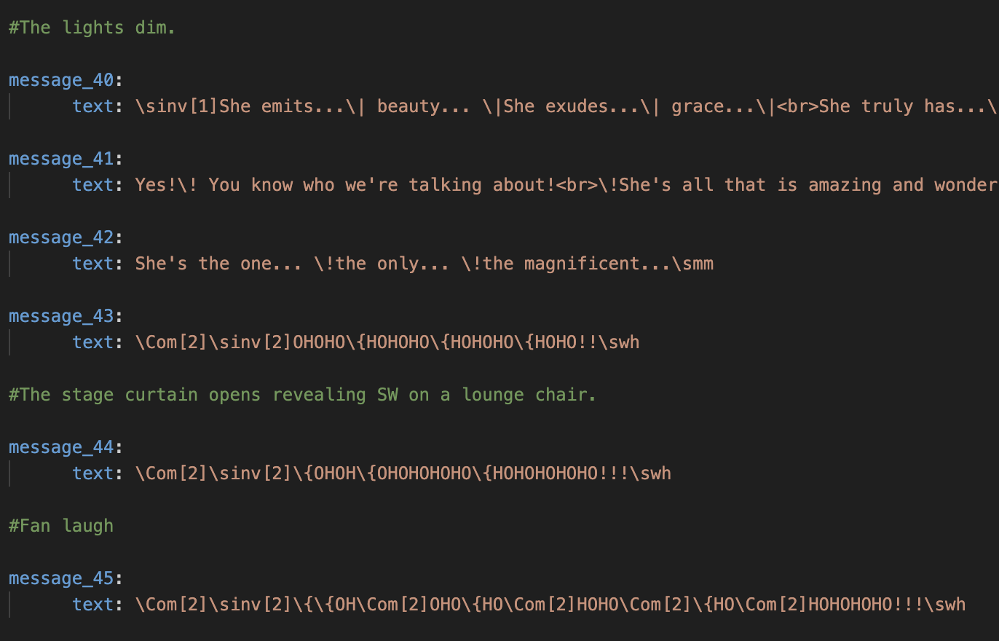

(source: 15_cutscenes_herothebachelor.yaml, basegame)

We have here Sweetheart’s iconic entrance with Sweetheart’s iconic
laugh. Repeated a grand total of three times, each time with different
formatting.

What exactly is going on with this dialogue?

Here’s what I see in terms of formatting:

- \\Com[2]
- \\sinv[1]
- \\sinv[2]
- \\{
- \\!
- \\\|
-  
- \\smm
- \\swh

We already know most of these. As I mentioned, \\sinv[1] and
\\sinv[2] are the thing that caused Sweetheart’s dialogue to get all
wavy. \\\| is pause 60 frames, and \\! is wait for user input before
progressing. And  , of course, is line break. So what are \\{,
\\Com[2], \\smm, and \\swh?

\\{ is what increases the text size. Similarly, \\} is what decreases
the text size.

\\Com[x] runs the Common Event from the game that has the same number as
the number passed in to the command in place of x. In this case, Common
Event #2 is Shake Screen, which means that every time \\Com[2] is run,
it’ll shake the screen. (Wow, that’s a lot of screen shaking in that
last Sweetheart laugh.)

Now what are \\smm and \\swh?

It’s simple, really. But it involves getting into a topic that we
haven’t really gotten into yet.

It’s time to talk about:

.. _h.m0lmbk2z27gs:

Names
-----

That’s right, names. That little box that pops up on top of dialogue
boxes to tell you who’s speaking.

Now that I think about it… we haven’t really seen how names are defined,
yet. Only the dialogue itself. How does the game know who’s talking?

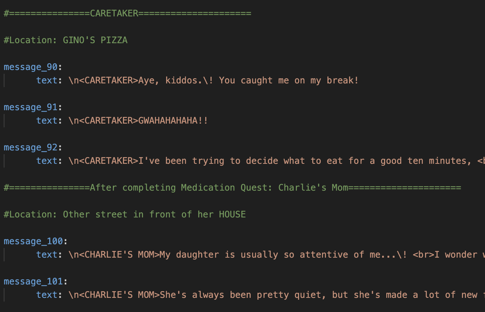

(source: farawaytown_extras_dailydialogue.yaml, basegame)

Well it’s just the following line tacked on to the beginning or end of
the text:

\\n<NAME OF PERSON HERE>

But where is that for the other dialogues we’ve encountered so far?

Here’s the thing. Writing \\n<NAME> over and over and over again can get
tiring, especially when the name is super long. So OMORI has a set of
Macro Plugins. What these are are shorthands for strings of text, which
can include text codes. You can put anything into these Macros, and you
can add your own by changing the parameters in the Plugin Manager, but
in OMORI, they are mostly for names. 

Here’s a short guide of common names:

- \\aub = Aubrey
- \\her = Hero
- \\bas = Basil
- \\kel = Kel
- \\mar = Mari
- \\omo = Omori
- \\who = ???
- \\swh = Sweetheart
- \\smm = Sprout Mole Mike
- \\sbf = Space Boyfriend
- \\cap = Capt. Spaceboy
- \\spxh = Space Ex-Husband

Recognize any?

That’s right. \\smm and \\swh were used to denote that Sprout Mole Mike
and Sweetheart were talking! That makes a lot of sense.

Of course, there’s definitely more. For a full list of macros, visit
\ `this <https://www.google.com/url?q=https://github.com/Gilbert142/gomori/wiki/Text-Macros&sa=D&source=editors&ust=1782966892300169&usg=AOvVaw00ETgemo02FsoVLTufk544>`__\  link.

Note: For a renameable character like Sunny (barring the examples
earlier;
\ `parallels <https://www.google.com/url?q=https://mods.one/mod/parallels&sa=D&source=editors&ust=1782966892300405&usg=AOvVaw0_32_SGR5paQneQ-TQc0PQ>`__\  doesn’t
have a renameable Sunny) you’ll have to use \\n[8] for the character’s
name. 8 is the actor ID for Sunny. If there’s a different character that
you want to get the name for like that, just use \\n[ACTOR ID]. So the
final product would be \\n<\\n[ACTOR ID]>

Now, it’s time to go over the things I said I would go over earlier.
Faceset and faceindex.

.. _h.5i94vch76e39:

Faceset
-------

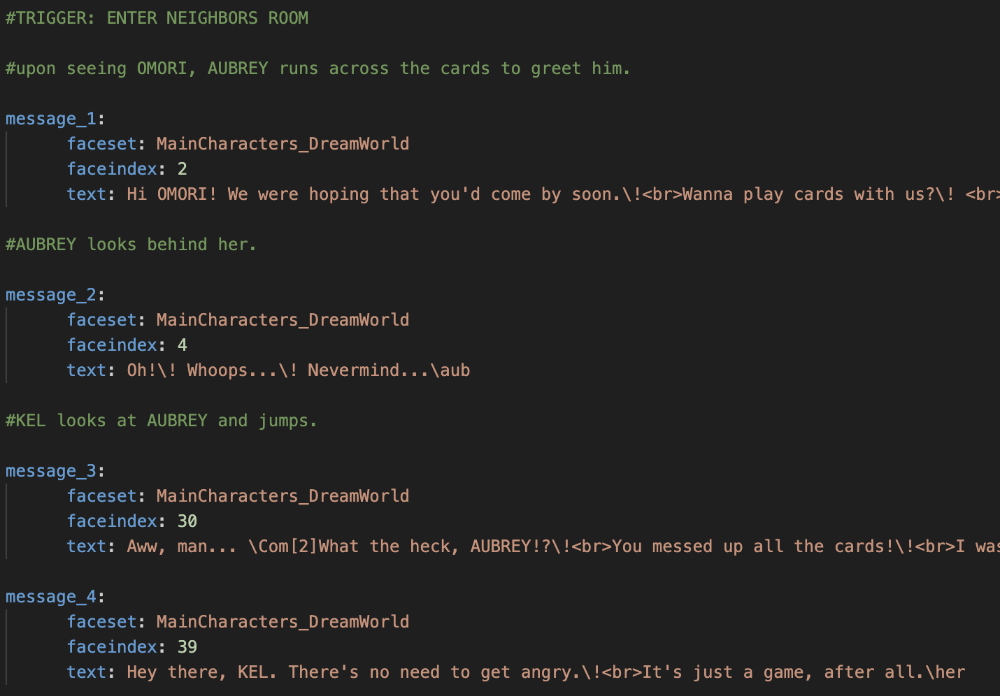

(source: 01_cutscenes_neighbors.yaml, basegame)

What is faceset? What are these random strings in the faceset?

They’re filenames. More specifically, for files in the img/faces folder,
shown here:

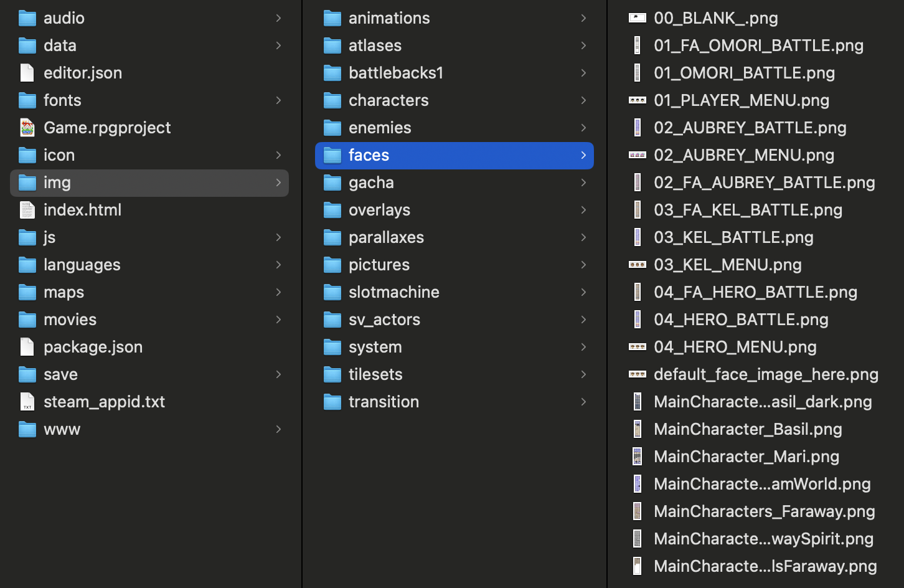
  

(source: FruitDragon)

The files in specific that we’ll be referring to for yaml files are the
ones at the bottom of the image, denoted with the MainCharacter\_ or
MainCharacters\_ prefix.

Here are options provided with the basegame:

- MainCharacter_Basil_dark — For all your nighttime Faraway Town
  character needs!
- MainCharacter_Basil — All of the daytime faces for Faraway Basil and
  Dreamworld Basil! With Stranger, nighttime Aubrey, and a little
  nighttime Hero thrown in for good measure!
- MainCharacter_Mari — Dreamworld Mari and the unused Spirit Mari! Plus
  a few faces belonging to our faceless mannequins in Black Space and
  our Faraway Town twelve year olds.
- MainCharacters_Dreamworld — Dreamworld Hero, Aubrey, and Kel. Plus
  Hector.
- MainCharacters_Faraway — Faraway Town Hero, Aubrey, and Kel.

The file formatting for one of these facesets is pretty specific. 106
pixels by 106 pixels per face, 4 faces per row. You can have as many
rows as you need.

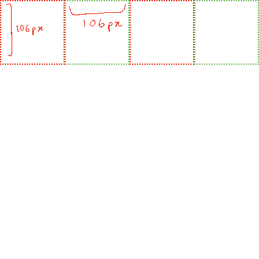

(source: FruitDragon)

How does the game know which face in each faceset to use, though?

Well, that’s where the next topic comes in.

.. _h.w39or5al8zx:

Faceindex
---------

This number tells the game which file to fetch from the given faceset.

Here’s an example using a darkened monochrome version of
MainCharacters_Faraway:

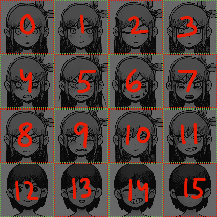

(source: FruitDragon (edit of MainCharacters_Faraway, face 15 is
custom))

As you can see, the count starts from 0 (because computers) and goes up
by one, wrapping around to the next row each time. So calling
MainCharacters_Faraway and assigning the faceindex value to 2 would show
the face with the value 2, or Aubrey with her eyes closed, when that
dialogue is printed.

.. _h.jz74153ns5i1:

Dialogue Examples:
------------------

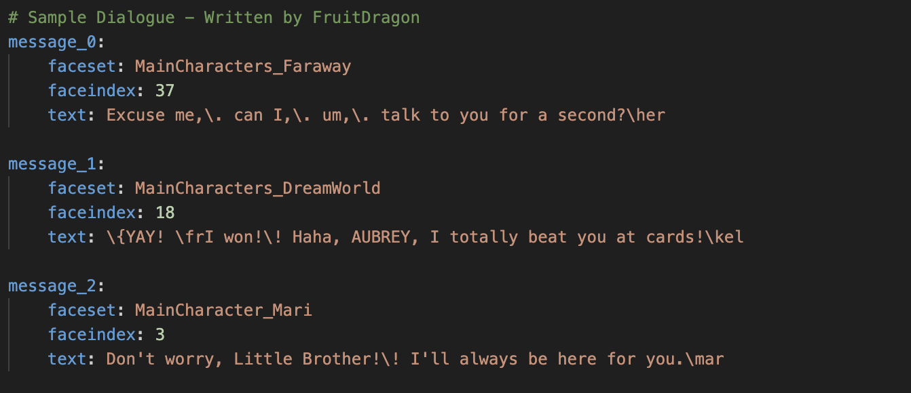

Let’s see what each of these turn out to look like!

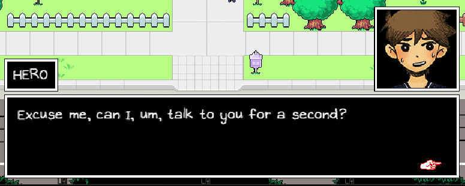

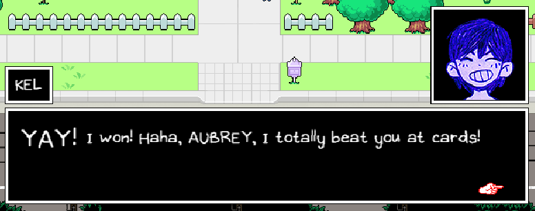

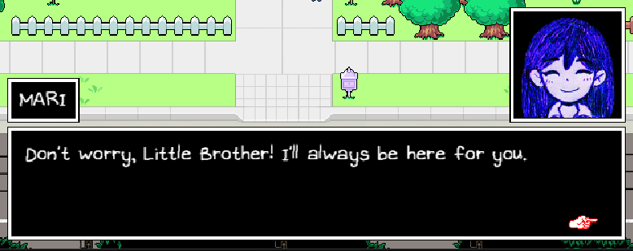

(source: Biggie Cheese)

I used pretty basic formatting, since a lot of the text moving ones like
\\sinv can’t translate well to screenshots. \\!, \\., \\\|, and any
other wait/player input commands also don’t translate to screenshots.

There is a new one: \\fr, which resets all font changes. This is used
because at the beginning of Kel’s dialogue, the font size is increased,
but we don’t want the font size to stay large for the entirety of the
line.

Now, you may be wondering, how do you add these dialogues to the game?

Well, I’ll go over that in the next section:

.. _h.3ek5unxwrmmt:

Events
======

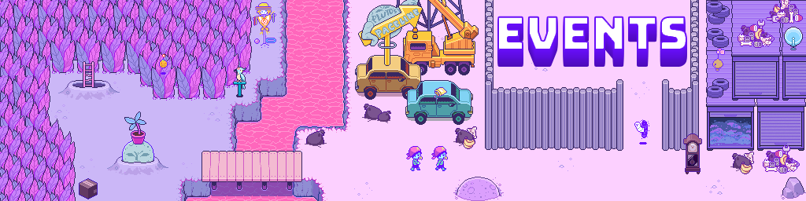

“What is an event?”

Well, an event is anything that happens in the game. Even the Player is
a type of event, but that’s a level of technical we’re going to ignore
for this.

To turn on the Event Editor, click the following button at the top of
your main RPG Maker MV window.

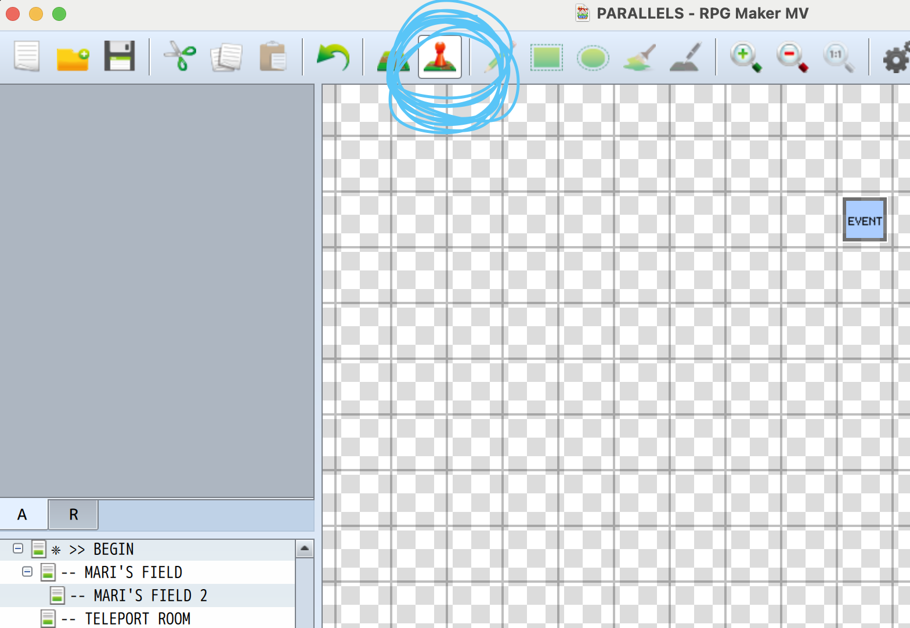

(source: FruitDragon)

.. _h.jloze3db1ozb:

Making Events
-------------

It is highly recommended that you look at events similar to the one you
are trying to make to figure out how they work before you try making one
of your own.

Also, you can always copy/paste events and then edit them.

To make a new Event, all you have to do is double click any empty square
in the Event Editor. You’ll get a new page that looks something like
this:

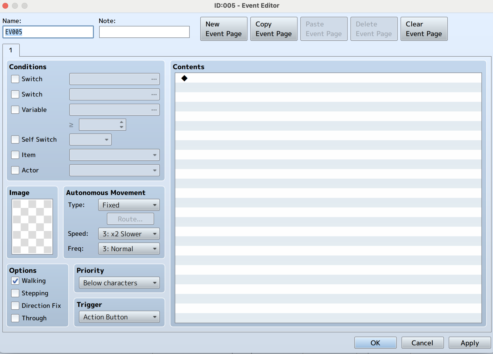

(Source: FruitDragon)

There’s a few important things to note when we’re talking about Events.
First, you can see just how many things there are to consider. This is
because of just how specific Events can be.

We’ll go over almost all the sections in detail.

.. _h.lh8uiqwbjm3z:

Event Page - The Top
~~~~~~~~~~~~~~~~~~~~

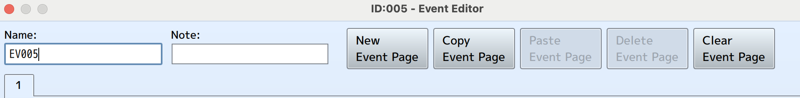

It’s pretty self-explanatory. An Event can have multiple pages, and this
is where you can make a new event page, copy an existing event page to
paste somewhere else or duplicate in the same event, or delete/clear an
existing event page.

Of course, there’s always the option to name your event. And the notes
box is used for things like extending the Hitbox of the Event or
changing the X/Y-offset of the event.

Some of the possible Notetags that can go in the notes box:

Hitbox changers:

<Hitbox Left: 2> (extends the hitbox left 2 squares)

<Hitbox Right: 4> (extends the hitbox right 4 squares)

<Hitbox Up: 1> (extends the hitbox up 1 square)

<Hitbox Down: 1> (extends the hitbox down 1 square)

Sprite Offset: (positive means right/down, negative means left/up)

<Sprite Offset Y: +20> (sprite moves 20 pixels down)

<Sprite Offset X: -3> (sprite moves 3 pixels left)

<Sprite Offset: +7, -5> (sprite moves 7 pixels right and 5 pixels up)

Note: This does NOT change the hitbox of the event.

Copy Event: This basically copies the entirety of an event from one map
and adds it to another. Good for events like a specific enemy that you
want consistent across multiple maps.

Note #1: You will run into events with Copy Event tags that don’t
specify the event they’re copying. Those events are selected with the
help of plugins. You can usually find the event that they’re copying in
the Dev Rooms.

Note #2: Maps you copy events from must be added to a list of maps to
preload in YEP_EventCopier in the Plugin Manager. Where that is and how
to modify stuff like that can be found in the
\ `Plugins <#h.rxmxx9evltp>`__\  section.

<Copy Event: Map 46, Event 3> (acts the same as Event 3 in Map 46. If
you want to know what event this is, it’s the door to Basil’s room in
Faraway Town.)

Activation changers: Extends the area a event can be triggered by Player
Touch or Event Touch, explained later.

<Activation Square: 4> (extends the area the event can be triggered by
player or event touch is extended by 4 units in a square shape.)

<Activation Radius: 2> (extends the area the event can be triggered by
player or event touch is extended by 2 units in a diamond shape.)

Mini Label: Causes a small line of text— the “mini label”— to show up in
the game above the event. This is used pretty much exclusively in the
dev rooms, for organization purposes.

<Mini Label: label goes here>

It’s also important to note the ID number at the top of the Event page.
That ID number is important for Scripting later. Sometimes, it’s a good
idea to include the ID number when naming the event, so that it’s easy
to tell the number without having to open the Event page every time.

.. _h.ydhbn486qsq2:

Event Page - Conditions
~~~~~~~~~~~~~~~~~~~~~~~

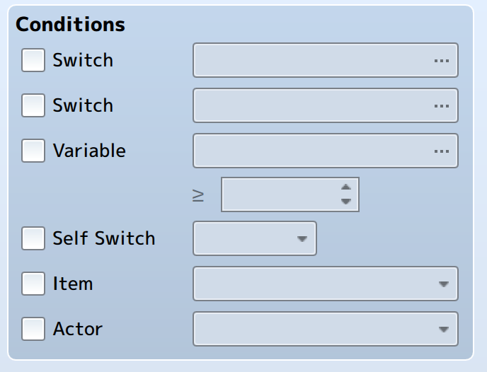

(Source: FruitDragon)

These tell you what Conditions need to be fulfilled in order to run that
particular event page. Since there can be multiple event pages in an
event, this helps to differentiate things.

Quick Guide:

- Switches are true/false statements you can use to trigger events. You
  may also know these as flags or booleans.
- Variables are just that— variables.
- Self Switches are true/false statements specific to the event you’re
  currently coding. These aren’t meant to be used for multiple events,
  but with Scripting you can do so. More on this later.
- Item: This means the player has to have that particular item in their
  inventory. This cannot check for equipment.
- Actor: That means that the event runs only if that specific actor
  (character) is in the player’s party.  To check for a tagged actor,
  place a Conditional Branch that checks the following script
  “$gameParty.leader()._actorId === ACTOR ID”

Event Pages run from left to right in priority, so if the Conditions of
Event Page 4 and Event Page 6 are both met, it will run Event Page 6 as
that one has the highest priority.

Here’s some examples:

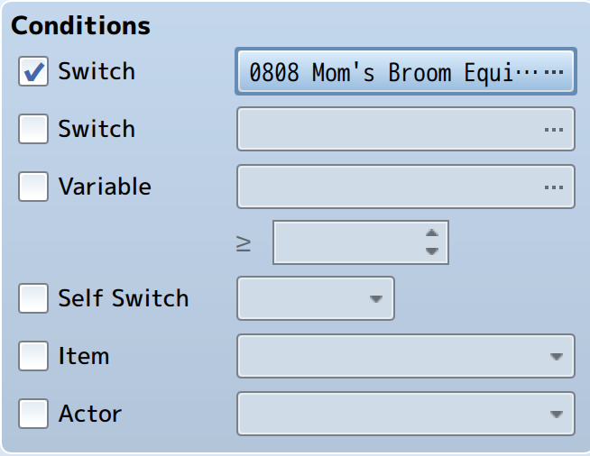

(Source: FruitDragon)

This set of Conditions means that the Event Page won’t run unless the
Switch Mom’s Broom Equipped is true— basically, it won’t run unless the
player equips Mom’s Broom.

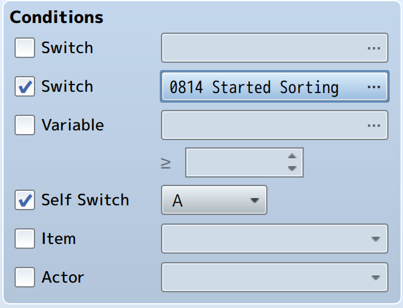

(Source: FruitDragon)

This set of conditions means that the event page will run when the
player has started sorting and the Self Switch A was triggered.

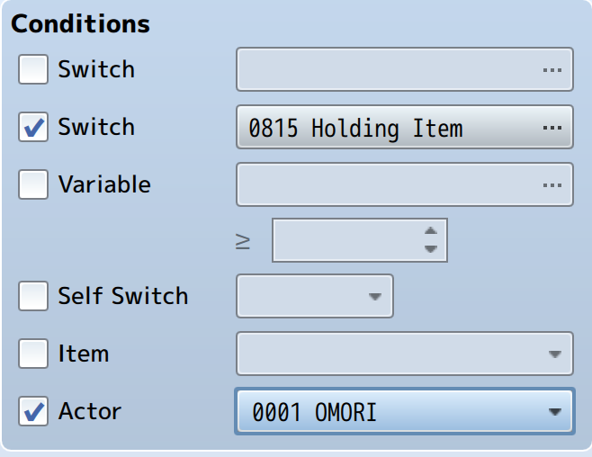

(Source: FruitDragon)

This set of Conditions means that the event page will run when Omori is
in the party and you are holding an item. (This particular one is
impossible in the vanilla game— since the Holding Item Switch is
specific to the sorting chore in Sunny’s house.)

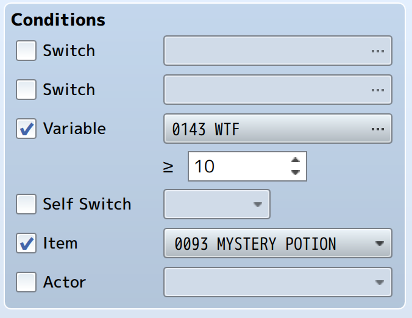

(Source: FruitDragon)

This one means that the event page will run when the save’s WTF Value is
greater than or equal to 10 and the Mystery Potion is in the player’s
inventory.

.. _h.xn0oirjpe53f:

Event Page - Image
~~~~~~~~~~~~~~~~~~

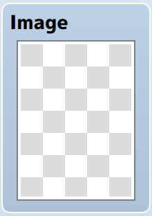

(Source: FruitDragon)

This one’s also pretty self explanatory. When you double click on the
gray and white checkered box, it’ll summon an image selection window.

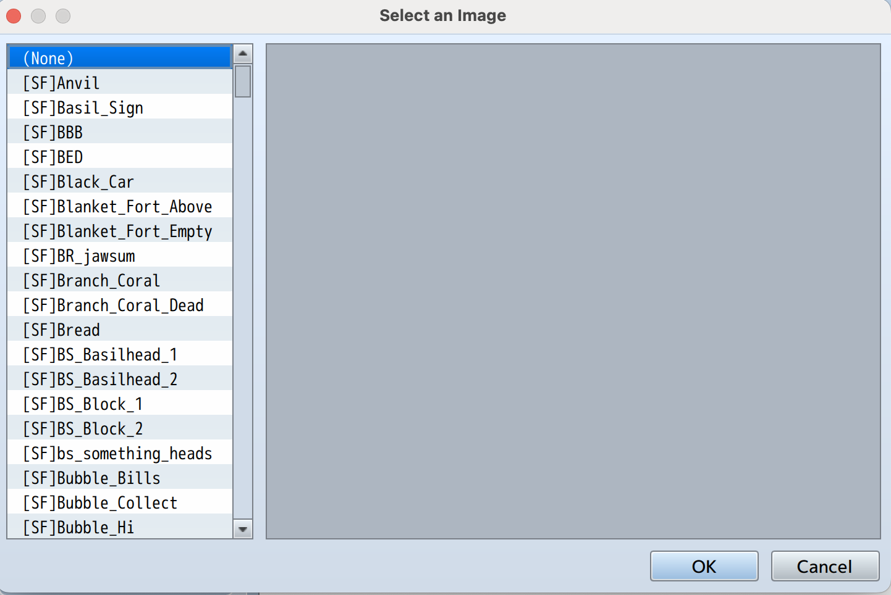

(Source: FruitDragon)

From there, you can select a sprite from the img/characters folder to
use as the image for the sprite.


(Source: FruitDragon)

These are typically found in the basic walking animation groups of 3 x
4— however, in some cases (like the one above), there are some
animations that require fewer sprites. To see exactly how those work,
you can skip ahead to the \ `Sprites Section <#h.gsbdya7y8lgi>`__\ .

There are also some unusually shaped spritesheets in the folder, and
those will look very strange when selecting, because they’re used with
the help of plugins.

Here’s a common one that is used aside from actual character sprite
sheets, usually for dev purposes:


(Source: FruitDragon)

The boxes on the far side are used to denote where Tag Events, Camera
Events, Teleport Events, Initializing Events, Enemies, and more are on
the map, since it’s hard to tell these types of events apart
otherwise. DEV\_ sheets don’t appear in-game, so you don’t have to worry
about a random INIT box showing up in the middle of Forest Playground or
something.

.. _h.sroolriinfxy:

Event Page - Autonomous Movement
~~~~~~~~~~~~~~~~~~~~~~~~~~~~~~~~

This box is used to decide where the Event moves when it’s not being
triggered.


(Source: FruitDragon)

Honestly, they’re pretty self-explanatory.

You can look at the Forest Playground cutscenes to see most of their
advanced capabilities.

.. _h.wczems5bw6cc:

Event Page - Priority
~~~~~~~~~~~~~~~~~~~~~


(Source: FruitDragon)

Priority is what layer of the map the event is on.

Below characters means it’s below the characters’ feet.

Same as characters means it’s on the same layer as the characters, as
though it were a solid obstacle in their path.

Above characters means that it’s above the characters’ heads, so they
can walk underneath without issue.

.. _h.yxr49f829h9e:

Event Page - Trigger
~~~~~~~~~~~~~~~~~~~~

.. _h.w2h3l2mtyci7:

 

 
^^^^^^^^^^^^^^^^^^^^^^^^^^^^^^^^^^^^^^^^^^^^^^^^^^

(Source: FruitDragon)

This determines how the event gets triggered.

Action Button means the player has to activate it using the action
button (Z by default for OMORI). If the event is Above characters or
Below characters, this means they’ll have to stand below it/on top of it
and press the action button to activate it, while Same as
characters means the player needs to face it from the side and use the
action button.

Player Touch means the player has to touch the event ( and face the
event if it’s Same as characters) to activate it. Can also be triggered
the same as Action Button.

Event Touch means the event can touch the player to activate itself.
(The player does not need to face the event.) Can also be triggered the
same as Action Button or Player Touch.

Autorun means that it runs automatically the moment its conditions are
fulfilled. This also locks all player movement until the event changes
pages or is deleted.

Parallel means that the event page runs at the same time as whatever
other event page is running at the moment on that map. Player movement
will not be locked.

.. _h.hfiblx21xj8y:

Event Page - Options
~~~~~~~~~~~~~~~~~~~~


(Source: FruitDragon)

Walking means that the walking animation is turned on when the event is
moving, and only then.

Stepping means that the walking animation is turned on even when the
event isn’t moving.

Direction Fix means that the character in the event can’t change
direction. Useful if you want to make a character walk backward without
having them turn around, or if they only have sprites for one direction.

Through makes it so the character can pass through normally impassable
objects, tiles, and events.

.. _h.m3vv65v4pqh8:

Event Page - Contents
~~~~~~~~~~~~~~~~~~~~~

And finally, we reach the last part of the Event Editor.


(Source: FruitDragon)

This empty box is where the code goes.

“But…” you ask, “what code? What can we even put here?”

Well, dear future OMORI modder, I’m glad you asked! Because that’s our
next topic!

.. _h.n9a33t54rq48:

Event Code
----------

This section is going to be a lot of summary, mostly, since there’s
plenty to go through. For more in-depth, detailed explanations, ask
someone in the \ `Mods.one Discord
Server <https://www.google.com/url?q=https://discord.gg/EDTMF85Hnp&sa=D&source=editors&ust=1782966892321465&usg=AOvVaw2PYq9pQ3lwAkAJ7tdc2wRW>`__\  or
the \ `OMORI Modding
Hub <https://www.google.com/url?q=https://discord.gg/pkBEr7ywCG&sa=D&source=editors&ust=1782966892321580&usg=AOvVaw385Lc3ygdr0RxTCTQE2vZ0>`__\ ,
perhaps one of us.

When you double-click on the Contents box, you get the following menu,
with three pages of options:


(Source: FruitDragon)

Many of them are self-explanatory, especially if you already know how to
code, so I’ll just go over a few that are used often in OMORI and a
couple that are more specific to RPG Maker MV.

.. _h.5n2z0ej0bphn:

Event Commands - Message
~~~~~~~~~~~~~~~~~~~~~~~~

This is a special case. OMORI uses a different system of displaying text
and choices and the like. Therefore, don’t use any of these. Instead,
you would use a Plugin Command, located down below.

.. _h.5r195mh62ho2:

Event Commands - Game Progression
~~~~~~~~~~~~~~~~~~~~~~~~~~~~~~~~~

These are all really important, as they are how you can set Switches and
Self Switches on and off, as well as change the values of Control
Variables and set up a timer using real-life time instead of in-game
frames.\ `[c] <#cmnt3>`__\ :sup:`\ `\ `[d] <#cmnt4>`__

.. _h.2zq34t7fixyq:

Event Commands - Flow Control
~~~~~~~~~~~~~~~~~~~~~~~~~~~~~

Comments are useful in being able to tell what is happening on an event
page, oftentimes to label a Script.

Conditional Branches (or If-Then/If-Else statements) are extremely
useful in making certain things in events happen only when certain
conditions are met. They’re basically the same as if-else statements in
the majority of programming languages.

Exit Event Processing— Essentially terminates the event in the middle.
Like pressing a big red “STOP” button. This will not end the
Autorun player lock, you have to change Event Pages or delete the event.

Label and Jump to Label are the kinds of things that are much better
understood through looking at example events, but I’ll do my best to
explain.

They act as headers that allow you to skip large amounts of code.

Because of the linearity of RPG Maker MV’s code windows, going from top
to bottom, it’s incredibly hard to make it so that portions of code get
passed over without the use of Conditional Branches. Labels solve that
problem. You place a Label somewhere in the code, place a Jump to
Label for that Label somewhere else in the code, and then you can have
the code go straight from the Jump statement to the Label without
running anything in between. It works the other way, too— it lets you
repeat sections of code without having to use a loop. Labels are usually
used in tandem with Conditional Branches. (They are also often found
with the Plugin Commands AddChoice and ShowChoices)

Lastly are Common Events. These are much more complex so we will give
them their own section.

.. _h.8hsacdxrvfa6:

Common Events Vs. Map Events
^^^^^^^^^^^^^^^^^^^^^^^^^^^^

A Common Event is an event that can be called in multiple places, like
reusable code, or a function/method for those already experienced in
coding. As mentioned in the \ `YAML Section <#h.eyo0h7t5nx1p>`__\  of
this guide, it can also be called by the dialogue. Examples of this
include the Shake Screen event, the Picnic Save event, and more— all
things used in multiple places, so the code doesn’t have to be copied
over each time. Events that aren’t specific to a location can also be
put here. An example of this is the Tag System event in the basegame,
shown below:


(source: FruitDragon)

Since tagging occurs when you use the Tag option in the menu, and not
when the player interacts with an object, it’s put as a Common Event so
the menu can call it.

A Map Event is an event that occurs in only one place on the map and is
usually much more specific. Examples of this include Cutscenes and Map
Transitions, since Map Transitions need specific coordinates and
Cutscenes require specific characters and dialogues.

An important thing to note is that Map Events can call Common Events,
but Common Events can’t call Map Events. That being said, Common
Events can call other Common Events.

.. _h.emb55q2fjdi:

Parallel Common Events
^^^^^^^^^^^^^^^^^^^^^^

Now to go another layer deeper, there are three types of Common Events,
based on their Trigger conditions.

Most Common Events are triggered by Map Events and we’ll call these
Regular Common Events, as you will primarily see these throughout the
game and most mods. However there are two other types, being Autorun and
Parallel Common Events, which we will group as Automatic Common Events.
Unlike Regular Common Events, these are not called by Map Events and
instead run when a Switch is active. Autorun Common Events will lock the
player’s movement while active, and Parallel Common Events will run in
parallel to the player and Map Events. They are both very useful for
systems that you want passively occuring across many maps so that you
don’t have to have multiple Map Events running the same code across
different maps, which can be a problem if you need to change all of
them.

It’s also worth noting that Automatic Common Events can be called from
Map Events like Regular Common Events are, albeit this rarely sees use.

.. _h.u9hmorpbrltg:

Making Common Events
^^^^^^^^^^^^^^^^^^^^

To create a Common Event, all you need to do is find an open Common
Event slot in the Database and put your code in. In addition, to assign
it the types listed above, you’ll want to change the Trigger option to
the desired mode, with None being a Regular Common Event, and then
assigning a Switch to control the activity of Automatic Common Events.


(Source: FruitDragon)

Of course, don’t forget to name it! That’s how you’ll be able to
identify the Common Event when you’re trying to call it later on.


(Source: FruitDragon)

Otherwise, adding code is basically identical to coding in Map Events,
so let’s return to those!

The only significant thing to note is that any commands that apply to
the Map Event itself (Self Switches, Movement Routes, etc.) apply to the
Map Event that called the Common Event that called it. Automatic Common
Events by proxy don’t support these commands.

.. _h.c9e51ad7t4ma:

Event Commands - Movement
~~~~~~~~~~~~~~~~~~~~~~~~~

I’ll specifically talk about Set Movement Route here. This is how you
can get characters to move around in cutscenes. When you click on it:


(Source: FruitDragon)

Movement Routes are highly versatile. All of these options are mostly
self-explanatory, so I will instead focus on options provided by the
Script option. These scripts come from the
\ `YEP_MoveRouteCore.js <https://www.google.com/url?q=http://www.yanfly.moe/wiki/Move_Route_Core_(YEP)&sa=D&source=editors&ust=1782966892330803&usg=AOvVaw2cgZpdV0-6yCB1O5dI8XHd>`__\  plugin,
so you may see more options in there. I will cover the basics.

UP: x

LEFT: x

RIGHT: x

DOWN: x

UPPER LEFT: x

UPPER RIGHT: x

LOWER LEFT: x

LOWER RIGHT: x

JUMP FORWARD: x

All of these will move the event in the stated direction for x tiles.

MOVE TO: x

JUMP TO: x

STEP TOWARD: x

STEP AWAY FROM: x

TURN TOWARD: x

TURN AWAY FROM: x 

TELEPORT: x

All of these are self-explanatory, but X operates specially here. x can
be either x, y for exact map coordinates, EVENT X, for the event with an
ID of X, or PLAYER for the, well, I think you can guess.

.. _h.cpsecgbzymtx:

Event Commands - Character
~~~~~~~~~~~~~~~~~~~~~~~~~~

I’ll specifically talk about Show Balloon Icon and Erase Event.

Show Balloon Icon: Shows that icon that sometimes pops up in a cutscene
to show a character’s mood.

Note: To get this command to work correctly, you’ll have to set two
things. You’ll have to set the Control Variable “Change Balloon
Variable” to 0 and then run the Common Event “Balloon Image.” This only
needs to be run once.

The source images can be found in img/system/balloon.png


Erase Event: Erases the event for the duration of the player’s stay on
the current map. The event will be brought back when the player leaves
and comes back to the map.

.. _h.ic5ln0yyl9ub:

Event Commands - Picture, Audio & Video
~~~~~~~~~~~~~~~~~~~~~~~~~~~~~~~~~~~~~~~

These are all used for cutscenes and sound effects. Take a look at some
of the events with cutscenes (Especially the INIT Event in the “❈ >>
BEGIN” map) to find out how they work.

Acronym meanings:

BGM - Background Music (video game soundtrack) [Loops]

BGS - Background Sounds (like ambient noise) [Loops]

SE - Sound Effects (like a door opening) [Doesn’t Loop]

ME - Music Effects (when an ME is playing, all sounds aside from the
ME are paused) [Doesn’t Loop]


(Source: FruitDragon)

And now for the third and final page. I’m only gonna cover the
Advanced section, since the rest are all pretty self-explanatory.

These are a lot more in-depth than the rest, though, so I’ll talk about
them individually.

.. _h.datv5m12g97r:

Plugin Command
--------------

OMORI has a lot of plugins. All you have to do is visit the Plugin
Manager, located next to the Database, to see that. All Plugin
Command does is take a command meant for one of the plugins and runs it.

Probably most used is the ShowMessage plugin command, which is used to
run… dialogue.

We’ve come full circle.

.. _h.kwpdo5k2ky8n:

Dialogue
~~~~~~~~

We’ve talked about how to write dialogue in the .yaml files. But now
it’s time to talk about how to run said dialogue in the game itself.


(Source: FruitDragon)

When we click on Plugin Command, we get the above window. All you have
to do is enter the below text:


(Source: FruitDragon)

Replace file_name with the name of the file you want to get the message
from (e.g. 00_template) and XX with the number of the message.

And that’s it! When you trigger the event in the game, the dialogue will
show.

.. _h.dzkh81t39vca:

Dialogue Options
^^^^^^^^^^^^^^^^

Now, you may know, actually you should know, that OMORI has multiple
instances in which the player must make a choice in the dialogue. This
will usually dictate what is said next. Well, these are done with Plugin
Commands as well. This time there are two.

The first of these commands is the AddChoice command. This adds your
dialogue to be called later. To use it, place this text.

“AddChoice file_name.message_XX label”

The middle section is the same as regular dialogue, except now, it’s
what message the option will show as. Then there’s the label. If you
remember from above, labels are markers in RPG Maker MV events that can
be jumped to in order to skip or loop code. In this context, each
dialogue option will basically act a Jump To Label command to the
specified label, which you input in place of the word label. Now you
just do this for all of your dialogue choices.

Then we need to actually display the choices. This is done with the
ShowChoices command. Simply add the command and then the number of which
choice would be selected if the player were to click “X” or “Cancel”.

Note: It starts from 0, so if you want the second choice to run if the
player clicks cancel, you actually have to put 1. It’s kinda weird but
it’s just how computers are. If you want the player to not be able to
press cancel to skip a dialogue choice box, you can type -1 instead.

And now you know how to fully use dialogue. Congrats!

.. _h.3x1tjmpwqtpn:

Camera Controls
~~~~~~~~~~~~~~~

The other common use for Plugin Commands is to control the camera. This
is done through four mostly self explanatory commands.

Note: The way speed works is slightly counterintuitive. Higher numbers
actually decrease the speed and vice versa. The default is 800, which is
what will be chosen if you exclude Speed from the command.

CAM PLAYER SPEED: Follows the player at the chosen speed.

CAM EVENT ID SPEED: Follows the chosen event at the chosen speed.

CAM DISABLE: Resets the camera to follow the player at default speed.

.. _h.u6hcehxl07t0:

Weather
~~~~~~~

While base RPG Maker MV does have a command for weather effects, OMORI
uses a much more in-depth plugin to control its weather. The plugin
consists of three plugin commands to change the weather and uses six
weather types, those being rain, storm, snow, embers, shine, and leaves.

AriesSetWeatherImage weather filename

This determines what image the game will use for the specified weather
type, pulled from the img/pictures folder. OMORI, despite only using
rain, storm, and snow, also has images for the other three types that
you can use. However you may also use your own images for this.

AriesToggleStormThunder boolean

This is a true or false that determines whether the storm weather type
will show flashes of thunder periodically.

AriesWeather weather power duration

This is what actually sets the weather. Power is a number 1-9 that
dictates the intensity of the weather. Duration is the number of frames
it takes for the weather to fade in.

.. _h.3e2f57whopyw:

Scripts
-------

Scripts are powerful. They let you do things that vanilla RPG Maker
MV doesn’t let you do. Sure, you theoretically have to know Javascript…
but that’s also why looking at pre-existing events is so important. You
can puzzle out and copy their scripts, if applicable. That’s less work
for you, and you don’t need to know Javascript. You just need to know
how to figure out what code does.

A lot of things in the game use Scripts to set variables for things such
as teleportation. Scripts can also be used to set Self Switches of other
events. And these are just a few examples. Like I said, seriously
powerful stuff.


(Source: FruitDragon)

An example of a Script commonly found in the game. This script is used
for setting the variables used to teleport from map to map.

Note: RPG Maker MV has a built-in cap of 12 lines in a Script command.
Due to Omocat working with Archeia, a developer for RPG Maker MV, she
got a customized version to bypass this. So if you see a 13+ line Script
command, do not edit it or else it will be cut off and
broken.\ `[e] <#cmnt5>`__\  That being said, however, you can bypass
this restriction with the recently released RPG Maker MV mod \ `OneMaker
MV <#h.4a99xvlix9d1>`__\ .

Other commonly used scripts include scripts for picture cutscenes, for
better follower control, and scripts for setting variables and switches.
For a full list of nearly all the possible scripts you can use, visit
\ `this official
spreadsheet <https://www.google.com/url?q=https://docs.google.com/spreadsheets/d/1-Oa0cRGpjC8L5JO8vdMwOaYMKO75dtfKDOetnvh7OHs/edit?gid%3D1186334695%23gid%3D1186334695&sa=D&source=editors&ust=1782966892342768&usg=AOvVaw1sUjuRa_oHV_WmGV0DHwir>`__\ .

.. _h.30ui65nu67ka:

Animated Events
~~~~~~~~~~~~~~~

Sprite animation is a pretty large topic, so I’m only going to go over
the basics here.

Usually, it’s done by setting the sprite to a certain section of the
spritesheet and turning the sprite back and forth and left and right so
that the images that you want show up, or by setting them manually with
a Script command. For a guide on which images are in which direction,
just look at the walking animation found for nearly every NPC in the
game.

Here’s an example of a script found when opening doors:


(Source: FruitDragon)


(Source: !objects_fa_doors.png, basegame)

Here’s what the spritesheet looks like, so you can see how it works.

For more complex animations, you can use this script:

script: this.setCustomFrameXY(x,y)

Note: The word “this” in this context is the event the code is being run
from. If you want to set the animation of another event, you’ll have to
replace it with the script call for that, which is
$gameMap.event(eventId). When putting this in a movement route for that
event, however, you would return to using this.

This script sets an Event to an exact frame in their sheet. It’s used
for most complex animations in the game. To cancel out these custom
frames, use this.setCustomFrameXY(null, null). A good example to look at
are the hugging animations.

It’s usually a good idea to look for examples of animations that you
want to make elsewhere in the game so you have an idea of how you’re
going to animate what you want to animate.

.. _h.vehgwrux8uzj:

Shops
~~~~~

Shops are strange little things, since they don’t really appear much.
Nonetheless, I’ll explain how to set them up.

First off, assuming you’re making a shop with new dialogue, you’ll have
to write all of that dialogue. This dialogue has to be placed in
System.yaml. The easiest way to do this is just copy paste one of the
pre-existing dealers and just change their name and their dialogue.

Note: You’ll notice that most of the Faraway Town dealers call for other
yaml files. This is a requirement.

Now we’re going to actually make our shop. First things first, make your
new event and add whatever beginning dialogue or other stuff you want.
Then, once you get to the point of buying or selling, make a dialogue
selection between Buying, Selling, and Cancel. You can refer to the
above sections on how to do that.

Now, in the Buying section, we’re going to use a Script Command, that
being “this.setupShop('name', 0)” What this does is it tells the game
what dialogue it should be showing, which is done through the ‘name’,
which should be the name you gave your dealer in the System.yaml file.
Then the 0 tells the game you are buying. Now just use the Shop
Processing Command to add all your items and set their prices. Make sure
to not tick the “Purchase Only” box. It doesn’t work in OMORI.

Then, for Selling, we’re going to do all of that the exact same, except
for one change. We’re going to replace the 0 with a 1, to tell the game
we are selling instead of buying. You’re still going to need the Shop
Processing by the way, even if it does nothing when selling, since it’s
what tells the game to actually pull up the shop menu.

Lastly for Cancel, you just end the event. Not much to say about it.

Also if you want to add a portrait for your dealer, you’ll have to mess
with plugins to do that, or use
\ `TR_PictureShops <https://www.google.com/url?q=https://github.com/modsone/omori-modding-resources/blob/main/Data%2520Organization%2520Plugins/TR_PictureShops.js&sa=D&source=editors&ust=1782966892347341&usg=AOvVaw31CDcnxbOZtCL0vGJ9rlE8>`__\ .
Honestly, though, it’s not super important, as only the Mailbox has a
portrait in OMORI.

.. _h.9j8d825dwjpk:

Animated Pictures
~~~~~~~~~~~~~~~~~

In OMORI, pictures get animated all the time for various cutscenes, such
as the White Space intro. The game will also store multiple pictures
together in one sheet, and yet be able to only use one frame of it. So
how does it do that?

The answer is that it uses scripts.

The first thing we need to do is to create the picture we want to
animate. Simply use the Show Picture command and preferably set the
opacity for the time being to 0. Also make sure to keep in mind the ID
you are using. The higher IDs will always display higher, and an ID of
1 displays below the characters.

Now we can begin to script.

Firstly we need to define to the game what the divisions are between
each frame, so we use this script:

this.setupPictureCustomFrames(id, width, height, hframes, vframes);

Now let’s break down what each of those are.

The id is simply the ID of the picture you’re applying the frames to.

The width and height are the pixel widths and heights of the ENTIRE
image, not just one frame.

The hframes and vframes are the amount of horizontal and vertical frames
in the image.

Now what we add after is dependent on what we’re doing.

If you’re just setting a single frame of an image, like say a lighting
overlay, use this;

this.setPictureFrameIndex(id, frameId);

Once again id is the picture ID, meanwhile frameId is the ID of the
frame. Frame IDs are ordered from left-to-right, top-to-bottom, starting
at 0. So the top left is 0 and then the one to the right is 1 and so on.

However if you’re setting an Animation, then use this instead;

this.setPictureAnimation(id, frames, delay, loops, wait);

Alright now let’s break this down again.

First up the id is the same as always, the Picture ID.

Next is the frames. This is an Array of the frameIds that you want the
animation to go through. For those who don’t know, an Array in
JavaScript is a list of values stored as a variable. They look like
this: [value,value,value,value] So if you want to have your frames go
from 0-6, then your frames will look like [0,1,2,3,4,5,6].

The delay is the number of frames (as in your monitor’s fps) that it
takes to update from one frame to another.

The loops determines how many times the animation should play before
being complete, if you want to set it to infinity, type Infinity.

Lastly, the wait is a true or false (otherwise known as a boolean) that
determines whether or not the game waits for the animation's completion.

Now with the Move Picture command, you can fade in your animating
picture. And once you’re done with all your custom framed pictures, make
sure to include a this.removePictureCustomFrames();

.. _h.toiszrxt17u7:

Fog \ `🕊️ <https://www.google.com/url?q=https://mods.one/author/FoG&sa=D&source=editors&ust=1782966892352030&usg=AOvVaw1ma6TLmAG4M-Dp6gpquyOx>`__
~~~~~~~~~~~~~~~~~~~~~~~~~~~~~~~~~~~~~~~~~~~~~~~~~~~~~~~~~~~~~~~~~~~~~~~~~~~~~~~~~~~~~~~~~~~~~~~~~~~~~~~~~~~~~~~~~~~~~~~~~~~~~~~~~~~~~~~~~~~~~~~~~

A feature I rarely see get used in mods is fog. Fog is used in basegame
areas like the North Lake for a misty atmosphere.

From a technical standpoint, fog is effectively just a tiled (tiled as
in it has seamless edges, not the program Tiled) image looping across an
entire map. This means that you can actually use it for a lot of cool
things aside from just fog, but that's for you to figure out how to be
creative with it. I’m simply here to break down the script.

let fog = this.generateMapFog()

fog.move.x = x_scroll

fog.move.y = y_scroll

fog.name = ‘name’

fog.opacity = opacity

fog.blendMode = blendmode

this.createMapFog(‘fog1’, fog);

Now let's break down everything in this script.

The move.x & move.y determine the scroll speed of the fog, equivalent to
that of parallax scrolling.

The name is the filename of the fog from img/overlays.

The opacity is from 0-255 and is the, well, opacity of the image.

The blendmode is a value that determines the Blend Mode of the image.
These take a number value associated with the 4 Blend Modes in RPG Maker
MV, being 0 (Normal), 1 (Additive), 2 (Multiply), 3 (Screen).

Lastly an important note, if you use fog in a looping map, the fog
image’s dimensions must be a factor or multiple of the map’s image
dimensions, so for example a 1024\*1024 map must have the dimensions be
factors/multiples of 1024. Otherwise when reaching the looping points of
the map, the fog will begin to teleport.

.. _h.49my6p8x81ju:

Event Examples
--------------

(source: parallels, courtesy of FruitDragon)

Teleport Scripts!

The door is animated, as you can see with the Movement Route; and then
the Game Variables are set using a Script.

Finally, the Common Event Teleporting Style is used, the sound effect is
used, and the movement route to close the door is shown. The Common
Event Fade-In Screen is used to make it so the new map kind of fades
into view.

There are other types of Teleport Scripts aside from front doors,
though, so it’s always good to check those out!


(source: parallels, courtesy of FruitDragon)

Door cutscenes!

As you can see, there’s an animation added to show the door opening.
Sound effects are used for the audio. In the first visible script,
$gameMap.event(6).setPosition(x, y); changes the position of Event 6 to
46, 10. Afterwards in the second part of that same script, though it’s
partially cut off, the Self Switch of that event is set to True, which
in this case will make the Event’s sprite visible.

.. _h.uhf8h4xswr8:

Maps
====


“So… what, exactly, is a map?”

Well you’re looking at one right now! Look at that banner. It’s a map!
Excluding the words and npcs…

A Map is the land that the party gets to move around on, and where
events are located.

Maps are located in the bottom left corner of the RPG Maker MV editor:


(source: FruitDragon)

.. _h.y2wi4nyj8sy8:

Basic Facts about Maps
----------------------

You can find all the information here at the bottom right of your
editor!!

(source: parallels, courtesy of FruitDragon)

#. The Coordinate System

Maps use a coordinate system of (x, y), much like most grids; however,
the origin, or the (0, 0), is located at the upper left corner, so
farther right equals a higher X value, and farther down means a higher
Y value.

Coordinates are how you decide where certain events go, based on the
tilemap, and they are also an easier way to figure out where to move
events around the map. Teleport scripts also use the coordinate system
to figure out exactly where to put the player.

2. Map ID

This is an ID number assigned to each map. In the example above, it’s
520. It’ll be very relevant later, when we’re discussing how to assign
tilemaps to maps, and it is how you can reference a map from another one
in Events.

3. Dimensions

The numbers inside the parenthesis. Basically, it tells you how large
your map is. This’ll also be very important when making tilemaps.

“FruitDragon,” you might say, “you’ve mentioned tilemaps, but what
actually is a tilemap?”

Tilemaps are what you see when you load a map in the game. Let’s go over
them in a bit more detail.

.. _h.mmbjv9ne17a2:

Tilemaps
--------


(source: map28, Kim & Vance’s house, basegame)

This is a Tilemap. They’re made of tiles, using the \ `Tiled
1.0.3 <https://www.google.com/url?q=https://github.com/mapeditor/tiled/releases/v1.0.3&sa=D&source=editors&ust=1782966892358962&usg=AOvVaw01okWJzzhbNkontRJcfLJh>`__\  software.
No other version will work correctly without external plugins.

(Note: You can use the \ `most recent Tiled
version <https://www.google.com/url?q=https://www.mapeditor.org/&sa=D&source=editors&ust=1782966892359223&usg=AOvVaw0h4KgFa3PoBN0-8HYwpj6x>`__\  alongside
the \ `tiledfixer plugin <#h.bgfu25fl9tkh>`__\ . It provides more
stability and support, and better tools. If you download it, however, it
overwrites your Tiled 1.0.3 software, so it’s best to install it in
every playtest you plan to edit maps in.)

All Tilemaps found in the game are in the maps folder in the playtest
folder.


(source: FruitDragon)

The maps themselves just look like a bunch of numbers when you open them
in a code editor. Definitely not like what you’d expect from the game.

When you open the same file with the Tiled editor though, this is what
shows up.


(source: map53, Artist & Angel’s house, basegame)

A Tilemap is made up of multiple Layers: the Layers below the
characters, the Layers on the same levels as the characters, the Layers
above the characters, and the Collision Layer. That Collision
Layer makes it so that the player can’t walk through objects, or
wherever you place a collision tile. It will not show up in-game.

In the photo above, the translucent red layer is a visual representation
of the Collision Layer. That same layer is made invisible in the image
of Vance & Kim’s house, mostly to make it easier to tell what things
are.

Where do the tiles used in Tilemaps come from, though?

.. _h.duuhxgwfm0h:

Tilesets
--------

Tilesets are included with the basegame. They’re basically just sets of
all the 32px by 32px Tiles that are used in Tilemaps.

They’re located in the same folder as the maps themselves
(playtest_folder/maps), and can also be opened with the Tiled map
editor. To use a Tileset in a Tilemap, you need to load the tileset in,
so that the Tilemap can access it.

The images associated with the tilesets (separate from the tilesets
themselves) are located in the img/tilesets folder, like so:


(source: FruitDragon)

Tilesets are generally densely packed, as shown above. This is so you
can have as many tile options as possible while having as few tilesets
loaded in at once as possible. Sure makes finding certain tiles in the
tilesets a pain, though… It certainly helps to look at previously
existing maps and find out which tilesets the tiles you want come from.

But how do we use all this to create a map?

.. _h.744w6vj0sw7n:

Creating Maps
-------------

Here is a \ `really good video
tutorial <https://www.google.com/url?q=https://youtu.be/pstj8qSbM0g&sa=D&source=editors&ust=1782966892362576&usg=AOvVaw32HtKu5k-SlHiMW0PT78Iv>`__\  on
how to create maps. I seriously recommend you watch it! However, I’ll
also go over it here in much more detail, too. And, as always, it helps
to experiment with the Tiled editor or watch a few tutorials about it,
too!

First, we have to make a new map in RPG Maker MV. It’s important to note
that the map organization is based on which map you have selected in the
editor when you create the map. Here’s an example:


(source: FruitDragon)

Right now, I have the Developer’s Room selected. When I create a new
map, it goes here, at the bottom of the Developers’ Room category.


(source: FruitDragon)


(source: FruitDragon)

However, when I select the main game…


(source: FruitDragon)

The map shows up here instead.

Don’t worry, though! If you end up creating your map in the wrong place,
you can drag and drop it to where you want it to go. Just drop it on the
map you want it to nest underneath.

So, now that we’ve got that out of the way… let’s get into making a map.

Right-click on the map category you want your map to fall under, then
click on New.


(source: FruitDragon)

It’ll open up the following window:


(source: FruitDragon)

There, you can name your map, change the width and height, make it
scroll if you want (making it an infinite map instead of a map bound by
the dimensions, think of the Endless Highway in Deeper Well or many of
of the rooms in Black Space) and add specific music to play when the
player enters the map.

Note: Display Name is usually what is shown as the name at Save Points.

It’s important to understand that background sounds persist between maps
if they aren’t directly changed. Toggling the selection but leaving it
blank cuts off any audio that’s already playing, though. For example, if
you have background audio, such as wind rustling through trees, that you
want to cut off when you walk inside a house, turning on the setting
like below but not selecting any sound will make it so that the music
will stop but there won’t be any audio playing in its place.

This is also the case for Battlebacks, the term used for battle
backgrounds.


  

(source: FruitDragon)

You can also add a parallax image. Parallaxes are located in the
img/parallaxes folder.


(source: FruitDragon)

They’re basically the background images of maps, and they show up when
the player moves to the edge of a map, or through empty gaps in maps,
such as in the Town Area in Black Space. Usually they’re considered the
sky of the map, but there are cases, mainly in Black Space, where
they’re something else.

You can make the parallax image move across the screen using the Loop
options. Feel free to fiddle with the numbers and find out how best to
do it!

So, here are my settings for this map:


(source: FruitDragon)

It’s important to note the ID (530, for me) at the top of the screen.
We’ll need this when we make our tilemap.

I also decided to have the map loop horizontally but not vertically,
similar to the Endless Highway. This means that the player won’t be able
to go past the top or bottom of the map, but can go left or right
indefinitely.

Once you’ve decided all your settings, make sure to click “OK” at the
bottom. Your new map should show up in the list of maps on the corner of
your RPG Maker MV editor!

And that’s all there is to do in RPG Maker MV. Now, it’s time to switch
over to Tiled.

Before we can do that, though, we need a tilemap to edit. In the maps
folder, find the following file:

maps/map00_Template_32x32.json


(source: FruitDragon)

Make a copy of it and rename it to mapXX (XX being the ID number we
noted down earlier). That’s how RPG Maker MV will know that the tilemap
we’re gonna make belongs to the map we made in RPG Maker MV.

Here’s mine:


(source: FruitDragon)

Now, open it in Tiled.


(source: FruitDragon)

This is what the resulting editing window will look like. First, before
we do anything else, we want to resize the tilemap to fit the dimensions
of our map in RPG Maker MV. We can do that by clicking on Map > Resize
Map from the toolbar at the top of the screen.


(source: FruitDragon)

Once that’s done, it’s time to make our map.

“But why are there so many layers? What do they all mean? How do I get
the tileset that I want?”

Let’s go over a few things about the Tiled map editor before we start
making our map.

.. _h.c6knh11gmt4l:

Loading Tilesets
~~~~~~~~~~~~~~~~

Loading a tileset is pretty simple.


(source: FruitDragon)

This window in the corner is where the tilesets show. If I want a
tileset that isn’t there, though, all I have to do is:

#. Locate the tileset in my file manager (usually, the name is the
   internal name of the area)
#. Click on Map > Add External Tileset
   


(source: FruitDragon)

3. Select the tileset that I want (make sure that the file type is set
   to .json)
   


And that’s all! The tileset that I want is now added to the map that I
just made, and I can freely use any tile from it in my tilemap.


(source: FruitDragon)

Note: Do not load every tileset at once. Learned this the hard way,
haha. There are some tilesets in the folder that don’t work due to
calling for images that don’t exist, and those will basically render
your new tilemap useless— not to mention that after a certain number of
tilesets (approximately 16), Tiled can no longer identify tiles
properly. I have gone through every single file in the maps folder, and
a list of every usable tileset is in \ `this
spreadsheet <https://www.google.com/url?q=https://docs.google.com/spreadsheets/d/157gbdncgn1_1sT9ZbLotL1KiRml7Y1oFKG7rZEccOA0/edit?usp%3Dsharing&sa=D&source=editors&ust=1782966892371222&usg=AOvVaw0CHXN3Fh16FroxER6VX8jA>`__\  for
your reference, with some styling and extra info from TomatoRadio.
Generally, if a tileset doesn’t have a corresponding image
in img/tilesets, it’s busted.

“What’s the difference between all of these layers? Which layer do I
use, though? What even is a layer?”

Well, I think it’s time to go over the next major part of making a map
in Tiled:

.. _h.54pr6pc8yb8l:

Layers
~~~~~~

Layers are what add depth to our maps. How else will we make it so that
some tiles go above the player, but other tiles are below the player’s
feet, and still others are on the same level as the player?

The answer is simple: Layering.

If you’ve ever heard of the Layers used in digital art and photo
editing, Tiled’s Layer system works much the same way. They go in order
from bottom to top, the topmost layer being the Region and Collision
layers, usually. This makes it easier to tell what parts of the map
you’ve already set as a certain region or blocked off, since they’re not
blocked by any tiles from layers above.


(source: FruitDragon)

The layer menu for an OMORI tilemap will look somewhat like this.

The naming convention for tile layers is as follows: GROUND, for tiles
that go under the characters’ feet. SAME AS CHARACTER, for objects that
they can interact with. And ABOVE ALL, for things like tree leaves and
overhangs (the secret path in Otherworld comes to mind) that the player
has to walk under. Then there’s COLLISIONS, for collisions, and REGIONS,
for region tiles; both of which we will go over later.

However, the game doesn’t read the layers with the name that Tiled has—
if you opened the map as is to RPG Maker MV, you’d get the characters
traveling around on a flat plane. (And worse, the collision layer and
region layer would be visible.) Instead, we have to set a few custom
properties. But how do we add custom properties?

.. _h.3swd68k6a8dj:

Adding Custom Properties
~~~~~~~~~~~~~~~~~~~~~~~~


(source: FruitDragon)

This is your properties window. By default, if you used the template,
you’ll already have two custom properties loaded in; priority and
zIndex. However, there’s more types of custom properties than just those
two. To add a new one:


(source: FruitDragon)

Click on the plus sign at the bottom.


(source: FruitDragon)

Put the name of the property in the corresponding box. You should
not change the data type of the property from ‘string.’


(source: FruitDragon)

You’ll be redirected to the Custom Properties bar, where your new
property will pop up. Once there, you can put in the value for that
layer.

.. _h.8h5e0uugfcqj:

Guide to Custom Properties 
~~~~~~~~~~~~~~~~~~~~~~~~~~~

The most important properties that we’re gonna have to add, the ones
that need to be added to every single layer (excluding Region and
Collision layers) are zIndex and priority.

.. _h.6m2jfl5vulxq:

zIndex
^^^^^^

zIndex tells OMORI what layers are in relation to the player. OMORI
typically uses three different zIndex values:

1: Ground (below character)

3: Same as character (same layer as the player)

5: Above all (character goes underneath)

Note: The game is only able to display 256 Same as Character tiles at
once, so use them only when needed.

There are more possible values than this, but OMORI doesn’t use them, so
you don’t have to. Still, here’s a quick guide.


(source: \ `this google
doc <https://www.google.com/url?q=https://docs.google.com/document/d/1LyoDxBbtw4MUb7HirIZEaigpbJOcbwTelby7vttIAlg/edit%23heading%3Dh.dckld2q0kapk&sa=D&source=editors&ust=1782966892376861&usg=AOvVaw2_PrKN1bpRHBfZMRR2cy-m>`__\ )

.. _h.il08r9x6bhne:

Priority
^^^^^^^^

priority is basically in what order the layers should be loaded (as in
loaded into memory, not layering). Priority numbers reset with each
zIndex change. The lowest priority number with the lowest zIndex value
is loaded first, followed by the next highest priority layer loading on
top of it, and the next; until the zIndex goes up and the priority goes
back to 1.

A good way to visualize it is through a table. Each value in the
table is in the order (zIndex, priority) and it goes from left to right,
top to bottom.

==== ==== ==== ==== ====
1, 1 1, 2 1, 3 1, 4 1, 5
3, 1 3, 2 3, 3 3, 4 3, 5
5, 1 5, 2 5, 3 5, 4 5, 5
==== ==== ==== ==== ====

.. _h.6dcu8zc6ja26:

RegionId
^^^^^^^^

regionId is basically a way to apply an effect to sections of your map.
There are a few different RegionIds that have specific effects on the
party. These can be set by setting the “regionId” custom property to the
specific id.

The effects are:

1: Used to make the mirrors in Headspace reflect the player.

10: Makes the player slide. The Snowglobe Mountain ice uses this.

20: Acts as a collision tile, but only for events, not the player. The
rugs in the Last Resort use this.

28: Makes footprints appear. Sand and snow use this, as do the bloody
footprints from the Truth Sequence. To make the bloody footprints show
up, however, you have to turn on Switch 84 ‘used in recital’.

90: Makes the party use their climbing sprites. All ladders use this.

92: Flashes the screen red and damages the party for 10 Heart. Cannot
kill. Used by the shattered mirror in Black Space 2.

The tileset “Tile_Region_32x32” has tiles for regions 1-127. These don’t
have any inherent effect on regions, but they are good for labeling.

You can use Regions to make JavaScript checks on where the player is
with $gamePlayer.regionId(). For example if you need to check if the
player is in Region 3, just use $gamePlayer.regionId() === 3. In
addition, you can use plugins to run a common event when a player stands
in a certain region.

There is one big limitation however to keep in mind however. A tile can
only be assigned one region. So you can’t for example, have a patch of
snow that leaves footprints with Region 28. Those tiles are not able to
also block event movement with Region 20.

.. _h.pqgfttwpjtgu:

Collision
^^^^^^^^^

collision is basically what makes a Layer a Collision Layer. All
collision layers are automatically set to invisible when loaded in game,
and they are used with a special tileset known as
TileCollision_32x32.json, located in the maps folder (though it’s
automatically loaded in with the template map.)

When you create a collision layer, all you need to do is set the
collision property to tile-base, like so:


(source: FruitDragon)

Note: The Collision Layer in the template map is already set up
correctly

.. _h.ok4qspe7hp9b:

Levels 
^^^^^^^

In addition, you can also make multiple Levels on your map in order to
create layouts where for example you can pass under bridges taking one
path, but that you walk over on a different path.

Levels are easily the most complicated of these properties, so I’ll
break it down into the two parts of it.

.. _h.5rwfcmuncpe0:

To Level Tiles
''''''''''''''

The first thing we’ll need is to create two new layers, which we’ll call
TO LEVEL 0 & TO LEVEL 1. What these are going to do is that when we pass
by a tile on that layer, it will move the player up or down to the
corresponding Level. Usually the transition is placed on the “path”
(ladder, stairs, etc) that takes you between layers, where TO LEVEL 0 is
at the bottom and TO LEVEL 1 is at the top, looking similar to this
crudely drawn diagram.


(Source: TomatoRadio)

Conveniently, the Collision Tileset has tiles to mark these tiles on the
map for ease of use. 


However, we need Custom Properties to get these layers to actually do
anything.


(Source: TomatoRadio)

First, the level property marks what Level the layer is on. By default,
all layers are on Level 0.

Next, the toLevel property marks that when stepping on a tile of this
layer, the player is moved to the specified Level, here being 1.

Now make an inverse version for returning to Level 0 and you have your
transition layers done!

.. _h.1be4xd4z0nt3:

Level Layers
''''''''''''

Now that we have the ability to move between Levels, we need to create
the layers that change between levels.

Once again, we’ll need two types of Custom Properties.


(Source: TomatoRadio)

Here we have an Above All layer and a Ground layer, respectively. This
Above All will only display if the player is on Level 0, and the
Ground Layer will only display if the player is on Level 1.

These are done with these two properties:

Level once again simply marks what Level a layer is on.

HideOnLevel is pretty self-explanatory— if the player is on the
specified level, then the layer is hidden.

When used in pairs like these, we can create objects like bridges that
act as Above All when on Level 0, and act as Ground when on Level 1.

Lastly, in maps with Levels, collision and region layers need to be made
for both levels, using the same properties as above.

Still don’t understand? Scroll down to the \ `Level
section <#h.mbezaci7kne4>`__\  in the Making Our Map heading for a more
step-by-step explanation.

.. _h.xeqmo5erxcjt:

Making Our Map
--------------

Now let’s use what we’ve learned to make our map!


(source: FruitDragon)

Here’s my editor in its entirety. My plan is going to be a map of
islands connected by bridges that the player can move around, with
ladders leading into the water so that the player can swim underneath
the bridges and between islands. Let’s see how to implement that!

For this we’ll need two levels: one for the ground layer with the
islands, and one for the water. They’ll need different collision
layers as well.

I’m going to start building the island layer first. I’ll start with the
terrain tiles and set up a basic idea of what I want my terrain to look
like.

“Wait— terrain tiles?”

.. _h.w249jq4tobw:

Terrain Tiles
~~~~~~~~~~~~~

Terrain tiles are a much much easier way of tilemapping, especially with
tiles such as land tiles. Instead of having to manually place each piece
and potentially getting mixed up, Tiled has a way of doing it
automatically with the use of Terrain Tiles.

To create Terrain Tiles, simply open the tileset in the Tiled editor by
clicking “Edit Tileset”, then set them up. It’s the little icon with the
wrench.


(source: FruitDragon)

Now that you have your tileset open, click the icon that looks like a
tiny tilemap to open the Terrain Sets editor.


(source: FruitDragon)

Click the plus sign and add a new Corner Set.

Note: If you are using v1.0.3, then it will not prompt for what type of
Terrain Set you want, as v1.0.3 only has Corner Sets.


(source: FruitDragon)

Feel free to name your terrain set whatever you want! I just named mine
after the tileset I’m using, DW_VastForest.


  

(source: FruitDragon)

Now all you have to do is set up the terrain set like below. To do this,
all you need to do is drag your mouse where you want the terrain to be.
All this is doing is defining what type of tile each of these tiles are—
a top tile, a corner tile, an inverted corner tile, etc. Make sure to
save!


(source: FruitDragon)

Then, you can navigate to ‘Terrains’ at the bottom of the editor and
select your terrain set.


(source: FruitDragon)

Now you can simply drag your cursor and your land will be made
perfectly, just like that!


(source: FruitDragon)

Note: OMORI does come with a premade set of Terrain Sets, in
TerrainTiles.json. If you load that tileset to your map, it will
automatically load the corresponding Terrain Sets for your access.

Now let’s go back to making our maps.

.. _h.vh0gxfz6yi3u:

Making the Map
~~~~~~~~~~~~~~

Here, I’ve gone and set up an island archipelago using the light green
grass from Vast Forest (DW_VastForest.json, or more specifically the
Vast Forest grass in TerrainTiles.json) and the medium blue water from
North Lake (DW_NorthLake.json). I used the bottom two layers— GROUND -
I for my water, and GROUND - II for the islands. It’s looking pretty
good so far!


(source: FruitDragon, a map made for The Dreamer)

Now I’m interested in making the bridge system. I’ve created some custom
bridge tiles by editing the bridges from DW_NorthLake.json, so I’ll be
using those.


(source: FruitDragon, a map made for The Dreamer)

Looking nice! I decided to make it so that in order to reach some of the
islands, the player will have to go through the water instead of only
using the bridges to navigate. I also like how it’s a little bit like a
maze. I ended up using two layers for this, GROUND - III and GROUND -
IV, because of some overlap between tiles that required using a second
layer.

Speaking of going through the water, the player will need to be able to
get into the water. Let’s put down some ladders.


(source: FruitDragon, a map made for The Dreamer)

I used some of the ladder tiles from general_use.json for this. There
are quite a few types of ladders on that tileset! I’ll put these on
GROUND - V.

But wait, I’ve already run out of GROUND layers!

That’s okay. To create a new layer, all I need to do is right-click the
layer window, then click New > Tile Layer.


(source: FruitDragon, a map made for The Dreamer)

After that, I can name it whatever I want. I’ll put custom properties at
the end, once I’m finished with the map, in case I need more layers.


(source: FruitDragon, a map made for The Dreamer)

Now it’s probably a good idea to add some detailing. Things like grass
tiles, flowers, and trees. For detail work, I like to go section by
section— in this case, island by island— so I don’t lose track of where
I’ve done detailing and where I haven’t. I’ll start with adding grass
and flowers, then add trees on a different layer.

Note: For detailing with multiple variants of a single-tile piece of
decor, like grass tufts or flowers, you can select all of the tiles you
want by holding ctrl and then enable the random tool, which looks like a
pair of dice. This will make every tile you place be a random one of the
selected tiles. This also works on the fill and rectangle tools.


(source: FruitDragon, a map made for The Dreamer)


(source: FruitDragon, a map made for The Dreamer)

All of these grass and flower tiles are on the
DW_VastForest.json tileset. Now for trees. I’m going to place the bottom
half of the trees on the GROUND layer, and place the top half of the
trees on the ABOVE ALL layer. This is so that we can appear above the
stump, but behind (below) the leaves.

Note 1: This is a good time to remind you that you can select multiple
tiles (without the random tool), and be able to mass-place them with the
rectangle tool. This is especially useful for blocking out where trees
will be.

Note 2: For small amounts of trees, you can also place them on the SAME
AS CHARACTER layer; however, there is a limit to how many of these tiles
will be visible to the player at once, and will display as invisible if
exceeded.


(source: FruitDragon, a map made for The Dreamer)

I decided to add bushes on the same layer as the trees. These are also
from the DW_VastForest.json tileset.

Also, I saw a submerged tree tile on DW_VastForest.json that seems cool
to add in the water. Let me add a few of those. I’m going to add these
on the same layer as my land tiles for ease (GROUND - II).


(source: FruitDragon, a map made for The Dreamer)

With that, I’m done with my tilemap!

…Or at least I would be if I didn’t need collision. And region layers.
Oh, and levels, of course.

On that note, let’s get our land and water level system set up. You can
skip to the \ `Region and Collision <#h.hv052rq283sr>`__\  section if
you’re not interested in making a level system.

.. _h.mbezaci7kne4:

Levels
~~~~~~

Because I want the player to start on the land, I’m going to make that
Level 0. RPG Maker MV automatically sets a player to Level 0 when they
enter a map, so that’s the easiest option. This makes our water layer
Level 1, since that’s the level that the player has to transition on to.

When the player is on Level 1, I want the bridge to go above the player.
In order to do that, I’m going to make a duplicate of my two bridge
layers and set them to Above All.


(source: FruitDragon, a map made for The Dreamer)

Of course, I need to remember to set my zIndex to 5!


(source: FruitDragon, a map made for The Dreamer)

.. _h.i6g3tk6bxuj8:

level and hideOnLevel
^^^^^^^^^^^^^^^^^^^^^

Now it’s time to add the level and hideOnLevel properties. The ground
bridge needs to be hidden when the player is in the water (Level 1), and
the above all bridge needs to be hidden when the player is on land
(Level 0). Let’s see what that looks like.

My GROUND bridge:


(source: FruitDragon, a map made for The Dreamer)

My ABOVE ALL bridge:


(source: FruitDragon, a map made for The Dreamer)

Now to set up a way for the player to go between those levels. Because
the only way from the water to the land and vice versa is through the
ladders, I only need to set up a transition next to each ladder.

You’ll want to create two layers like this, preferably at the top of
your layers list for organization purposes.


(source: FruitDragon, a map made for The Dreamer)

TO LEVEL 1 will be located at the base of the ladder, while TO LEVEL
0 will be located at the top of the ladder. Let’s see what that looks
like.

.. _h.lsfiao7qtahz:

TO LEVEL 0:
^^^^^^^^^^^


(source: FruitDragon, a map made for The Dreamer)

The “LVL 0” tile shown is from the Tile_Collisions_32x32.json tileset.
Here’s what the Custom Properties look like:


(source: FruitDragon, a map made for The Dreamer)

.. _h.xc88rfjemkb5:

TO LEVEL 1:
^^^^^^^^^^^


(source: FruitDragon, a map made for The Dreamer)

The “LVL 1” tile shown is from the Tile_Collisions_32x32.json tileset.
Here’s what the Custom Properties look like:


(source: FruitDragon, a map made for The Dreamer)

.. _h.la0zlwojldex:

Final Note
^^^^^^^^^^

And that’s about it! Make sure to do the hideOnLevel and level
properties for any other layers that change between levels. For any
layers that don’t change between levels, however (such as the water
layer and the land layers for my map), you don’t need to add a level or
hideOnLevel property. Those ones will remain the same regardless of what
level that you are on.

However, for REGION layers and COLLISION layers, you will need to have
separate layers for each level. The COLLISION layer is especially
crucial, as if you don’t have a separate collision layer for every
level, the game will break.


(source: FruitDragon, a map made for The Dreamer)

The custom properties for these will look something like this.

Collision:


(source: FruitDragon, a map made for The Dreamer)

Region (Region 90):


(source: FruitDragon, a map made for The Dreamer)

Now let's talk about making these region and collision layers.

.. _h.hv052rq283sr:

Region and Collision
~~~~~~~~~~~~~~~~~~~~

.. _h.lhdbh6c7uyg5:

Collision
^^^^^^^^^

Making a collision layer is simple. There’s a tileset, called
Tile_Collisions_32x32.json, that is used for collision layers.


(source: FruitDragon)

The red collision tile, known as the full collision tile, is the tile
that we generally use most for collision. It’s the easiest to use and
the hardest to mess up. The player and other events (barring those with
Through turned on) cannot step onto these tiles in any way.


(source: FruitDragon, a map made for The Dreamer)

The other collision tiles (ignoring the LVL 0, LVL 1, and LVL
BLK tiles), known as partial collision tiles, are slightly different.
With these tiles, the player will still be able to walk onto the tile
with a partial collision tile, but only from the direction marked with
an arrow. Similarly, the player will only be able to leave the tile from
the direction marked with an arrow. Therefore, these are used in much
rarer cases, where the ‘wall’ is between two tiles.

In the example below, I didn’t want the player to be able to access the
ladder from the side, so I used a partial collision tile.


(source: FruitDragon, a map made for The Dreamer)

Basegame also uses these for things like poles.


 


(sources: map63, Faraway Park, basegame; and map383, Beach Memory,
basegame)

Once a collision layer is done, add the collision Custom Property to it.


(source: FruitDragon, a map made for The Dreamer)

And that’s about it for collision! With Levels, each level needs to have
a separate collision layer, but otherwise, collision is complete.

.. _h.ur8ac4njpw83:

Region
^^^^^^

I need to add Region 90 to my map on the ladders, so that the player has
a climbing animation when they climb it. How do I do that?

A region layer is just as simple as a collision layer. Just like
collision, there’s a tileset known as Tile_Regions_32x32.json, which is
the tileset that we use for regions.

For my Region 90 layer, I’ll use the tile marked with a ‘90’. All I need
to do is put the ‘90’ tile on each ladder.


(source: FruitDragon, a map made for The Dreamer)

And to finish it off, I’ll make sure my regionId Custom Property is set
to 90.


(source: FruitDragon, a map made for The Dreamer)

When working with regions, however, it’s important to note that if you
put two different region tiles on the same tile in two separate region
layers, they cancel out. So watch out for that! Also, make sure to have
separate region layers per level.

.. _h.32pa3rmtd2dr:

Organization
~~~~~~~~~~~~

Organization is really, really important when it comes to making maps.

Because right now? My map is a total mess.


(source: FruitDragon, a map made for The Dreamer)

Not to mention, my zIndex and priority Custom Values aren’t lined up
properly. But I can barely tell what anything is supposed to be, let
alone what zIndex and priority values go where.

So how do I organize this?

.. _h.vr5yao4107kr:

Step 1: Delete Unused Layers
^^^^^^^^^^^^^^^^^^^^^^^^^^^^


(source: FruitDragon, a map made for The Dreamer)

This is already looking significantly better. Way less overwhelming and
easier to deal with.

.. _h.ycgknkie60k4:

Step 2: Rename All Layers
^^^^^^^^^^^^^^^^^^^^^^^^^

It’s so much easier if all of your layers use the same name scheme. It
doesn’t have to be the basegame’s naming scheme of “GROUND - I, SAME AS
CHARACTERS - I, ABOVE ALL - I,” though that’s what I’ll be using. Other
schemes you could use could be something like “G1, S1, A1” or “Ground 1,
Character 1, Above 1.” Whatever works best for you!


(source: FruitDragon, a map made for The Dreamer)

.. _h.gpmwhl65zbm1:

Step 3: Levels
^^^^^^^^^^^^^^

A little something I like to add is Level Specification. This helps on a
map with multiple levels, especially to help me tell what layers are a
duplicate of other layers so that if I edit one layer, I remember to
edit the other layer.


(source: FruitDragon, a map made for The Dreamer)

.. _h.ug8c9ees54j1:

Step 4: Priority and zIndex
^^^^^^^^^^^^^^^^^^^^^^^^^^^

Finally, I can figure out what my custom properties are! Going from the
bottom up, I can put the proper zIndex and priority without much of a
struggle because of my map’s organization.

And that’s it! You have a fully finished map!

Because you named the map mapXX (XX being the ID of the map in RPG Maker
MV), it should load perfectly fine upon accessing that map in the game.

…Right?


(source: FruitDragon, a map made for The Dreamer)

Well. It’s not there. Upon playtesting the game, it loads fine, but it
sure doesn’t show up in the editor. How do I make it appear so that I
can place events without having to go back and forth between Tiled and
RPG Maker MV?

Simple: by loading a parallax. (Or by using \ `OneMaker
MV <#h.4a99xvlix9d1>`__\ .)

.. _h.26aes05t898p:

Loading a Map in RPGMaker MV
~~~~~~~~~~~~~~~~~~~~~~~~~~~~

If you have
\ `OneMaker <#h.4a99xvlix9d1>`__\ ` MV <#h.4a99xvlix9d1>`__\ , you can
skip to the \ `‘Loading a Map in OneMaker MV’
section <#h.1qxync9w9sll>`__\ . If you don’t have it, I recommend you
get it— it has a lot of amazing tools that OMORI modders can really use.
But if you don’t want to, or can’t, I’ll walk you through the steps to
loading a map into the editor in base RPG Maker MV.

First, we’ll need to open the map that we want to load into RPG Maker
MV in our Tiled editor.


(source: FruitDragon, a map made for The Dreamer)

Set the zoom level to 150%. This is important. Importing the map to
RPGMaker will not work properly otherwise.


(source: FruitDragon, a map made for The Dreamer)

(Note: This is because OMORI’s tile size is 32x32 pixels, while RPG
Maker MV’s tiles are all 48x48 pixels. Setting the zoom to 150% is how
we increase the size of the map from 32x32 to 48x48 pixel tiles,
ensuring everything lines up properly.)

Next, I’ll need to export the map as an image. I can do this by
selecting File > Export as Image.


(source: FruitDragon, a map made for The Dreamer)

It’ll open the following window.


(source: FruitDragon, a map made for The Dreamer)

The only two boxes you should have checked are “Only include visible
layers” and “Use current zoom level”. Assuming that your collision and
region layers are hidden, this will ensure that your entire map is
visible and the proper size for RPG Maker MV.

In addition, you’ll need to change the filepath for where your image is
going to be located. It exports to the following file path by default:

…/www_playtest/maps/mapname.png

Instead, change ‘maps’ to ‘img/parallaxes’.

…/www_playtest/img/parallaxes/mapname.png

You can set the name of the map to whatever you want, but it’s usually
easiest to just keep it in the mapXX format.


(source: FruitDragon, a map made for The Dreamer)

Now that that’s done, click ‘Export’!

It’s time to go back to RPG Maker MV.

Right click on the map name in the map list on the left of the screen,
then click ‘Edit’.


(source: FruitDragon, a map made for The Dreamer)

It’ll open the following window:


(source: FruitDragon, a map made for The Dreamer)

The section we’ll need is the Parallax Background section. Open the
image selection window and locate the map image you just exported. It’ll
only show images in the img/parallaxes folder, which is why we had to
put it there instead of the maps folder.


(source: FruitDragon, a map made for The Dreamer)

Click “OK”, then make sure the “Show in the Editor” checkmark is
selected. It should look something like this:


(source: FruitDragon, a map made for The Dreamer)

The ‘Loop Horizontally’ and ‘Loop Vertically’ checkmarks won’t affect
anything, so if you already have a moving parallax that you’re being
forced to replace with this, you can leave the scroll settings intact.

Now, once you exit out of the map editing window, your map will
automatically show up in the editor!


(source: FruitDragon, a map made for The Dreamer)

If you’re replacing a parallax, though, just make sure to remember to
switch the parallax back to the original once you’re done or when you’re
compiling or exporting.  

As a note, you can do this method in OneMaker MV, but you don’t have
to. There is a far easier method.

.. _h.1qxync9w9sll:

Loading a Map in OneMaker MV
~~~~~~~~~~~~~~~~~~~~~~~~~~~~

If you don’t have OneMaker MV and have no intention or method of getting
it, you can \ `skip this section <#h.m2ks2m2si3vf>`__\ .

When in OneMaker MV, upon opening the map editor, you’ll find that the
“Show in the Editor” checkmark has been replaced by a checkmark labeled
“Show Tiled Maps”. This is because all parallax images are rendered on
the map by default, and Tiled maps are separately rendered.


(source: FruitDragon, a map made for The Dreamer)

It still doesn’t work automatically, but it’s now a lot easier to save
and export.

.. _h.7foqhu7wzjgb:

Automatic Map Rendering Tool (OMORI Map Renderer)
^^^^^^^^^^^^^^^^^^^^^^^^^^^^^^^^^^^^^^^^^^^^^^^^^

If you have a lot of maps that you want to export renders for, you can
use the \ `OMORI Map
Renderer <https://www.google.com/url?q=https://github.com/rphsoftware/omori-map-preview-renderer/actions/runs/20416117980&sa=D&source=editors&ust=1782966892416921&usg=AOvVaw26C29L-j1YEezrNmhx-Adb>`__\  to
export them automatically. Simply go to the link, scroll down, and
download the version for your OS (shown below).


(source: FruitDragon, GitHub)

I’ll be using the Windows OS version.

Next, bring the application to your playtest folder and drop it in. It
should be located in the same folder as your Game.rpgproject file.
(Note: The file may not be called 'renderifier.exe' for you.)


(source: FruitDragon)

Run the application. You should get a terminal window that looks
something like this:


(source: FruitDragon)

Caution: it’s laggy and takes a lot of processing power from your
machine. Be aware of this. You may not be able to do anything while it’s
rendering, or your computer battery may drain faster, etc.

The OMORI Map Renderer creates two folders in your playtest, scaled and
render. The render folder has all the maps your maps folder exported at
100% zoom level, which is what OneMaker MV will use. The scaled folder,
on the other hand, contains all the maps in your maps folder exported at
150% zoom level. This is the size that you would use were you adding the
maps to RPG Maker MV as parallaxes. Thankfully, we don’t need to do
that.

The folders would appear something like this in your File
Explorer window, in the same folder your Game.rpgproject file is in:


(source: FruitDragon)

Now you can simply open your RPG Maker MV project and the maps will
automatically be rendered by OneMaker MV.


(source: map14, Player’s House (Day), basegame, in the OneMaker
MV editor)

To disable the Tiled map view on any map, simply uncheck the “Show Tiled
Maps” checkmark for that map. You’ll be left with the checkered event
grid instead.


(source: FruitDragon)

And don’t worry, the Tiled maps won’t show up in game! Parallaxes will
still be visible with them on, too. Here’s an example.

Without the Tiled map:


(source: map55, Shopping Center (Day), basegame, in the OneMaker
MV editor)

With the Tiled map (edited slightly for testing purposes lol):


(source: map55, Shopping Center (Day), basegame, in the OneMaker
MV editor)

The same map, loaded in the playtest:


(source: map55, Shopping Center (Day), basegame)

Okay, this is cool and all, but now comes the part that I know you’ve
all been waiting for.

Rendering custom maps.

.. _h.l4c9pn74zvqx:

Custom Maps (Tiled)
^^^^^^^^^^^^^^^^^^^

Unfortunately, the OMORI Map Renderer doesn’t support rendering custom
maps (This section is deprecated, it does do that now). This means we’ll
have to render the maps ourselves in Tiled.

(Note: This method works for basegame maps as well. If you only want to
render one or two maps from the basegame instead of all of them, it’s
recommended you use this method instead.)

However, this is a lot easier than doing it without OneMaker MV, because
now we don’t care about the zoom level.

Before exporting the map, though, we’ll first have to make sure the
render folder exists. If you don’t already have one from the OMORI Map
Renderer, create a new folder in your playtest folder (the same folder
that contains Game.rpgproject) and name it ‘render’. That’s all you need
to do.

Going back to using the Vast Forest Maze example, we’ll have to open the
map in Tiled again.

(source: FruitDragon, a map made for The Dreamer)

Don’t bother setting the zoom level.

Now I’ll need to export the map as an image. I can do this by selecting
File > Export as Image.

(source: FruitDragon, a map made for The Dreamer)

It’ll open the following window.

(source: FruitDragon, a map made for The Dreamer)

The “Only include visible layers” is the only box that needs to be
checked. Not setting it to “Use current zoom level” will make it so that
it exports at 100% size by default.

Change the ‘maps’ in the file path to ‘render’, like so.


(source: FruitDragon, a map made for The Dreamer)

And that’s it! Export!

Now, if you open your map in OneMaker MV, it’ll show up in the editor.
Amazing, right?

“But, FruitDragon,” you say, “now I know how to make a custom map and
load it in OneMaker MV, but how do I make a custom tileset? You
mentioned those earlier but didn’t talk about them!”

Oh, right, I did! Well, it’s really easy! Let me show you.

.. _h.m2ks2m2si3vf:

Custom Tilesets
---------------

Before you start with your custom tileset… you need a custom tileset
image. The \ `Tilesets section <#h.1zgigevc1sol>`__\  under the Sprites
and Art heading talks more about the specifications of those, so I won’t
go over that here.

Here’s my tileset:


(source: FruitDragon, edited version of DW_CattailField.png)

It’s just an edited version of DW_CattailField.png, turning it pink.
Make sure to put your tileset image in the img/tilesets folder!

Next, I’m going to make a new tileset in Tiled. Go to File > New >
Tileset.


(source: FruitDragon)

It’ll open to the following window:


(source: FruitDragon)

You can name it, but you don’t need to. Instead, click “Browse” and
locate your tileset image in the tilesets folder. If you don’t put
anything in the Name box, your tileset will automatically take the name
of whatever the image of your tileset is.


(source: FruitDragon)

The rest of the settings can be left as default. Save the tileset in the
maps folder as whatever you want.
\ `Tiledfixer <#h.bgfu25fl9tkh>`__\  users, make sure you save the
tileset as .json. You can do this by selecting “JSON tileset files” and
then manually typing .json at the end of the file name, then clicking
“Save”.


(source: FruitDragon)

As soon as you’re done with that, your new tileset should pop up in
Tiled.


(source: FruitDragon)

After that, you can do whatever you want with it! It’ll automatically
pop up in the tilesets list of any map you have open, so you can start
using it immediately.

 “But wait! FruitDragon! How do I animate tiles?”

.. _h.r0kkl9qkm62j:

Animating Tilesets
^^^^^^^^^^^^^^^^^^

To animate tiles, first click on the tile you want to animate. Then,
click on the video camera icon thing at the top to open the Tile
Animation Editor. I don’t really know what the icon is called lol.

“It’s called a film camera.” - TomatoRadio


(source: FruitDragon)

It’ll open up this window.


(source: FruitDragon)

Here, you can drag tiles into the animation editor and set the
milliseconds that tile is shown for. Setting the frame duration at the
top sets the default time that is set when you drag a tile into the
editor.


(source: FruitDragon)

Here’s the typical animation for water.

And once you’re done, all you need to do is close the window!

An interesting trait of Tiled is that animation is only stored on one
tile, instead of all tiles that the animation includes.

This means that if you want to have the animated tile play at different
speeds in different areas, you can start the animation on a
different tile and it will be stored separately.

What happens if you want to replace all of one tileset with an edited
version of that tileset, though? What do you do then?

.. _h.m94arvi4oxvp:

Replacing a Tileset
^^^^^^^^^^^^^^^^^^^

Well, if you’re using the OMORI-specific 1.0.3 version of Tiled, it’s a
fairly in-depth process. It’s a lot easier if you’re using the most
recent version of Tiled with the \ `Tiled
Fixer <#h.bgfu25fl9tkh>`__\  plugin, but still doable without. So, let’s
say I wanted to replace DW_Cattail.json with my
DW_CattailFieldPink.json in one of the Otherworld maps. First, I’d have
to locate which map.

Here’s the map I picked:


(source: FruitDragon)

Now, I need to locate it in the maps folder.


(source: FruitDragon)

Then I need to open it with my code editor of choice. I’ll use \ `Visual
Studio
Code <https://www.google.com/url?q=https://code.visualstudio.com/&sa=D&source=editors&ust=1782966892430008&usg=AOvVaw1ahPe6fhdd1yVsRotS1i43>`__\  for
this.

It takes me to a window that looks like this:


(source: FruitDragon)

Scroll all the way to the bottom, and you’ll find the names of the
tilesets.


(source: FruitDragon)

Simply replace “DW_Cattail.json” with “DW_CattailFieldPink.json”. Then
open your map and see what it looks like now!


(source: FruitDragon, edited map118.json)

And would you look at that! Pink Cattail Field! Though… it only replaces
DW_Cattail.json and not DW_Junkyard.json, which is why not all of the
tiles are replaced with pink. You would need to edit all the tilesets
that the map requires in order to replace an entire map this way.

To replace tilesets if you have the most recent version of Tiled
(through the \ `Tiled Fixer <#h.bgfu25fl9tkh>`__\  plugin), the above
method would still work for you. But you also have access to a much
easier way. Select the tileset you want to replace, then click on the
“Replace Tileset” icon here. After that, locate the tileset you want to
replace it with in the file explorer window that pops up. And that’s
all!


(source: FruitDragon)

And now that’s the end of this in-depth guide to Tiled and
tilemap-making! I hope it was helpful!

(Also, yes, the map I used as a tutorial for making maps was the Vast
Forest Maze map from \ `The
Dreamer <https://www.google.com/url?q=https://mods.one/mod/thedreamer&sa=D&source=editors&ust=1782966892432241&usg=AOvVaw2E8FUGJaColDWtg6xn-4It>`__\ .
It’s a map that I, FruitDragon, made for that mod!)

Onto the next thing:

.. _h.gsbdya7y8lgi:

Sprites and Art
===============


Now, I hear what some of you are thinking, “FruitDragon, events and
tilemaps are nice and all, but I don’t want them to look like they do.
What if my mod takes place in the war-tattered wreckage of the Black
Mesa Research Facility? How do I make that?” Well first, I’m not
FruitDragon, this is the point where we switch over to TomatoRadio
mainly guiding you. Secondly, I can’t draw, so that part is on you. But,
I can tell you how to format that art.

This section will detail the formatting of every image type in OMORI, so
that you know how to make them for your own purposes.

Note: All of these images are found in the img folder, which has
numerous subfolders, which is how I’m categorizing these. The subfolders
do matter, and they determine what an image is used for.

.. _h.qcht5dp9swo1:

Overworld Sprites
-----------------

The majority of overworld sprites in OMORI are stored in the
"characters" folder as spritesheets. More specifically, these are the
images that Events can be set to use. Now before I show you all the ways
these can be set up, I’ll show you how these work at a basic level.

This is the most basic spritesheet you can have in OMORI. They are made
up of 8 3x4 sets of sprites, all uniform in size. The size of the
sprites between spritesheets can vary, as long as they follow this
format. Each of these 8 sets make up a “section,” as I’ll call them.
These sections will have 3 sprites of movement in the 4 cardinal
directions as pictured below. You don’t need to do anything to make the
animations work aside from lining them up correctly.


(source: DW_NPC_10.png, basegame)

Now. As you can see here, Capt. Spaceboy’s spritesheet, while sized the
same, has a few “sections” that don’t follow this structure at all. Many
spritesheets will also store character animations in the same sheet.
These are called through scripts in the event coding.


(source: DW_SBF.png, basegame)

Now. This is actually just one of 5 ways that these sheets can be set
up. And the way these formats are chosen is by their file name. RPG
Maker MV (or plugins) will check the filenames of all loaded
spritesheets to see how to split them. I will show you now what these
look like.

If a $ is added to the front of a filename, it becomes a 3x4 sheet
designed for one character/section. This is best for animated characters
or objects with special dimensions.


(source: $glassomori.png, basegame)


(source: $BS_Raft.png, basegame)

If [SF] is added to the front of a filename, it becomes a single image
designed for one character/section. This is best for unanimated
characters or objects with special dimensions.

Note that in the Event Editor, it will be divided into a 12x8. Don't
worry about that, it will show as one sprite in game.


(source: [SF]Blanket_Fort_Empty.png, basegame)

(source: [SF]FA_basil_TV.png, basegame)

If %(x) is added to the back of a filename, it extends the amount of
walking sprites by the number that takes the place of x. This is used by
the overworld somethings and running sprites. In addition, due to the
plugin that OMORI uses for this feature being older than the version of
RPG Maker MV that OMORI uses, this plugin is slightly buggy and will
only work on $ images. If you need/want to use larger sheets, you can
use \ `this Galv
plugin <https://www.google.com/url?q=https://galvs-scripts.com/2015/12/12/mv-character-frames/&sa=D&source=editors&ust=1782966892436993&usg=AOvVaw0DM45MKdZZccwLXu-WDMCP>`__\ ,
which works nearly the same. (This is OMORI-exclusive. If you try this
feature in base RPGMaker MV, it will not work.) 

Note that in the Event Editor, it will be divided into a 12x8 or 3x4.
Don't worry about that, it will show correctly in game.


(source: $DW_BASIL_RUN%(8).png, basegame)


(source: $bs_en_nanci%(7).png, basegame)

In RPG Maker MV, characters are automatically shifted up 6 pixels in
comparison to the map. This is to add a sense of depth. However, if you
want this disabled for certain sprites, like doors, you can add ! to the
front of the filename in order to disable this.


(source: !FA_PLAYERHOUSE_OBJ.png, basegame)


(source: !objects_fa_doors_sunset_2.png, basegame)

.. _h.anmh2bbipons:

Dialogue Portraits
------------------

These made a brief mention in the
\ `YAML/Dialogue <#h.eyo0h7t5nx1p>`__\  section, but might as well go
slightly more in depth for sake of completeness.

All dialogue portraits are stored in the "faces" folder. These follow a
very specific format that can't be deviated from.

Each image (as in png file) is a "faceset" containing 4 106x106px faces
per row, though you can add effectively as many rows as you want.
Seriously, you can merge every faceset in the game into one image and it
works fine.

Each face in the faceset has a number assigned to it, being its
"faceindex." These start at 0 and go left to right, top to bottom. This
is how they are selected in the dialogue files. If you have trouble
keeping track of what number each face has, a good practice is to add
pure black (#000000 hex code) numbers in the corner of each slot that
state the number. Since they are black, they will not be visible against
the in-game text box. (This method does not work with custom
windowskins/text boxes, like the ones shown in mods such as \ `OMORI IS
MISSING <https://www.google.com/url?q=https://mods.one/mod/omoriismissing&sa=D&source=editors&ust=1782966892439588&usg=AOvVaw0Zpy2gnGeu2IFRnYy3xC4F>`__\  or
\ `HIKITO <https://www.google.com/url?q=https://mods.one/mod/hikito&sa=D&source=editors&ust=1782966892439673&usg=AOvVaw0_Ikoo7ttNxjF87tBgFfnA>`__\ .)

Note: Another thing to keep in mind with the basegame textbox is that
its borders will crop off 4 pixels of all dialogue portraits.


(source: TomatoRadio)

An example of numbering a faceset. The background is added for
visibility, and shouldn't be present in the actual faceset.


(source: MainCharacter_Mari.png, basegame)

A Faceset for Mari. A bunch of other sprites, used in Black Space and
memory sequences, can also be seen here. It's a good idea to condense
your facesets to include multiple characters, especially if there are no
plans to add additional faces. It will save on the amount of filenames
and overlapping indexes for you to remember and cuts down on file size.

In fact, there is virtually no limit to the size of a faceset, as an
image as large as this still works perfectly okay in game. For
reference, that’s 400 faces.


(Source: big.png, TomatoRadio’s dearly beloved creation)

.. _h.9mqtv2fx48di:

Party Battle Sprites
--------------------

Battle portraits operate very similarly to dialogue portraits and are
stored in the same folder. They’re also 106 by 106 px for each portrait;
however, the game’s UI actually covers the outer 6 pixels, leaving you
with a 100x100 area to work with.

Unlike dialogue portraits though, battle portraits are stored in rows of
three, each row being the frames of animation used for a specific
emotion. They will loop from left to right.

The rows used for each emotion are coded into the states, so if you are
making new sheets, you must follow this format.

0. Neutral
1. Happy
2. Ecstatic
3. Afraid (Also used for the "OMORI did not succumb" state)
4. Sad
5. Depressed
6. Angry
7. Enraged
8. Toast/Blacked Out
9. Hurt
10. Victory
11. Manic
12. Miserable
13. Furious
14. Stressed Out (Only used by Sunny)

If you want more emotions you must extend the sheet lower down by adding
more rows.

Here is the confetti used for DW victory faces. Feel free to download it
for yourself.


(source: \ `this google
doc <https://www.google.com/url?q=https://docs.google.com/document/d/1LyoDxBbtw4MUb7HirIZEaigpbJOcbwTelby7vttIAlg/edit%23heading%3Dh.dckld2q0kapk&sa=D&source=editors&ust=1782966892442816&usg=AOvVaw06w27_FA8vUBwjTWWkbu0H>`__\ ,
image creator unknown)


(source: 01_OMORI_BATTLE.png, basegame)

In the example above, the bottom row with each stage 3 emotion is not
used by Omori, but it is where Stressed Out sprites would be if used.


(source: 03_KEL_BATTLE.png, basegame)

Since only Omori and Dreamworld Basil (console exclusive) can reach 3rd
tier emotions, most sheets end here.

.. _h.fzvywuiuvpta:

Enemy Battle Sprites
--------------------

Enemy battle sprites are stored in two locations. A single neutral frame
of the enemy is stored in the "enemies" folder, while the full sheet is
stored in the "sv_actors" folder.

The full sheet in the sv_actors folder operates similarly to the party
battle portraits. Each row contains 4 sprites; however, frames 2 and 4
are identical to make the animation look like "1, 2, 3, 2, 1" instead of
"1, 2, 3, 1." This is otherwise known as boomeranging, rubberbanding,
and some other names.

Note: The number of frames in the animation is only convention, and you
can have many more frames for specific enemies if you want. For example,
in the final fight with Omori, he only uses 3 frames.

Unlike for party members, the sprites called for each emotion are chosen
manually by every enemy’s programming, so you can put them on the sheet
in any order you like. However, by convention, they will usually go:

0. Neutral
1. Hurt
2. Defeat
3. Sad
4. Angry
5. Happy


(source: !battle_sprout_mole.png, basegame)

Above is what the formatting of most enemy spritesheets in the sv_actors
folder will look like.


(source: !battle_humphrey_face.png, basegame)

This is what they look like in the enemies folder. It’s just one frame
of their neutral sprite.

Note that this is only used for the RPG Maker MV Database, and is not
seen in-game, so if the design of your enemy changes slightly (while
retaining the original dimensions), then you don’t need to update this.
You can actually see this with both Basil and Stranger sporting old
designs in their enemies images.

Also, yes, the third phase of Humphrey is just his face in the files.
Not that hard to guess, but still funny nonetheless.


(source: !battle_basil_something.png, basegame)

Most Something-related enemies can't feel emotion; therefore those
sprites aren't included. Here is Basil's sheet, only containing neutral
and hurt sprites, and an unused defeat sprite.


(source: !battle_biscuit_doughie.png, basegame)

Extra emotions, such as third-tier emotions, are usually shoved at the
bottom, like above.

.. _h.w178lzu1rzgf:

Battle Animations
-----------------

The majority of attacks in OMORI use the "animations" folder to hold all
their frames and are animated in the "Animations" tab of the RPG Maker
MV Database.

Animations are stored in sheets with 192x192px given to each "Pattern"
(frame of animation). These have a horizontal limit of 5 Patterns per
row, but like Portraits, have no limit on the amount of rows. In OMORI,
a frame often uses multiple patterns, and therefore must be aligned
together when animating.


(source: e_protect_the_earth.png, basegame)


 \ `[f] <#cmnt6>`__

(source: TomatoRadio)

Here is an example of the above image in the actual Animations tab. As
you can see by the gray squares, the images are being broken up into
multiple parts.

.. _h.erkrcheu7d10:

Battle Backgrounds
------------------

Battle Backgrounds, or Battlebacks as they are often called, are really
easy and fun to make. They are stored in the "battlebacks1" folder.

Technically speaking, you may place any 640x480 image in the folder and
it will be usable as a battleback; however, OMORI uses a very specific
style for its battlebacks. Specifically, OMORI uses dithered stock
photos for its battlebacks.

OMORI sources its photos
from\ `  <https://www.google.com/url?q=https://www.pexels.com&sa=D&source=editors&ust=1782966892448224&usg=AOvVaw1KpmGz5j1W3B5t-i61PbSj>`__\ `Pexels <https://www.google.com/url?q=https://www.pexels.com&sa=D&source=editors&ust=1782966892448307&usg=AOvVaw2mjIMYH_7qS6NigJjObPJd>`__\  and\ `  <https://www.google.com/url?q=https://pixabay.com&sa=D&source=editors&ust=1782966892448349&usg=AOvVaw0AhFYg8fcdl6N_8K41qy9m>`__\ `Pixabay <https://www.google.com/url?q=https://pixabay.com&sa=D&source=editors&ust=1782966892448385&usg=AOvVaw3bSeMzqY3DlCydH4h3G6Xw>`__\ ,
which I would also recommend, as the photos are all free and
watermarkless. Once you have your photo, you must crop and/or scale it
down to 640x480, and then place it through a dithering tool. Photoshop
gives the most accurate results,
but\ `  <https://www.google.com/url?q=http://ditherit.com&sa=D&source=editors&ust=1782966892448646&usg=AOvVaw3WjdYfOb3ZGVCL6m5F1yan>`__\ `Ditherit <https://www.google.com/url?q=http://ditherit.com&sa=D&source=editors&ust=1782966892448684&usg=AOvVaw3gROQ9vaDtBa62aLIxnBOo>`__\  gives
good results too.

What is dithering, though? It’s basically just reducing the color
palette of the given image by using alternating pixels to mimic more
shades. That makes the image retain its depth, but become small in file
size. It also has a very specific, unique effect on images that frankly
just sorta looks cool.

Example:


Original Image
(\ `Photograph <https://www.google.com/url?q=https://www.pexels.com/photo/water-fountain-beside-green-leaf-trees-242258/&sa=D&source=editors&ust=1782966892449266&usg=AOvVaw3liujNduVxHdDoPVoakjLf>`__\  by:
Mike Bird)


Cropped to 640x480


Dithered using
\ `Ditherit <https://www.google.com/url?q=https://ditherit.com/&sa=D&source=editors&ust=1782966892449575&usg=AOvVaw0MnEsgS93851O4Ha9uSIP8>`__

Pay special attention to the texture of the bushes on either side of the
image. The colors are reduced from hundreds of different shades of green
to just five or six, as you can see, but the bush still retains its
texture. Fascinating, right?

Also a rarely mentioned feature is that you can have multiple battleback
images at once in battle with the use of Plugin Commands, including
scrolling battlebacks. This is how the Omori fight works in addition to
the final fight in \ `Autumn
Break <https://www.google.com/url?q=https://mods.one/mod/autumnbreak&sa=D&source=editors&ust=1782966892450174&usg=AOvVaw1WK3H4rsqrXVJ0bkADlNcA>`__\ .
So don’t be afraid to make some cool looking scenery!

.. _h.1zgigevc1sol:

Tilesets
--------

Tilesets feature all the tiles and props used in OMORI's maps. They are
sheets stored in the "tilesets" folder.

Most of OMORI's tilesets are 1024x1024, which is the maximum size
available. Each individual tile is 32x32, with some larger props using
multiple tiles, like trees and buildings. Tiles can be animated with a
looping animation of other tiles on the sheet, which is explained in
detail in the \ `Mapping Section <#h.uhf8h4xswr8>`__\ .


(source: DW_SnowForest.png, basegame)

Snowglobe Mountain's Tileset. Notice how all three frames of the water
are present. These are used for animated tiles.

Also notice how the Church of Something’s mountain is here, too. You
don’t have to stick to just one region for your tileset, and it’s
usually better to merge smaller tilesets to save on file space,
especially if they have similar types of assets. It’s less clutter for
you and less storage/processing for your and the players’ computers.

.

.

.

.

.

.

TILESETS, i know you just read about how to make em, BUT, here i've
taken some time to gather up and make a base for ya. i know,
how handy!!! Of course, you can just edit basegame stuff, but their
layouts are BAD! really bad oh god. so bad.


(Source: DW_SlimegirlLairTiles.png, basegame)

LOOK AT HOW BAD THIS IS!!! IT’S ALL OVER THE PLACE IT SUCKS!!! No no no,
let me explain why this sucks so much. The bridges are a mess, seemingly
added wherever they fit. The waterfalls are a whole school district away
from the actual water. Meanwhile the blue water cliffs are hanging in
Maine whilst their siblings are wondering how they got there when they
live in Arizona.

Now let me show you something far better!


 

 


(Source: ME!!! and basegame stuff too… oh and my sis…)

THIS!!! IS A TILE BASE!!!

“BUT WAIT, I HEAR YOU CRY!!! WHAT IS THIS???? WHY IS EVERYTHING SO
BRIGHT??” Let me explain.

Let's start with the standard base.

If you don't need any pre-existing objects, use this as a standard!
Anything on here you're gonna need for later. Firstly, the colors.


(Source: ME AGAIN!!!!, but TOMATO “fixed” it by changing it to say
cliff…)

Red is where your grass is going to go. In these, i've chopped off the
extra grass, so make sure to extend your edge grass OVER the red parts
and onto the blue, like this;


(Source: Aseprite)

OMORI tends to use the same grass for most things, but you may not want
to do that, of course. the dark blue is your CLIFFS. These tend to have
some slight shading and cracking at the bottom, but it depends on the
area.


(Source: edit of HS_PIREFLAIFORIST.png, basegame?)

Green is your water. For animated water, you have to manually add the
frames through tiled. I'm about 90% sure someone explained this in the
tiled part, but the frames go in this order && have a frame delay of
approx. 200 ms of delay. I don’t know man, you know it when you see it.


(Source: The green gunk from my gunk palace)

Yellow is your stairs! i kept this simple (not the trees i'll get there
wait). The one over on the left side IS different from the one more in
the middle. That bottom right one has straight edges, better for more
man-made (or whatever freaky creatures are the intelligent species of
the world you are creating), while the top-right has rougher edges for
us doofuses and unintelligent life. Meanwhile the rest are for larger
stairs, like the big boy stuff!

Cyan are your paths and the random debris that are around. Sprinkling
them around helps a lot. And as I said with the red, the grass can and
will go over the cyan. This is the farthest inward basegame does.


Now almost everything else is self explanatory. Grass, trees, rocks, you
know the deal. Just be aware that you may not need trees that are a
different color, but i'd seriously recommend it. Even if it's only a
minor change, it can add a lot to a map.


(Source: map159.png, basegame, compiled by an rph tool
\ `idr <https://www.google.com/url?q=https://github.com/rphsoftware/omori-map-preview-renderer/actions/runs/20416117980&sa=D&source=editors&ust=1782966892456077&usg=AOvVaw2mM48N5aA-qLt_z_Tb6-HF>`__\ ` the
name of
lmao <https://www.google.com/url?q=https://github.com/rphsoftware/omori-map-preview-renderer/actions/runs/20416117980&sa=D&source=editors&ust=1782966892456203&usg=AOvVaw16K930FInRGZEfTx6NKa09>`__\ )

“Now, what's with all the black stuff scattered around?”

Those are your connectors. think of them like parts in a puzzle piece.
make sure these line up at all times. you can just select them using any
kind of color picker (or The Eyedropper Tool ) to check. i’d personally
cut them and put them on another layer to be able to check them at any
time


(Source: I think they were like those little plastic connectors that
autistic kids really like K’NEK THEY CALLED K’NEK!!!)

here's a lovely test map TOMATO did to show how all this works


(Source: AGHHHITBURNSITBURNSAGHHHHHHHHHHHH.png)

now the outside and inside bases.

same stuff, but now with stolen goods! There are a lot of
basegame assets here to edit, all laid out by type.


(Source: I made it the \*@(# up)


(Source: I made it the @#@% up again)

Some basegame tiles are aligned weird, but they do serve a purpose. a
lot of the time they will be there to go on counters or line up to
another object. if something isn't looking right, try moving it around
by a few pixels.

Now, i’m sure you've noticed me and PINKER by now. I'm simply here to
fill up space! id kindly ask you not to remove me if you plan to use
these bases by the way! i \\sinv[1]looovee\\sinv[0] credit for my
work!!! anyway PINKER does serve a use. She's offset by six pixels
upwards. In RPG Maker MV, all events (with the exception of ones with a
‘!’ in their name) are shifted up Six (6) pixels compared to the
tilemap. This is for depth reasons, but means that you may need to make
some guesses for what the player would look like when mapping, but you
do know what PINKER would look like!!! She’s the one with cooties, so i
had to put her in the biohazard box, but i think you’re safe from those…


ok have fun \\{\\{\\sinv[1]byyeeee\\sinv[0]

if you want to grab my SLOP for your own use, then you can find them in
\ `this
pack <https://www.google.com/url?q=https://mods.one/mod/fdtromoutils/&sa=D&source=editors&ust=1782966892458986&usg=AOvVaw0dznYeXsSRsxLktX_uloD2>`__\  that
these other two NERDS made. They are really nice for letting me in…

- `Tester <https://www.google.com/url?q=https://mods.one/author/Patch357&sa=D&source=editors&ust=1782966892459203&usg=AOvVaw0oDtYLWtByh6aKbaZ91bRA>`__

.

.

.

.

.. _h.5tjo6sderudd:

Parallaxes
----------

Parallaxes are looping images used as map backgrounds. They’re stored in
the "parallaxes" folder. They are primarily used for the sky in
Headspace and Faraway, and also as backgrounds for Black Space maps.


(source: Space_parallax.png, basegame)

Headspace's starry sky.

(source: sunset_sky.png, basegame)

Faraway's sunset sky.


(source: !parallax_glitch.png, basegame)

The static used in Black Space’s Subconscious Spill. The pictures of
Mari in the Room of Stumps and the clocks in the Time Area are also
parallaxes, as are a bunch more that it would probably take a while to
name.

There’s only one specification for parallax images. Images with a
! placed at their front will stay aligned with the map, whilst images
without a ! will move with the player. In addition any scrolling
parallax should ideally have seamless edges, but you should’ve been able
to figure that out yourself…

Parallaxes can also be used for loading a map into the editor to make it
easier to place events in the right places, but that’s discussed in more
detail in the \ `mapping section <#h.26aes05t898p>`__\ .

.. _h.t18x2wwdh8k:

Pictures
--------

Pictures are images that will appear on top of the screen and can be
controlled in a few different ways. Pictures get used for various
purposes, but generally can be boiled down to images that appear above
the world for one reason or another.

This includes but is not limited to:

- Cutscenes
- Art popups
- Lighting


(source: release_stress[5x5].png, basegame)

Release Stress Cutscene.


(source: pictures_fa_extra.png, basegame)

A sheet of some of Faraway Town’s art popups. Yes, there are some
Dreamworld pictures mixed in, too. :D


(source: lighting_overlay.png, basegame)

Lighting Overlays.

The dimensions of each frame of a picture that you want to display on
the top of the screen have to fit within 640 by 480 pixels, but they’re
a lot more versatile than most of the other asset forms.

They can also be given the Multiply, Screen, and Add blend modes
in-game, which can be really helpful. For example the blackout in the
Spaceship of
\ `parallels <https://www.google.com/url?q=https://mods.one/mod/parallels&sa=D&source=editors&ust=1782966892462622&usg=AOvVaw3L9TK5o6wHxardQX_8DHA0>`__\  uses
a multiply layer.

In addition these can also be animated using scripts, which is how
cutscenes work usually. We list these scripts in the \ `Event
section <#h.9j8d825dwjpk>`__\ .

Lastly! (I know it's a lot but pictures are just really good) Pictures
can be ‘pinned’ to the center of the current map. And because pictures
with an ID of 1 display below the player and events, this means that you
can make a map be a picture, and display it that way. This can also be
used for more complex map specific overlays.

.. _h.vsfi51blno5f:

Item Icons
----------

Next up is Item Icons. These icons in base game are found in the
img/system folder, in a set of sheets called itemCharms.png,
itemConsumables.png, itemImportant.png, and itemWeapons.png. While
itemWeapon.png and itemWeapons.png are identical, itemWeapons is the
used version.

As the names suggest, each sheet is used for a specific type of item.
Depending on what the item is marked as in game, it calls the image from
that specific sheet.


(source: itemWeapons.png, basegame)

Item icons are 108x108px, and can be organized in any way as long as the
sheet is a fixed width and fits a whole number of icons in a single row.
This is especially clear when looking at base game's sheets, which are a
mix of 7, 8, or 9 icons across. The height of the sheet can be extended
indefinitely, allowing you to add as many rows as you want.

Stylistically, they are always white pencil on black background in base
game, but realistically they can be anything that you want them to look
like.

Accessing the icons using basegame's method can be difficult and
unrealistic, however. Using Stahl_AltItemIcon, you can just specify the
name of the sheet and then the index, enabling you to get any icon
regardless of what type of item it is. This plugin can be found in the
\ `OMORI Modding Resources
Repository <https://www.google.com/url?q=https://github.com/modsone/omori-modding-resources&sa=D&source=editors&ust=1782966892464995&usg=AOvVaw1h_m5OZOhZofCnH2sK1DxR>`__\ ,
and if it's not there, it can be found by asking in the \ `Omori Modding
Hub <https://www.google.com/url?q=https://discord.gg/exu5KTxDvC&sa=D&source=editors&ust=1782966892465157&usg=AOvVaw2IlydHlybDT6gNs4rguU7t>`__\ .
This method also allows you to define new item sheets.

Something to keep in mind, though, is that icons are compressed and
rescaled in order to fit where the game wants them to fit. Therefore,
using a pixel sprite as an icon won't work without it being blurred. If
using a pixel sprite is something that you want to do, you can use
\ `FD_ItemIconRescale <https://www.google.com/url?q=https://github.com/modsone/omori-modding-resources/blob/main/Battle%2520System%2520Plugins/Menu%2520and%2520UI/FD_ItemIconRescale.js&sa=D&source=editors&ust=1782966892465602&usg=AOvVaw0rga07v6ZrVSmYu0-h_s-->`__\  to
create an icon sheet that will not be resized. (Please note, it has not
been tested with shop icons and may not work if the item is put in an
in-game shop. Contact FruitDragon, the author of the plugin and owner of
this document, for assistance.)

.. _h.1403ms5rn6k4:

Windowskins
-----------

After that are Windowskins! If you’ve ever played \ `Broken
Dreams <https://www.google.com/url?q=https://mods.one/mod/brokendreams&sa=D&source=editors&ust=1782966892466009&usg=AOvVaw1IN6x3NI5S5SAeb18BBJFo>`__\ ,
\ `HIKITO <https://www.google.com/url?q=https://mods.one/mod/hikito&sa=D&source=editors&ust=1782966892466067&usg=AOvVaw2WhLxlJ3eLOB4IzoIP19sF>`__\ ,
\ `OMORI.exe <https://www.google.com/url?q=https://mods.one/mod/omoriexe&sa=D&source=editors&ust=1782966892466188&usg=AOvVaw2bGMzu7sTT3b83UCGo5lsL>`__\ ,
or many other mods, then you’ve seen Windowskins in use. These are
images in img/system that determine the appearance of the various
windows in the game, such as text boxes and menus.


 

 


(sources (left to right): Window.png, basegame \| REDACTED.png,
Unreleased Project by TomatoRadio \| Window_Guide.png, TomatoRadio)

Here we can see the anatomy of the windowskins. We’ll start at the top
left. This 96x96 square is the back of the windowskin, and is stretched
to fit the size of whatever window there is. Due to the stretching,
detailed images will get distorted and blurred, so instead, colors and
gradients are the best fit for the background of a windowskin.

To the right of the background is the frame and arrows. The frame
consists of 4 sides and 4 corners, which it tiles to create the border.
These do not get distorted. While most windowskins are 5 pixels thick,
it can go up to 24 pixels. Designs can also be added to the corners, but
may get messy on smaller windows, like the name box.

The arrows are used for menus to indicate that scrolling is possible.
They fit within the gray rectangles seen in the guide image. They do not
stretch.

In the bottom left of the image is a tiling pattern. This a 96x96 sprite
that will be overlaid on top of the background and tiled across the
window. This is how stuff like the stars on
\ `Lucille <https://www.google.com/url?q=https://mods.one/mod/roseglass&sa=D&source=editors&ust=1782966892467786&usg=AOvVaw0Bry9ZUsuyxxkXYrqrhOrc>`__\ ’s
windowskin work. In the green windowskin depicted, vines will be shown
across the window. It’s recommended for these to be partially
transparent.

The cursor and pause sign, which can be seen in the top half of the
bottom right quadrant, will very rarely if ever be seen in OMORI, but
for completion I will explain the both.

For menus that do not use the Red Hands cursor icon to select an option,
the game may default back to the normal RPG Maker MV method of showing
the cursor, which is with this section of the windowskin. It will be
stretched akin to the background across the option, and fade in and out
over about a second.

Meanwhile, the pause symbol is a 24x24 animated icon that would appear
in place of the Red Hands when waiting for the player’s input in a
message window. This goes completely unused, and therefore so does this
section of the windowskin.

Lastly, the colors! A grid of 32 12x12 squares make up the list of
colors that can be used for text via that windowskin. To be more
precise, the game uses the (7,7, starting at 1 from the top left)th
pixel, outlined in the guide image, to determine the color, allowing the
other pixels to be used for whatever, such as marking the index number.
It’s worth noting that changing windowskins can cause issues with these
colors, so caution is advised.

And on that topic, how do we actually change the windowskin?

Well normally, you can’t (easily) change the windowskin. So instead,
mods use the
\ `HIME_WindowskinChange <https://www.google.com/url?q=https://himeworks.com/2016/04/windowskin-change/&sa=D&source=editors&ust=1782966892469784&usg=AOvVaw3p3eZY6MilKs9-Puvo64Np>`__\  plugin.
From here, the script:

$gameSystem.setWindowskin(“NAME”);

Can be used to change the windowskin. Now, there are many caveats to
this that I’m going to rattle off with regards to errors that
windowskins can have. If applicable, a solution will be provided.

- Changing the windowskin every time a character talks is a hassle.

- Using
  \ `WN_ExtendedYAML <https://www.google.com/url?q=https://github.com/modsone/omori-modding-resources/blob/main/Data%2520Organization%2520Plugins/WN_ExtendedYAML.js&sa=D&source=editors&ust=1782966892470436&usg=AOvVaw31vGFIbuSiXnCRaoc32cmM>`__\  or
  preferably
  \ `DoubleExtendedYAML <https://www.google.com/url?q=https://github.com/modsone/omori-modding-resources/blob/main/Data%2520Organization%2520Plugins/DoubleExtendedYAML.js&sa=D&source=editors&ust=1782966892470562&usg=AOvVaw2TmWgYq0-W8AlN4ZIR1IQ->`__\  will
  allow setting windowskins in the YAML directly, bypassing this.

- Changing the windowskin for a message will apply it to the main menu
  and other places I don’t want.

- Using
  \ `TR_RestrictiveWindowskins <https://www.google.com/url?q=https://github.com/modsone/omori-modding-resources/blob/main/UI%2520plugins/Window%2520Skins%2520or%2520Layout/TR_RestrictiveWindowskins.js&sa=D&source=editors&ust=1782966892470911&usg=AOvVaw3F4cMYfKP_DL2lXXAlDk7g>`__\  enables
  you to control which windows are modified by the windowskin change.

- The text color isn’t updating.

- Using
  \ `BABY_ExternalColorImage <https://www.google.com/url?q=https://github.com/modsone/omori-modding-resources/blob/main/UI%2520plugins/Window%2520Skins%2520or%2520Layout/BABY_ExternalColorImage.js&sa=D&source=editors&ust=1782966892471194&usg=AOvVaw2YdqIcPCqTKegru09-b91t>`__\  should
  fix it, but might not always.

- I need more than 32 colors.

- Use
  \ `BABY_ExternalColorImage <https://www.google.com/url?q=https://github.com/modsone/omori-modding-resources/blob/main/UI%2520plugins/Window%2520Skins%2520or%2520Layout/BABY_ExternalColorImage.js&sa=D&source=editors&ust=1782966892471442&usg=AOvVaw3JF-dzoebla4gXSHKyZviT>`__\  and
  get 288 colors. Should be enough for you.

- My windowskin isn’t working in retail/I have text that’s black in
  retail.

- Make sure your
  \ `OneLoader <https://www.google.com/url?q=https://mods.one/mod/oneloader&sa=D&source=editors&ust=1782966892471723&usg=AOvVaw2DwMt8iwn7vRw2wYD1XMKk>`__\  and
  \ `BundleTool <https://www.google.com/url?q=https://mods.one/mod/bt&sa=D&source=editors&ust=1782966892471784&usg=AOvVaw25lE1qX5KS7bHjK6yx3y9q>`__\  are
  updated. Older versions had issues patching the base Window.png.

.. _h.faldvhvy9afa:

Movies
------

Movies are pre-rendered videos played in-game. These are exclusively
used for various in-game cutscenes. They are all 640x480 .webm files.

These are mainly used for when there are too many moving layers for
pictures to be usable or effective. Some examples are as follows:

- All three credits cutscenes
- Red Space cutscenes
- The Bookcase cutscene
- The Creation Of OMORI cutscene

We can’t embed these examples in this tutorial unfortunately :), but
definitely check them out in the “movies” folder found in the playtest
folder! (NOT the img folder!)

.. _h.k1o98u5ou6yk:

Atlases
-------

Lastly, we have Atlases. These guys are pretty weird but they are also
extremely useful, and I’d be remiss to exclude them, especially due to
being the most complex image type in OMORI.

Atlases are, in basic terms, spritesheets. They are larger images that
are composed of multiple smaller images, usually laid out in a grid or
other format. These sheets are then broken up by the engine into
individual images that can be called separately.

Let’s take a look at one from the basegame to better explain:


(Source: battleATLAS.png, basegame)

This is the atlas that stores the sprites for the Title Screen! Looking
through here, you can see both Omoris, Sunny, and whichever title color
is opposite of your theme right now.

Now let’s see what actually breaks down this image.

Heading over to your playtest’s data, you’ll find a file called
Atlas.yaml. Open it up in your editor of choice and you’ll be greeted
with this sight:


(Source: atlas.yaml, basegame) (I feel like this one should be obvious…)

Firstly, all of these are indented inside of the source: line. To avoid
getting especially technical, if a line is indented inside another, the
indented line can be called from the higher one in code. Therefore, the
game needs all of these to be indented inside of source:.

Now for the actual images.

Conveniently, the title screen is the first image in the list, so we
won’t have to scroll to analyze it.

The first line is the file path of the image you’re creating, including
all folders and the file extension, which is .png.

This will also therefore be the filename used when actually playing the
game, so remember it.

The following lines are then indented inside of the filename.

atlasName: This is the name of the full atlas image in img/atlases.

rect: The x and y are the coordinates of where what was the top left of
the original image will go in the new image. The width and height are
the size of the new image. If this sounds confusing, just set x and y to
0 and the width and height to the size of the image.

sourceRect: The x and y are the coordinates of the top left of the image
in the full atlas. Width and Height are self-explanatory.

If you did it all correctly, then you can now use these images whenever
you like in game, as they behave just like any other.

However, there are of course some notes.

These images will not appear in the editor, so if you’re using the
editor to select your image, it will not appear. This means that these
are best used for images that are called by notetags or scripts, such as
facesets or badges.

Here’s an example of them being used for the State Icons of
\ `parallels <https://www.google.com/url?q=https://mods.one/mod/parallels&sa=D&source=editors&ust=1782966892476621&usg=AOvVaw2ma29n5cXJDlB198HLTGul>`__\ .


(Source: parallels, sprites created by TomatoRadio)

When adding a new atlas, it's a good idea to get the
\ `Stahl_AtlasExtended <https://www.google.com/url?q=https://github.com/modsone/omori-modding-resources/blob/main/Data%2520Organization%2520Plugins/Stahl_AtlasExtended.js&sa=D&source=editors&ust=1782966892476999&usg=AOvVaw0Qo-xBz5jZwx61hLoKbhRU>`__\  plugin
from the \ `OMORI Modding Resources
GitHub <https://www.google.com/url?q=https://github.com/modsone/omori-modding-resources&sa=D&source=editors&ust=1782966892477114&usg=AOvVaw0rfHUhbndybluqKg1pN1e7>`__\  and
create a new atlas instead of editing the base game's Atlas.yaml. This
is because the base game atlas is very useful as reference, and due to
its syntax being extremely easy to mess up, it's easier to simply leave
it as reference and not modify it if it can be avoided. That way, you'll
have a file to reference in case things go wrong with your atlas.

Other images that are atlased in base game include almost all of the
assets of the various photo albums, a variety of UI assets for battles
and such, tag photos, and Omori's sketchbooks. They can all be found in
the img/atlases folder.

.. _h.g7yzgvnqi3cb:

States
======


“Oh boy, I’m going to learn about states? Aren’t those how battle
emotions are stored? Can I make my own emotions? I’m gonna make so many
cool emotions for the player to use!”


  

(source: image by u/Whisp_Is_My_Waifu)

“What the [WTF Value 13] is wrong? Why isn’t it working!”

It’s not actually that scary, especially since you’re having it
explained to you directly, but it sure was hell figuring this out when I
(TomatoRadio) literally just started modding.

Now. Like your hypothetical future modding peer said, yes you’re going
to learn about States, and that does include learning about emotions.
But before we can start making new feelings for our friends and foes to
feel, we have to learn the basics of how states work, since they are
much more than just emotions.

.. image:: images/image88.png
   :align: center

(source: TomatoRadio)

Wowie! It’s the States tab, in the Database. This is where every single
passive battle effect in the game resides. Buffs, debuffs, counters, an
immense amount of game logic, they’re all in here.

.. _h.keyjwp9cztg:

Basic Settings
--------------

I’ll first give a brief overview of the middle column stuff. If I don’t
mention something, don't touch it, it probably just doesn’t work in
OMORI. (If you haven’t already figured it out… OMORI tends to go its own
route most of the time instead of just using default RPG Maker
MV tools.)

- Name: This is the name of your state (wow, so smart…). However, this
  name is never shown in OMORI. For example, the UNCONSCIOUS state is
  actually what TOAST & BLACKED OUT is called. Still, it’s best to name
  these states something easily distinguishable, so you can tell them
  apart.
- Remove at Battle End: This is self-explanatory. You want this enabled
  for pretty much everything so that states don’t persist between
  battles. (Charms that add states at the start of battle work
  differently.)
- Auto-removal Timing: Determines how long a state lasts. Mostly
  self-explanatory.
- Messages: Self-Explanatory.

.. _h.3us6hxj0kton:

RPG Maker MV's Traits
---------------------

Traits are modifiers placed onto the battler inflicted with the state.
You can add as many as you like in one state. An \* indicates the trait
is not used in OMORI.


(all trait windows source: TomatoRadio)

Element Rate: A percentage based multiplier on the damage taken from the
element listed. This is used mainly for Emotions.

\*Debuff Rate: Changes the probability that a skill or item will debuff
the listed stat.

\*State Rate: Changes the probability that a skill or item will inflict
the listed state.

(Note: These only affect the “Add State” effect in skills and items, not
the notetags that most of OMORI uses.)

State Resist: Become immune to the listed state.


Parameter: A percentage based multiplier on the listed stat.

Ex-Parameter: A percentage based adder on the listed stat.

Sp-Parameter: A percentage based multiplier on the listed stat.
All of these parameters will be detailed in the following section.


Attack Element: Adds the listed element to any skills used. Mainly used
for Emotions.

\*Attack State: Adds percentage based chance that an attack will add the
listed state.

(Note: These only affect the “Add State” effect in skills and items, not
the notetags that most of OMORI uses.)

\*Attack Speed: A speed boost added to any skill used.

Attack Times +: Repeats the skill used. So +1 makes the skill happen
twice.


\*Add Skill Type: Adds the listed skill type to the available skills.
This doesn't really apply to OMORI.

Seal Skill Type: Seals use of the listed skill type. Only really used by
afraid.

\*Add Skill: Learn the skill listed. The learned skill is not equipped,
but simply added to the available skills. Equipping skills is done
through troop events in OMORI.

\*Seal Skill: Seals use of the listed skill. Works fine, it's just not
used in OMORI.


\*Equip Weapon: Unlocks the inputted weapon type. This would allow for
characters to equip each other's weapons if out of battle.

\*Equip Armor: Unlocks the inputted armor type. All of OMORI's charms
except for FA Kel's Pet Rock are the same type.

Lock Equip: Locks the inputted equipment type. This means you can't
change your equipment while the state is active. This isn’t used by any
states, but is used for Omori and Sunny’s weapons.

\*Seal Equip: Seals the inputted equipment type.

\*Slot Type: Meant for dual-wielding. Doesn't work in OMORI.


\*Action Times +: A percentage based chance that an actor will execute a
command a second time. These can stack.

\*Special Flag: Applies effects that don't work in OMORI.

\*Collapse Effect: Determines the death animation. Doesn't work in
OMORI. That is handled in the enemy’s note tab.

Party Ability: Adds a party wide ability. Only Gold Double and Item Drop
Double work and only Gold Double is used.

.. _h.5g2iuqsaut7f:

Parameters
----------

Parameters are a rather weird aspect of RPG Maker MV in regards to
OMORI, due to many parameters, which I will now interchangeably refer to
as stats, not having much effect, or having inconsistent effect due to
OMORI’s extensive use of plugins.

Now, there are three categories of Parameters, normal parameters
(referred to simply as parameters), Ex-Parameters, and Sp-Parameters.
The differences in these is how the stats are numerated, which I will
break down now.

.. _h.kb2gvx73224i:

Normal Parameters
~~~~~~~~~~~~~~~~~

These are the most normal form of stats in RPG Maker MV. These are
integers that increase from 0 and grow for every level an Actor gains,
with the rate of growth determined by their Class. Here’s a list of each
of these individually and what they do:

The left name is the full name of the stat while the name on the right
is the 3 letter code the engine uses to refer to the stat.

Max HP: mhp

This is the maximum HP (or HEART) of the battler. The current HP of the
battler uses the code hp.

Max MP: mmp

This is the maximum MP(or JUICE) of the battler. The current MP of the
battler uses the code mp.

Attack: atk

This stat has no defined function in RPG Maker MV. Instead it is used by
the developers for the formulas of the Skills. However in OMORI, this
stat is obviously used to determine the damage a battler deals.

Defense: def

Another freeuse stat. In OMORI, this stat is used for determining how
much damage a battler resists from an attack.

M. Attack: mat

Yet another freeuse stat. This stat goes unused in OMORI, so make of it
what you will as for how you want to apply it.

M. Defense: mdf

The last freeuse stat. This stat also goes unused in OMORI, so make of
it what you will as for how you want to apply it.

Agility: agi

Known in OMORI as SPEED, this does have a combat function. Turn order is
determined by agility, so faster battlers act first.

Luck: luk

Used for critical hit rate (as in hitting in the heart). Every point of
luck is +1% to a base crit chance of 0%.

.. _h.uyrilhqkzdlm:

Ex-Parameters
~~~~~~~~~~~~~

These are Extra stats (get it that’s why they’re called Ex-Params) that
are percentages increasing from 0%. They do not grow with level. When
calling them by scripts, they are a decimal between 0 for 0% and 1 for
100%. So a 0.5 is 50%.

Hit Rate: hit

Exactly what it says on the tin. Any skill using the “Physical Attack”
Hit Type will perform a hit rate check to see if the skill connects.

Evasion: eva

The counter to hit rate. If the hit rate check is passed, then a
separate check for the defender’s evasion is done for the chance to
evade the attack. This means that an attacker with 1000% hit rate can
whiff an attack to a 1% evasion. It’s pretty dumb but that’s just the
way it is.

Critical Rate: cri

In normal RPG Maker MV, this stat is used to determine the chances to
land a critical hit. However, OMORI placed this role on luck instead,
leaving this unused.

Critical Evasion: cev

Same deal as critical rate.

Magic Evasion: mev

An unused stat in OMORI, if the skill’s Hit Type is “Magical Attack”,
then this stat is checked instead of evasion for dodging attacks.

Magic Reflection: mrf

An unused stat in OMORI, if the skill’s Hit Type is “Magical Attack”,
then this stat is checked to reflect the attack back to the attacker.

Counter Attack: cnt

An unused stat in OMORI, if the skill’s Hit Type is “Physical Attack”,
then this stat is checked to initiate a counterattack back to the
attacker.

HP Regeneration: hrg

At the beginning of every turn, the battler will restore a percentage of
their Max HP. The exact percentage is your stat.

MP Regeneration: mrg

At the beginning of every turn, the battler will restore a percentage of
their Max MP. The exact percentage is your stat.

TP Regeneration: trg

At the beginning of every turn, the battler will gain a percentage of
TP. The exact percentage is your stat. TP goes unused in OMORI.

.. _h.1ts9hbpxayew:

Sp-Parameters
~~~~~~~~~~~~~

These are special stats that are percentage based modifiers to general
rates. When calling them by scripts, they are a decimal of 1 for 100%.

Target Rate: tgr

From what I currently know, this stat likely has no effect in OMORI.
However it is supposed to determine the chance of an enemy targeting an
actor.

Guard Effect: grd

The effectiveness of using Guard.

Recovery Effect: rec

Increases/Decreases the amount of HP and/or MP recovered from any source
by the modified percentage.

Pharmacology: pha

Increases/Decreases the potency of item formulas by the modified
percentage.

MP Cost Rate: mcr

Increases/Decreases the cost of Juice skills in battle by the modified
percentage.

TP Charge Rate: tcr

Unused in OMORI and doesn’t work.

Physical Damage: pdr

Increases/Decreases the damage taken from skills using the “Physical
Attack” Hit Type by the modified percentage.

Magical Damage: mdr

Increases/Decreases the damage taken from skills using the “Magical
Attack” Hit Type by the modified percentage.

Floor Damage: fdr

Unused in OMORI and doesn’t work.

Experience: exr

Increases/Decreases the exp received at the end of a battle by the
modified percentage.

Note: The state tag, “Remove at Battle End” removes the state before the
party is given exp, so this effect will go unused if placed like this.
You can actually see this in the Release Energy buff.

.. _h.vvpb0wv5houi:

Notetags
--------

Now it’s time for you to meet the section of RPG Maker MV where you will
slowly lose your sanity. The Notes Section.

\*The Dracula Piano Sting and a lighting strike.\*

You’ve seen these a little in the \ `Events
Section <#h.3ek5unxwrmmt>`__\ , but now you’ll see them properly.

In standard RPG Maker MV, this is simply an area to put regular notes,
but since OMORI is an actually respectable RPG Maker MV game, it uses a
plentitude of plugins which turn the Notes section into a pseudo
JavaScript host. The top 9 tabs of the Database all have Notes (Except
Troops) and over the course of these tutorials you’ll learn what you can
do with them. But to start out, let’s look at their use in the States
tab.

.. _h.irht3fpwxs74:

Notetag Groups
~~~~~~~~~~~~~~

In the States tab, most Notetags are held in what we’ll call “Notetag
Groups” which are Heading Notetags that are set up like this.

<Notetag Group>

Code

Code

</Notetag Group>

If that looks familiar it’s because that’s how HTML works.

For our states, there are a few different Notetag Groups that determine
when the code in them gets triggered. These are only the common ones, a
few more can be found at the \ `YEP Buff States
Core <https://www.google.com/url?q=http://www.yanfly.moe/wiki/Buffs_%2526_States_Core_(YEP)%23Lunatic_Mode&sa=D&source=editors&ust=1782966892497931&usg=AOvVaw0zkRNb5ccn9fR1uE_sM0wt>`__\  plugin
page.

<Custom Apply Effect> Runs when the state is first applied.

<Custom Remove Effect> Runs when the state is removed.

<Custom Leave Effect> Runs when the state is removed specifically due to
its duration ending.

<Custom Turn Start/End Effect> Runs when the battler’s turn starts/ends.

<Custom Action Start/End Effect> Runs when the battler’s action
starts/ends.

<Custom Battle Effect> Runs when a battle is started. Useful for Armors
that add states at the beginning of the battle.

<Custom React Effect> Runs when the battler is selected as the target of
a skill. You can see this used by Sad for the Juice drain.

.. _h.1nzlmujslwqj:

Coding Notetags
~~~~~~~~~~~~~~~

States specifically use very little of what these are capable of, so
I’ll only detail a small fraction of it. These are placed inside the
notetag groups.

NOTE: X in all of these contexts is what the code is targeting. In most
contexts you will use “user” for the battler with the state. However, if
you are using <Custom React Effect>, then you will instead use target.
You can also use the $gameActors.actor(ID) script call for specific
actors.

x.addState(y) adds the state with the ID of y to x.

x.removeState(y) removes the state with the ID of y from x.

x.removeStateCategoryAll(“y”) removes all states with the category “y”
from x.

x.gainHp(y) heals x for y Heart.

x.gainMp(y) heals x for y Juice.

.. _h.oaru3n8icamy:

OMORI Emotions
--------------

So. We’re here. We made it to the emotions. The part you are probably
here for.

This section will go over how emotions are set up. Now, let me give a
huge asterisk to all of this section. OMORI’s emotion system is built
off of many plugins working in tandem with the built in state effects.
What I am going to teach is what I believe are the minimum requirements
to get emotions to function, meaning there are likely cases where your
emotion will break.


(source: TomatoRadio)

This is the State for the Ecstatic emotion.

First we will look at the traits, as they are the easy part of this.

The traits have 3 parts.

- The stat changes. For Ecstatic, these are the Hit Rate, Luck, and
  Speed modifiers. Every emotion should have at least 1 positive and 1
  negative stat change.
- Elemental typing. In RPG Maker MV you set the resistances and
  weaknesses for elements.

- First you should set the attack element to the emotion (new elements
  can be defined in the Types tab), making all attacks from the
  character be the emotion’s element.
- Then, add the Element Rate for the resistance, which in this case is
  angry. Set it to the correct percentage listed above.
- Finally, add the Element Rate for the weakness, which in this case is
  sad. Also do this for the Emotion element. I don’t know exactly what
  uses it, but it’s likely important.

- State Resistances. Make your state resistant to the lower tiers of its
  emotion. So for Ecstatic we are resistant to the basic Happy emotion.

And, presto, we have 1 of three parts of our emotion done!

Also, this is how Buffs and Debuffs are set up, excluding the elemental
stuff.

Next step, the Notes coding. Which actually is really easy for emotions.

<TransformEmotion: happy>

//GRAPHICS

<StateFaceIndex: 2>

<StateBackIndex: 3>

<StateListIndex: 4>

<BattleLogType:ECSTATIC>

//STATE CATEGORIES

<Category: EMOTION>

<Category: HAPPY>

<Custom Apply Effect>

user.removeStateCategoryAll("SAD")

user.removeStateCategoryAll("ANGRY")

user.removeStateCategoryAll("AFRAID")

user.result().removedStates = user.result().removedStates.filter(s =>
!user._isEmotionalState(s))

</Custom Apply Effect>

Here are the Notes for Ecstatic. We'll go step-by-step.

- The <TransformEmotion: x> is for Emotions that change the enemy’s
  appearance. If you don’t want that, remove this line. What this does
  is it tells the game what variant of an enemy a foe should use when
  affected by this state. I’ll explain this better in a little bit.
- The “//GRAPHICS” lines are for your party and determine what
  portraits, backgrounds, and labels to use for the state, respectively.
  These are all indexed from 0 and go from top to bottom.
- The <BattleLogType:X> determines what text to display when afflicted
  by the emotion. This is done with the “Custom Battle Action Text.js”
  plugin. If you’re adding your own, you can just copy paste another
  emotion and replace the text as needed.

- The “//STATE CATEGORIES” lines are used in various other Notetags so
  that emotions can be referenced without having to check for every
  tier.
- The <Custom Apply Effect> removes Sad, Angry, and Afraid, and is an
  example of State Categories in use.

.. _h.wsmakoihvb9:

JavaScript Modding
~~~~~~~~~~~~~~~~~~

Lastly is two bits of plugin modification. I have never seen a mod use
this first one before, and in fact I had to discover this on my own, so
be warned— this is likely buggy.

When modding JavaScript files, it’s better to make new JavaScript files
that overwrite code rather than patching it. This is for mod
compatibility. So that’s what this will do. So make a new JavaScript
file, this can easily be done by copy pasting any of the "Header files"
like ------------------.js, and then add these two bits of code into
your file. These are modded versions of existing code, so when loaded in
game, these will overwrite the original files.

//=============================================================================

// REFRESH ENEMY EMOTIONS from Omori BASE.js

// What this code does is it defines what Emotions can be felt by
Enemies, and what slot each emotion should use. The emotion states
reference this code with <TransformEmotion: emotion> with emotion being
one of the cases listed with happy, sad, angry, and new_emotion_here.
The 'new_emotion_here' case is a demonstration of how to add more
emotions. So if I put <TransformEmotion: new_emotion_here> on a state
and give it to an enemy, it will transform into the enemy four slots
ahead of its neutral form in the Database.

// tl;dr 'text in quotes like this' can be put in <TransformEmotion:
emotion> on states and these lines do that work.

//Add more lines for all emotions you want to add. Don’t forget to add 1
to the number for each one, too.

//=============================================================================

Game_Enemy.prototype.refreshEmotionStateTransform = function() {

  // If Not Dead

  if (!this.isDead() && !this._isStateTransforming) {

        // Get Emotion

        var emotion = this.getStateEmotion();

        // Get base Id

        var baseId = this.enemy().meta.TransformBaseID;

        // Set Base ID

        baseId = baseId ? Number(baseId) : this._enemyId;

        // Set Transform ID

        var transformId = this._enemyId;

        // Switch Case Emotion

        switch (emotion) {

          case 'normal': transformId = baseId ;break;

          case 'happy': transformId = baseId + 1 ;break;

          case 'sad': transformId = baseId + 2 ;break;

          case 'angry': transformId = baseId + 3 ;break;

          case 'new_emotion_here': transformId = base Id + 4 ;break;

          break;

        };

        // If Transform Id

        if (transformId !== this._enemyId) {

          this._isStateTransforming = true;

          if(this.name() === "SPACE EX-HUSBAND") {

            $gameScreen.setFlashWait(60)

            $gameScreen.startFlash([255,255,255,255], 130)

          }

          this.transform(transformId)

          this._isStateTransforming = false;

        };

  };

};

//-----------------------------------------------------------------------------

// EMOTION ELEMENTAL FIXES from YIN_OmoriFixes.js

// What this code does is it controls what states are emotions and uses
that for moving and dull attacks. So in order to have new emotions work
with that system, we must add them here. Replace x, y, and z with the
ids of the three tiers of your new emotion. In case you're wondering,
the states for Sxbf, Sweetheat, and the Twins are special versions of
their tiered emotions.

// tl;dr Replace x y and z with your new emotion ids so Moving and Dull
attacks work.

//-----------------------------------------------------------------------------

Game_Action.prototype.calcElementRate = function(target) {

        /\*if (this.item().damage.elementId < 0) {

            return this.elementsMaxRate(target,
this.subject().attackElements());

        } else {\*/

            // YIN Instead of bypassing the subject's attack element, we
want to use it if they are inflicted with an emotion.

            // If elementId == None or Normal Attack

            if (this.item().damage.elementId < 1) {

                // These are all base emotion states (non afraid)

                var emotionStates = [6, 7, 8, 10, 11, 12, 14, 15, 16];

                emotionStates = [...emotionStates, 119,120,121]; //
Space Ex Boyfriend

                emotionStates = [...emotionStates, 122,123,197]; //
Sweetheart

                emotionStates = [...emotionStates, 124,125,126]; //
Unbread Twins

                emotionStates = [...emotionStates, x,y,z]; // New
Emotions

                // Search states for emotion states

                var emotionAfflicted;

                this.subject()._states.forEach(function(stateId) {

                    // Do we have an emotion state on us?

                    if (emotionStates.contains(stateId)) {

                        emotionAfflicted = true;

                    }

                }, this);

                if (emotionAfflicted) {

                    return
target.elementRate(this.subject().attackElements()[0]); // If so, that
is our attack element

                } else {

                    return
target.elementRate(this.item().damage.elementId);

                }

            } else {

            return target.elementRate(this.item().damage.elementId);

            }

        //}

};

.. _h.7bhqrvvklm0t:

Plot Armor
----------

[TODO] [Basically a rephrasing of
\ `this <https://www.google.com/url?q=https://omori-modding.gitbook.io/wiki/rpgmaker/custom-battles/plot-armor&sa=D&source=editors&ust=1782966892513834&usg=AOvVaw28Z31OkEU94ZXzuX-vdcnA>`__\ ]

.. _h.fxyhekvcpn5l:

Weapons & Charms
================


You know, after all that JavaScript and probably buggy explanations of
how states work, it’d be nice to explain something easy.

“Hey, how do I make a cool weapon?”

Oh, thank god, an easy question.

Yes. Lucky for both of us, Weapons and Charms are some of the easiest
things to implement in OMORI, so this will be brief.


(source: TomatoRadio)

All right. Lightning round on what all these do.

- Name: It’s the name. Don’t forget all-caps.
- Description: It’s the description. Make sure to use   for line
  breaks.
- Weapon Type: Who can equip this?
- Animation: Don’t use this
- Price: Don’t use this
- Parameter Changes: Stat Changes. Remember that MP is juice, Agility is
  speed, and M. Attack/M. Defense aren’t used.
- Traits: These are the exact same as from the states tab, so I won’t
  repeat myself. Just know that you need to give all weapons their hit
  rates and that Omori and Sunny’s weapons use the Lock Equip trait to
  prevent you from changing them.

Now for a brief Notes Section round too:

- <IconIndex:x> Determines the icon used. It's based from
  img/system/itemWeapons.png and is indexed from 0, left to right, top
  to bottom. For charms it’s img/system/itemCharms.png.
- <PassiveState:x> Applies the specified state by id to the wearer while
  equipped.

And that’s it really. If only everything was this simple.

.. _h.yiwxubneaidf:

Skills & Items
==============


And now we’re right back into the hole of complexity. But at least these
are more fun, at least in my opinion. You may already know of the skills
the party can learn in OMORI, but in modding, Skills are not just those,
but rather every type of attack/move that both you and your enemies can
perform. So this means we can do a lot with these.

.. _h.fcxo3a1o12yf:

General Skill Configuration
---------------------------


(source: TomatoRadio)

This is the Skills tab, with Omori's Exploit open. Here I will detail
all the settings in the middle column. Anything I don't mention is not
used in OMORI, and should be left as is.

General Settings:

        Name: Self Explanatory

        Description: The description used in the menu. Don’t forget to
list the cost.

        Skill Type: All skills except regular attacks and Calm Down
should be Power Of Friendship. This is how Afraid restricts skill
access.

        MP Cost: Juice Cost. Make sure to update the Description with
this value.

        Scope: Who is the target. Note that being able to target both
friends and foes is done in Note Coding, so set it to 1 Ally for those.

        Occasion: If a skill can be used from the Menu, select Always,
otherwise select Battle Screen.

Invocation:

        Speed: Added speed when determining turn order. If you want a
skill to act first, spam 9 in here. There is a cap of 2000.

        Repeat: Times the skill's action is repeated. This can also be
done with Note Coding.

        Hit Type: Physical Attack for all damaging skills, Certain
Hit for non-damaging skills. Effectively determines if the skill factors
in Hit Rate.

        Animation: The animation that plays upon use. It will play on
the target of the skill. Can also be done with more precision in Notes
Coding.

Message: Adds text. Can be done with more detail in Notes Coding. If you
are using this, make sure to include a space at the front.

.. _h.ive0gi77lac:

Damage Formulas
---------------

Most skills have their damage calculated in the Damage section in the
top right corner. I'll go over the settings aside from the Formula
before delving into that.

[Probably best to place a crop of the damage section here]

Type: Determines whether Heart or Juice is affected, and whether it's a
healing or damaging skill. HP Drain and MP Drain aren't used by OMORI,
but they heal the damage done back to the user. This can be achieved
with more precision with Notes Coding.

Element: Almost always None. If you set it to something other than None,
emotional typing won't work with the skill. Best use for this is setting
it to EMOTION to be strong against a target with emotion.

Variance: A variance applied to the final damage of an attack. Normally
20% for damaging skills.

Critical Hits: Self-Explanatory

And now for the Formulas. RPG Maker MV uses a very specific system for
writing out formulas that must be followed correctly.

The first part of the system is how the user and target of a skill are
referred. They are known as a and b respectively. In addition if an
extra party member's stats are needed, they can be called by
$gameActors.actor(#), with # being their ID (1 for Omori, 2 for Aubrey,
3 for Kel, and 4 for Hero).

The next part is the stats being factored in. If we want to use the stat
of a battler, we must put their name with a period, and then the
abbreviation for the stat. In practice this looks like "a.atk" for the
user's attack stat.

List of Stat Shorthands:

hp - HP (Heart)

mhp - Max HP (Max Heart)

mp - MP (Juice)

mmp - Max MP (Max Juice)

atk - Attack

def - Defense

mat - Magic Attack (Not used by OMORI)

mdf - Magic Defense (Not used by OMORI)

agi - Agility (Speed)

luk - Luck

tp - TP (Not used by OMORI)

level - Level

After that we have the operations that can be used. These include
Addition, Subtraction, Multiplication, and probably Division(In OMORI
the devs just multiplied by decimals), all of which use the standard
keyboard symbols for them. Parenthesis can be used to create Order of
Operations equations. If you don’t remember what that is just google
“PEMDAS.”

<These formulas could have better color coding. Maybe faint highlights
like This>

This is all you need for basic formulas that don't have any variables
other than character stats. So for example an attack that adds the
attack of the user and Hero's luck, multiplies the sum by 2, and then
subtracts that by the target’s defense would look like: "(a.luk +
$gameActors.actor(4).luk) \* 2 - b.def"

The last part of these damage formulas are what I will call "State
Checks," which use if-then statements to determine what formula to use.

<Is this example too complicated? Should a simpler one be used? I chose
it so that a reader could see how to work with basically every operator
that if-thens have.>

(a.isStateAffected(6) \|\| a.isStateAffected(10) \|\|
a.isStateAffected(14)) ? a.atk \* 4 - b.def : (a.isStateAffected(7) \|\|
a.isStateAffected(11) \|\| a.isStateAffected(15)) ? a.atk \* 5 - b.def :
(a.isStateAffected(8) \|\| a.isStateAffected(12) \|\|
a.isStateAffected(16)) ? a.atk \* 6 - b.def : a.atk \* 3 - b.def;

This is one of the most extreme examples of this in OMORI, being the
skill Final Strike, which deals more damage the higher Omori's emotion
is. Let's take it one step at a time.

"(a.isStateAffected(6) \|\| a.isStateAffected(10) \|\|
a.isStateAffected(14)) ?”

This code checks if the user (Omori) is affected by state 6, 10, or 14,
which are Happy, Sad, and Angry respectively. The \|\| acts as a
shorthand for "or." And the "?" as a shorthand for "then."

So this code would read to a normal person as "If the user is affected
by state 6, or state 10, or state 14, then [proceeds to the rest of the
action.]"

"a.atk \* 4 - b.def"

This code will activate if the previous conditions were met, which is
thanks to the ? before this code.

This is the actual damage calculation for if Omori is at a stage 1
emotion. It's the user(Omori)'s attack times 4 minus the foe's defense.

": (a.isStateAffected(7) \|\| a.isStateAffected(11) \|\|
a.isStateAffected(15)) ?"

This code will activate if the previous conditions were not met, which
is thanks to the ":" at the front of this section, which acts as a
shorthand for "else." This code does the same check as before, but now
for the stage 2 emotions. So this will be the condition to be met.

"a.atk \* 5 - b.def" This code will activate if the newly defined
conditions of being at a stage 2 emotion are met. The code reads the
same as the previous formula, but now the user's attack is multiplied by
5.

": (a.isStateAffected(8) \|\| a.isStateAffected(12) \|\|
a.isStateAffected(16)) ?" This code is the exact same as the check for
stage 2 emotions, but now for stage 3.

"a.atk \* 6 - b.def" This code is the exact same as the stage 2 formula,
but now the user's attack is multiplied by six.

": a.atk \* 3 - b.def;" This code is activated if all the above
conditions are failed, meaning Omori has no emotions. The damage formula
itself is once again the same but the user's attack is multiplied by
only three.

And lastly any state checking formulas like this must have the final
formula end with a semicolon (";")

This was a really complex example, which I chose for demonstration
purposes, but you can make much simpler ones with only one state check,
or go even further and add more checks and variables. Since this simply
checks if you are affected by a specific state, you aren't limited to
just emotions. Buffs, Debuffs, and other states can also be checked, and
for anyone, not just the user. For example you could have
"$gameActor.actor(4).isStateAffected(1)" Which will check if Hero is
dead. This system is very versatile.

.. _h.cdim5qhr6fzn:

Notes Coding
------------

Now for the most complex section of making skills. The Notes tab. As
you’ve seen before, the notes tab in OMORI can act as a JavaScript host
alongside a lot of Plugin Commands, allowing you to make much more
complex skills. Thankfully due to how many skills are in OMORI, you can
pretty easily learn how to use them here by cross referencing different
skills. A lot of these notetags are from the \ `YEP Action Sequence
Packs <https://www.google.com/url?q=http://www.yanfly.moe/wiki/Category:Action_Sequences_(MV)%23Action_Sequence_Pack_1&sa=D&source=editors&ust=1782966892528710&usg=AOvVaw05SuI3pq-lBLyS6FLCmZ8a>`__\ ,
which will give you the full list of the options that you can use from
these plugins. I will only discuss the common stuff.

.. _h.fyxt06s3lygi:

General Parameter Notetags
~~~~~~~~~~~~~~~~~~~~~~~~~~

These notetags can be added to skills to make small functional or
aesthetic changes. These can be placed anywhere in the Notes tab, but
are usually placed at the top for organization.

<BattleLogType: string> This notetag determines what text to display
from a .js file called Custom Battle Action Text.js. Personally I prefer
using a different way of displaying text, but this can be used for basic
attacks where you just want "User attacks Target!" In this case just add
"<BattleLogType: ATTACK>"

<AntiFail> Some skills do things other than heal or harm a friend or
foe, but RPG Maker MV might still show a "It had no effect" message.
This disables that.

<HideInMenu> Self-Explanatory. Hides it from the skill equip menu. Use
this for your Basic Attacks and Follow-Ups.

<Enemy or Actor Select> The emotion skills, Sad Poem, Pep Talk, Annoy,
and Massage, can be used on both friends and foes. This is achieved with
this Notetag.

.. _h.hboc9ai01d2u:

Action Sequence Notetags
~~~~~~~~~~~~~~~~~~~~~~~~

These notetags can be added to skills to add extra flairs to the skill
in the Notes Coding. All of these must be placed before and after their
contained code, with the closing version having a / in front of the name
like this </Target Action>

<Setup Action> The earliest of the 4. This happens before any juice is
consumed, so things like User animations and other "setup actions" will
usually occur here.

<Whole Action> This occurs right before the main action, and applies its
effects to all targets simultaneously. However, it does this in a bit of
an odd way. It calculates the action for one target, and then dupes the
results onto everyone else. This can cause some issues for effects that
are based on target-by-target variables like their level of buff or
debuff.

<Target Action> In my opinion, the better Whole Action. Occurs exactly
as the main action effect will occur, and works its effects on each
target individually. So things like attack animations and state
changes should occur here. However unlike Whole Action, you can visually
seMake sure that if you use Target Action, you must define when the
skill's main action occurs. This is done with the line "action effect,"
which can be placed multiple times if you want the move to activate
multiple times, like Red Hands.

<Follow/Finish Action> Two rarely used aftermath sections. These are
used for times where a closing action needs to occur that isn't part of
the target action. I don’t know the difference between Follow and Finish
but Finish comes after Follow if both are used.

.. _h.nc96qwcgvx5y:

Action Sequences
~~~~~~~~~~~~~~~~

NOTE: Y in all of these contexts is what the action is targeting. This
can be filled in with a frankly overwhelming amount of options. The
important ones are user, target, actors, and enemies. These should
hopefully be self-explanatory. Once again, Yanfly’s page for the plugin
lists all your options.

add state x: y Adds the specified state to the target.

remove state x: y Adds the specified state from the target.

animation x: y Plays the specified animation. Y is where the animation
will play.

wait for animation Waits for all animations to end before proceeding.
Can sometimes be a bit buggy.

wait: # Waits the set number of frames before continuing. RPG Maker
MV runs at 60fps, so wait: 60 will wait for one second.

HP ± x: y(, show) Adds or subtracts the specified heart from the target.
If show is placed after the target, the damage popup will be displayed.
Percentages may be used.

MP ± x: y(, show) Adds or subtracts the specified juice from the target.
If show is placed after the target, the damage popup will be displayed.
Percentages may be used.

.. _h.sevnhmmfix5b:

Text Notetag
~~~~~~~~~~~~

The "eval:" notetag can be added to skills to execute JavaScript, but it
is mainly used in OMORI to display text. Like this:

eval: BattleManager._logWindow.push("addText", \`${user.name()} hypes up
${target.name()}!\`)

This is a line from a mod I'm working on, but that's not important. What
is important is that this is all you need to display detailed text in
OMORI's battle box. The red text is what's actually shown in game, with
the user and target name's being self-explanatory. Since it's part of
the Notes coding, you can determine when in the skill it plays, and have
if and then statements change the line used. It's rather versatile and
simple.

.. _h.czp8rta8z9qe:

Eval Notetags
~~~~~~~~~~~~~

These are some other Notetag Headers that can be added to Skills. Unlike
the Action Sequences, these use pure JavaScript, so be aware of that.

<Custom Requirement> This sets any extra requirements for a skill to be
usable. This does NOT prevent the player from selecting it, but will
stop the skill’s execution during their turn. This is done by the
boolean "value" that determines if a skill can be performed or not. This
is mainly used for Follow-Ups, which check if the recipient is dead.

.. _h.1crp8crmb2xy:

Follow-Ups
----------

Follow-Ups, as to be expected, work quite differently from all the other
skills in OMORI. This will explain how to set them up.

.. _h.6gniamqs8nek:

All Tiers Of The Follow-Up
~~~~~~~~~~~~~~~~~~~~~~~~~~

In OMORI, your follow-ups get stronger after hitting specific story
beats. These upgrades to your follow-ups are separate skills in the
Database, and as such you need to have a "Pre-Skill" that checks what
skill should be used, and then activates that skill. In OMORI, these are
called Checks.

Before the Checks actually determine what skill to use, they have
a <Custom Requirement> notetag that checks to see if the party members
involved in the follow-up are dead. This will lock the skill if they are
dead. You can just copy paste that requirement from a pre-existing
check.

Now for the actual Check. This is done by activating a Common Event from
the Effect section. This Common Event will then go through an if-else
chain to see if the player has met the story beat needed for a specific
tier, if they have, it uses the Force Action event on the Party Member
to use the actual Follow-Up on the Last Target. It roughly looks like,

If : StoryBeat2 is on

        Force Action : Basil, Vent 3, Last Target

        jump to label: stop

         end

Else :

If : StoryBeat1 is on

        Force Action : Basil, Vent 2, Last Target

        jump to label: stop

         end

        

        Else:

Force Action : Basil, Vent 1, Last Target

                end

label : stop

However, if your follow-ups don’t get stronger over time (for example
Basil in the console version, due to only being accessible on One Day
Left, after both story beats) then you don’t need these Checks.

.. _h.o7876hxu3byv:

Attaching The Follow-Ups To Your Attacks
~~~~~~~~~~~~~~~~~~~~~~~~~~~~~~~~~~~~~~~~

Now we're done with the annoying and tedious part. The rest is easy.

To attach your follow-ups, you have to add this Notetag to your basic
attack for all 3 follow-ups it has.

<ChainSkill: #, direction> The # gets replaced with the ID of the Check,
not any of the actual Follow-Ups. The direction is what arrow key has to
be pressed to activate the Follow-up. up, down, left, and right.

.. _h.g864wb6yqmvh:

Follow-Up Notetags
~~~~~~~~~~~~~~~~~~

<ChainSkillIcon: #> This determines what image to use for the
Follow-Up bubble. You can see them in img/system/ACS_Bubble.png. If
you're adding new Follow-Ups, refer to the \ `Sprites &
Art <#h.gsbdya7y8lgi>`__\  page for adding new Follow-Up bubbles. What I
didn't mention there is how they are indexed. It's the same as most
images in OMORI, starting at 0, left-to-right, top-to-bottom.

<ChainSkill[Name of a followup]> I don't know what exactly these do, but
I recommend just setting them to the Follow-Up that uses that slot
normally. So for example, Basil's comfort follow-up is his down
follow-up, and he takes Kel's place in the battle menu, so I'd set
Comfort to <ChainSkillPassToOmori>

<EnergyCost: #> Self Explanatory. All but Release Energy cost 3 energy,
with Release energy costing 10, but you can set them all to whatever you
like(Within reason. I don't know what would happen if you set one to
0 or anything above 10, probably works as expected, but just be ready if
something goes wrong).

<HideInMenu> Not Follow-Up specific but make sure they don't show in the
skill menu.

.. _h.nmc754yr9x7j:

Items
-----

Luckily for us, Items for the most part are simply one time use skills,
so most of the skill code carries over to here, and therefore I will
only go over the differences.

.. _h.l9zryvyt8sd6:

General Settings
~~~~~~~~~~~~~~~~

Item Type: Regular Item for Snacks and Toys. Key Item for Important
Items, alongside any Items that are hidden in the menu, like Hangman
Keys (Known internally as Blackletters)

Price: Not actually the cost in a store, but rather double the sell
price. Yes it’s weird but OMORI is just like that.

Consumable: Yes for Snacks and Toys. No for Important Items.

Element: HEART ITEMS for hp snacks. JUICE ITEMS for juice snacks. Items
that heal both are HEART ITEMS. Physical for damaging toys.

Variance & Crits: No. None. N/A. Null.

<IconIndex: #> The icon to be used in the menu. Indexed the same way
everything else in OMORI is. The sheet used
is img/system/itemConsumables.png or img/system/itemImportant.png
depending on if it’s a regular or key item.

<IsToy> Add this to the notes if it's a toy.

.. _h.qw460trh7jcv:

Party Members : Only the bare minimum for them
==============================================


NOTE: Party Members are inherently very complex and need so much more
than this. They need skills, equipment, dialogue, tag photos, tag
abilities, battle graphics, etc. BUT, those are either;

#. Already covered elsewhere in here
#. Dependent on what you’re doing

So I will just explain the bare minimum of the Actors and Classes tab,
plus how to set movement sprites.

.. _h.5z5k55klya34:

Actors
------

<Screenshot of Actor tab>

This is the Actors tab, which is where one part of all our Party Members
are stored. I'll break down everything here.

Name: Self-Explanatory.

Class: This is more of an RPG Maker MV holdover. Every Party Member has
their own Class. Basically the Actor is the “character” while the Class
is the “role” but again that’s redundant in OMORI.

Levels: DW Characters cap at 50, RW Characters cap at 1.

Character: This is more of a fallback as movements are coded into a
Common Event, but this will be the walking sprites if that Event is not
run. Make sure face and battler images are not set.

Traits: Various Effects the Party Member will always have. This is just
State Resistances in the Actors tab. Everyone besides Omori & Basil
resists tier 3 emotions, and Omori resists Afraid. These are the same
traits featured in the rest of the Database. You can see a full
explanation of them in the \ `States <#h.g7yzgvnqi3cb>`__ section.

.. _h.ecodhqc5e6zt:

Notes:
~~~~~~

<BattleStatusFaceName: faceset> The Faceset the character uses in
Battle.

<FearBattleFaceIndex: #>  Normally used by Sunny, if the control switch
“Neutral Face” is turned on, the Party Member's neutral face will be
changed to the row specified here.

<BattleStatusIndex: #> What corner they are displayed in Battle. 0 for
Top-Left, 1 for Top-Right, 2 for Bottom-Left, 3 for Bottom-Right

<MenuStatusFaceName: faceset> Used by characters whose faces are larger
than 106x106. These get used in Menus so that they don’t cut off.
Traditionally they are 125x125.

The rest of the BattleCommandList code can and should be copy pasted,
with the id for “skill” being replaced with the Party Member's basic
attack skill id.

.. _h.wdtur25oor16:

Classes
-------

<Screenshot of Classes tab>

This is the Classes tab, which is where all our Party Members' stats are
stored. I'll break down everything here.

Name: Self-Explanatory, doesn't show in game though.

Parameter Curves: This is how the leveling will scale for a character.
It looks like the devs manually set each level stat, which I think is
crazy. You can use the Generate curve button and set the stats as you
like there. They will make you input the stat for level 99, even if
OMORI caps at 50, so just put double of the level 50 stat. And after
it's done generating you can make adjustments if you want.

Skills to Learn: Self Explanatory. Make sure that the Follow-Up
checks are added to the list of learned skills.

Traits: Various Effects the Party Member will always have. This is
mainly equipment types for the Classes tab. Everyone is assigned the
POWER OF FRIENDSHIP skill type and CHARM Armor type. And each character
gets their own weapon type. In case you're wondering what the KEL type
armor is for, it's RW Kel's pet rock.

.. _h.di44otr84zdg:

Movement Graphics
-----------------

Movement Graphics for OMORI's Party Members are done through 3 Common
Events, Graphics Base, Graphics Climb, and Graphics Swim.

Luckily, all of the cases that are in these events are labeled in Code
Comments, so all you have to do is add another script under the main one
to add your party member. The format looks like this.

var bwalk = { name: 'DW_BASIL', index: 0 }

var brun = '$DW_BASIL_RUN%(8)'

$gameActors.actor(5).setMovementGraphics(bwalk, bwalk, brun);

The only parts you have to change are the variable names, so that there
are no duped variables, the images referenced, and the index for the
walking sprite.

The index is done the same as every other image in OMORI, but it refers
to the set of movement sprites, not any individual sprite.

REMINDER: If you try to edit the original scripts in these events, you
will notice that they get cut off. This is because RPG Maker MV by
default limits Script Commands to 12 lines. OMOCAT used a modified
version to bypass this. I assume that change was made by Archeia, who is
OMORI’s lead programmer and on RPG Maker MV’s actual dev team. No, this
version isn’t available and you just have to work with it or get
OneMaker.

.. _h.nkup6138v2ly:

Enemies
=======


So. You know how to make dialogue, events, maps, art(or at least how to
format it), states, equipment, skills, even party members(technically).
You’re building quite the repertoire. But now I’m going to introduce
something even worse than that.

Making enemies.

  

(source: image by u/Whisp_Is_My_Waifu, same as last time)

This is mostly just because they take a lot of work to explain and to
make. So let’s see how well I can do!

.. _h.3g51mlq6u5uy:

Images
------

This will be brief since I already explained this in the section in
\ `Sprites and Art <#h.gsbdya7y8lgi>`__\ , but you’ll want two images
for your enemies. You’ll need an image of all frames for your enemy
arranged like below in the “img/sv_actors” folder.


(source: !battle_snow_angel.png, basegame)

Then you’ll want just one frame of the neutral state as a separate in
the “img/enemies” folder, like pictured below.


(source: !battle_snow_angel.png, basegame)

NOTE: This single frame is only used by the Database, so the player will
never see this image. Therefore if your enemy's design changes you don’t
have to edit this image. You can actually see this in practice on Basil
and Stranger’s single frame sprites, both sporting slightly different
designs.

.. _h.reewkxco6cgw:

Basic Parameters
----------------

Now that we have our images, let’s put them into a new enemy. The first
place we’ll have to go is in the Database’s enemies tab. Then, just
scroll down until you reach empty space (you’ll need at least 4 slots)
and start working. For demonstration, I’ll just be showing the Snow
Angel’s page.


(source: TomatoRadio)

Let’s break this stuff down one at a time:

- Name: This is the enemy’s name. Wow. Very enthralling I know.
- Image: This is what the “enemies” image is for. You want to set that
  image in here. This is how your enemy will appear in the project file
  when arranging troops or testing animations.
- All Stats: These are self-explanatory. Note that for the EXP, Gold,
  and Item Drops, you have to change these for each emotion, since
  emotions are supposed to affect these drop rates.
- Action Patterns: Holdover from RPG Maker MV. OMORI doesn’t use this. I
  wonder where AI is set up…
- Traits: It’s the same traits tab you’ve come to know and… feel
  something towards. I don’t know if you love it or not. Anyway for
  enemies you’ll really just be using the traits shown above, all
  self-explanatory.

.. _h.8v8iuahpn88a:

Emotions
--------

So as you’ve noticed, every enemy has 4 versions. These are all of their
emotional variants. The way enemy emotions work is that when an enemy is
given an emotion, a function is called to transform the enemy to the new
version. This is what the <TransformEmotion> notetag in the states is
for. The number of slots these are moved is hardcoded, so enemies MUST
be placed in this order:

#. Neutral
#. Happy
#. Sad
#. Angry

And now you can change the drops, exp, AI (you’ll see below), and
anything else really.

.. _h.r6uf1afk3ltt:

Notes
-----

You can run all you like but there’s no escaping the notes tab. It’s
always there.

Let’s start with all the single line notetags.

General Notetags:

- <TransformBaseID: X> This tells the enemy what its neutral slot is. So
  you should set this to the ID of the enemy’s neutral form. Yes, even
  the neutral slot needs this.
- <Static Level: 1> Holdover from the plugins OMORI uses. This is always
  set to 1.
- <PassiveState: X> Can be used to add a state to the enemy as a passive
  state. This is mainly for passive game logic.
- <FallOnDeath> This is the notetag that makes enemies fall off screen
  when they are killed. Use this for normal enemies.

Graphical Notetags:

- <Sideview Battler: x> This is the image in the “sv_actors” folder.
  This is what is actually shown to players. You can place multiple of
  these to make an enemy have multiple possible appearances. However
  you’ll need /sv_actors and /enemies images and these need to be the
  same sizes for all versions. I guess you can use this to make varied
  colors for an enemy.
- <Sideview Battler Frames: x> This is how many frames are in a row.
  This is usually 4 in OMORI.
- <Sideview Battler Speed: x> This is the speed of the animation. It’s
  usually 12.

NOTE: This is not FPS. I don’t know exactly what it is, but higher
numbers are actually slower than lower numbers.

- <Sideview Battler Size: x, y> This is how large one frame of the enemy
  is. Basically just use the dimensions of your “img/enemies” image.
- <Sideview Width: 0> Holdover from the plugins OMORI uses. This is
  always 0
- <Sideview Height: 0> Ditto.
- <Position Offset Y: 0> Ditto.
- <StatusYOffset: x> This is the vertical offset of the Status box that
  shows an enemy’s health and name. A good starting point is a little
  less than the negative of the Sideview Battle Size Y value.
- <StatusXOffset: x> Ditto but for horizontal offset. This is rarely
  needed.
- <DamageOffsetY: x> This is the vertical offset of the Damage Numbers
  that will appear on an enemy. It looks like a lot of the inanimate
  object enemies (Things like Doombox and Watermimic) have a value
  of 30.
- <DamageOffsetX: x> Ditto but for horizontal offset. This is rarely
  needed.

Emotion Notetags:

<Sideview Battler Motion>

Name: x

Index: y

Loop

</Sideview Battler Motion>

This is a group that sets what row of the “sv_actors” images will show
depending on the enemy’s state.

X will be one of 7 things:

- Walk/Thrust/Guard/Skill/Other/Item/Spell

- This is for emotions. The y variable should be set to the row of the
  enemy’s emotion. According to the plugin description, you should only
  need the Other and Walk sets, but every enemy in OMORI uses all 7, so
  make of that what you will.

- Damage

- This is for taking damage. This is usually row 2, which is indexed as
  1.

- Dead

- This is for dying. This is usually row 3, which is indexed as
  2.        

- No line, as in the “Name: x” line is just not there.

- This should be the neutral enemy row, which is usually 0. Why this is
  needed I don’t know.

.. _h.mu3tdun032b1:

AI Notetags:
~~~~~~~~~~~~

Now for the AI, that thing that’s apparently taking everyone’s jobs.

So let’s get into how to set up the brain of your enemy.

OMORI uses the \ `Battle A.I.
Core <https://www.google.com/url?q=http://www.yanfly.moe/wiki/Battle_A.I._Core_(YEP)&sa=D&source=editors&ust=1782966892559744&usg=AOvVaw2MQLJ81N5sfSNceSDC1Jw0>`__\  plugin
by Yanfly to determine how enemies behave, so you can read that page to
get the full scope of what the plugin is capable of, because it is much
more versatile than is used in OMORI.

But for the actual tutorial, which will still be more in depth than the
basegame, but more tailored to how OMORI works.

First you’ll need this notetag.

<AI Level: 100>

This tells the game to follow the formula you’re about to write with
100% accuracy. We want that for OMORI.

Then we need to make a Notetag Group using

<AI Priority>

Now we can place down our skills.

The formula is structured with a series of checks to determine the skill
used, run from top to bottom where if a check fails, it proceeds until
one succeeds. Each check roughly look like this:

condition: SKILL x, target

That’s a lot of red, so let’s break it down a little bit.

The condition is what has to be met for the skill to be activated.
Here’s a list of the available conditions

ALWAYS: This will always activate once met. Good to use as the final
skill in a series of checks.

RANDOM X%: This is what the majority of OMORI uses. Replace x with the
percentage chance for the enemy to use this skill.

STATE === State X: This will activate if a party member has the listed
state.

You will notice that this is present on every enemy with State 186. This
is the way Observe works in OMORI, meaning that if you want to use
Observe, you must define what skills are used when it’s activated.

Note that for this and all other checks that check a stat related to the
party, only party members who meet the check can be targeted.

STATE !== State X: This will activate if a party member doesn’t have the
listed state.

SWITCH X Case: This will activate if the specified switch meets the case
listed (ON or OFF).

VARIABLE X PARAM Eval: This will activate if the specified variable
meets the eval.

Note: eval refers to basic equalities and inequalities like >= and ===
and can reference any script call or number.

USER stat PARAM eval: This will activate the user’s specified stat’s
eval is true.

STAT PARAM eval: This will activate if a party member meets specified
stat’s eval.

Type PARTY LEVEL eval: This will activate if the (Highest, Lowest, or
Average) Party Member’s Level meets the eval.

Party/Troop ALIVE/DEAD MEMBERS eval: This will activate if the
party/troop’s alive/dead members count meet the eval.

Troop is the name for enemy groups in RPG Maker MV. These will be
explained after this.

TURN eval: This will activate if the turn number meets the eval.

EVAL eval: Literally just a code check basically.

Two checks can be put together by placing +++ between them.

Next, you just put the skill you want to be used under that condition by
id.

Lastly, you put the type of target you want to prioritize. This can be

Target: Picks at random from the available targets.

Highest/Lowest Stat: The target with the highest/lowest stat.

Now. That was a bunch of words that probably sounded only partially
logical, so let me make an example with annotations.

<AI Level: 100> //This makes sure our enemy always follows this formula

<AI Priority> // This opens the group

State === State 186: SKILL 344, target //This skill will activate if
Observe is used, and will target a random party member.

Switch 21 === ON +++ Random 30%: SKILL 234, Highest HP //If the above
check failed, this skill has a 30% chance to be used if Switch 21 is ON,
and will target the foe with the highest HP.

ATK param > user.atk: SKILL 445, Lowest MP //If the above checks failed,
this skill will activate if a party member has a higher attack than the
user, and of the members with higher attack, the one with the lower MP
will be targeted.

Always: SKILL 143, target //If the above checks failed, this skill will
always be used, and the user will target a random party member.

</AI Priority> //Closes the group

Okay. That’s all for AI. I know it's pretty complex looking, and that’s
because it is. But in practice you will only be using a few of these at
a time, and once you get adjusted they are very versatile.

.. _h.mdex85wfil7i:

2-3 Tier Emotions
-----------------

Alright. Now some of you astute readers may have noticed my disregarding
of enemies capable of reaching 2nd and 3rd tier emotions, those being
Space Ex-Boyfriend, Sweetheart, The Unbread Twins, Space Ex-Husband,
and… Snaley…(I still don’t know why Snaley can feel 2nd and 3rd tier
emotions, almost certainly an oversight).

Well the reason is that they behave much differently than you might
think. If you remember way back to the states section, you’ll know that
the <TransformEmotion:> Notetag only has cases for Happy, Sad, and
Angry. So how do we make an enemy something higher?

Well there are two ways.

The first is the far simpler way, but also more rudimentary. 2nd and 3rd
tier emotions still have the <TransformEmotion:> Notetag, so if they are
used, the enemy will simply use their 1st tier emotion slot. So a
furious enemy uses its angry slot. This is how Space Ex-Husband and
Snaley work, and all you have to do is just disable the State
Resistances. However the problem with this is that it means you can’t
make any behavioral or visual adjustments between emotional tiers, just
the state changes baked into the emotions. This is why SXH and Snaley
don’t have sprites for their 2nd and 3rd tier emotions. So how do we do
what the other three emotional bosses do?

Well, it’s a little confusing at first.

So remember way back when I explained the <TransformEmotion:> Notetag?
The way it works is that each case will transform the enemy into the one
that is a hardcoded number of id slots forward from their neutral
variant. Now here’s what's good about that. You can put any emotion into
the <TransformEmotion:> Notetag, even if it doesn’t correspond with the
actual emotion of the state. So if I say, made an alternate version of
Angry, Enraged, and Furious, but set their <TransformEmotion:> to Happy,
Sad, and Angry, then we’ll have enemy slots that are unique to each of
these emotions. That’s what OMORI does. These three bosses are actually
two enemies, the first version is when they can feel all regular
emotions, and then when they become Emotion locked, they Transform into
the second version, which houses their tiered emotions.

So how do we set all that up? Simple actually.

First, make the first phase of your boss, with all their normal
emotions. Then once you’re done, copy over the neutral version of the
enemy again right below. Now make the next three slots your 1st, 2nd,
and 3rd tiers of your boss once they’ve been locked into their emotion.
Also make sure these new versions are resistant to the normal versions
of ALL regular emotions, even the ones they are locked into, since we
don’t want you to be able to add the regular emotions, which will change
the Boss’s slot.

It should once you’re done look like this.


(source: TomatoRadio)

So now we have our boss, but how do we actually fight it? Well, that’s
where the next section comes in.

.. _h.7q6h7if8ny0e:

Troops
------

Troops are the actual battles that you fight in. Both regular and boss
encounters are in here, but since regular encounters are very simple, we
will be looking at this tab from the Boss perspective, specifically the
tiered bosses.

Welcome to the Troops tab! The first thing you’ll want to do is add your
boss in here. You’ll want to select their neutral form.


(source: TomatoRadio)

Now, most bosses have about 6-8 pages of “Battle Events.” These are
Events that get triggered by specific requirements in the battle. They
are structured the same as Common Events and Regular Events, so your
workflow will be similar.

While there are a multitude of things you can do, I’ll just explain
what’s commonly done for sake of simplicity.

- Turn 0: This is a page for anything that you want before the battle
  begins. Things like dialogue and start of battle state changes should
  occur here. It’s also worth noting for all battle text, if the text is
  being spoken by the enemy, then the Control Switch “BSytem Bubble
  Toggle” should be ON, and OFF for narration. I believe this is what
  enables and disables the arrow on the text box.
- Enemy HP < #%: These pages will activate at the end of the turn once
  the enemy has reached below the specified HP.
  Since this is when Tiered emotion switches are performed, I’ll explain
  them here. You may skip ahead if your boss doesn’t have this.

- First, remove all regular emotions the enemy might have.
- Second, transform the enemy into their new form with Enemy
  Transform (SPECIFICALLY THE NEUTRAL FORM)
- Third, add the specialized 1st tier emotion to the enemy. These states
  are called Space Ex-Angry, Sweet Happy (This one is further down from
  the rest of these), and BD Sad.
- For the 2nd and 3rd tiers, remove the lower emotion and add the higher
  tier. It’s worth noting that these have check states as well. I don’t
  know what they do but you might as well add them to be safe. Likely
  game logic for certain skills or plugins.

- In addition, this is how the game plays victory events. All bosses
  that gray out the screen use the Common Event “Enemy Defeat” at the
  beginning of their event page, and then any additional dialogue may
  play.
- Actor HP < #%: These pages activate when the actor’s HP (Usually
  OMORI’s) is below a certain threshold, usually dead. This is how
  defeat text is displayed.
- Turn #: These will activate on the selected turn number. Most used for
  scripted fights like Basil or Stranger.

Lastly, these troops are what events use to start battles. You can use
the “Battle Processing” command to make a troop’s battle begin.

And I think that’s everything about OMORI's enemies. It’s a lot of small
vital pieces, so you will likely have to do some of your own
experimentation, but this should act as a good springboard to make all
of this less daunting.

.. _h.rxmxx9evltp:

Community Resources for Mod Making
==================================


Now. For the final step to this guide. Up until now, we’ve been mostly
going under the assumption that you have just been using the
basegame and your own assets, which is commendable. However, we are a
modding community, therefore there are quite a few community made mods
and plugins made for modders like you and me. This section will detail
how to add them to your mod and some of what I deem to be some of the
most useful.

.. _h.e4724h8if1zt:

Adding Plugins
--------------

Plugins are super easy to add. Plugins are stored as .js files. These
are placed in the js/plugins folder.

Then in RPG Maker MV, open up this tab


^This one

This will open up a new menu listing all of OMORI’s Plugins, now scroll
all the way to the bottom, and double click on the empty space. Then you
can select your plugin and set its Status to ON.

And that’s really it. The plugins are loaded from top to bottom, so
lower plugins will overwrite upper plugins, which is why we can make
plugins to overwrite the base code.

Now for what you’re probably here for, which is for me to list you a
bunch of cool plugins that are gonna help you make mods easier. So here
you go, curated by yours truly:

.. _h.ssry8i2y1zxb:

Development Mods\ `[g] <#cmnt7>`__\ :sup:`\ `\ `[h] <#cmnt8>`__\ :sup:`\ `\ `[i] <#cmnt9>`__\ :sup:`\ `\ `[j] <#cmnt10>`__\ :sup:`\ `\ `[k] <#cmnt11>`__
--------------------------------------------------------------------------------------------------------------------------------------------------------

These are mods that are made to assist in the development of other mods.

Note: All mods in this section should not be included in the compiled
mod.

.. _h.v3mwl8k89w33:

`BundleTool <https://www.google.com/url?q=https://mods.one/mod/bt&sa=D&source=editors&ust=1782966892575305&usg=AOvVaw0HZ5L2nISp-BrW-Te2Wj_b>`__\ : by Rph
~~~~~~~~~~~~~~~~~~~~~~~~~~~~~~~~~~~~~~~~~~~~~~~~~~~~~~~~~~~~~~~~~~~~~~~~~~~~~~~~~~~~~~~~~~~~~~~~~~~~~~~~~~~~~~~~~~~~~~~~~~~~~~~~~~~~~~~~~~~~~~~~~~~~~~~~~

An absolutely crucial piece of software. If you’ve noticed, you’d know
me and FruitDragon never explained how to compile a mod. While this can
be done manually, which you can see
\ `here <https://www.google.com/url?q=https://omori-modding.gitbook.io/wiki/getting-started/packaging-mods/mod.json-file&sa=D&source=editors&ust=1782966892575633&usg=AOvVaw0V0oy86EWJLf5bdukQLY8k>`__\ ,
BundleTool makes this process much cleaner and faster.

To use BundleTool, place it in your OMORI mod folder as if it were a
regular mod (Recommended that you don’t include other mods while doing
this.). Once you turn the game on, you will be prompted to select your
playtest folder. From there just follow the instructions.

.. _h.udcw3m54h5ew:

`Better $atlasData Errors <https://www.google.com/url?q=https://mods.one/mod/betteratlaserror&sa=D&source=editors&ust=1782966892576131&usg=AOvVaw3yKIDX0caPaLKma70k_FNm>`__\ : by DraughtNyan & Rph
~~~~~~~~~~~~~~~~~~~~~~~~~~~~~~~~~~~~~~~~~~~~~~~~~~~~~~~~~~~~~~~~~~~~~~~~~~~~~~~~~~~~~~~~~~~~~~~~~~~~~~~~~~~~~~~~~~~~~~~~~~~~~~~~~~~~~~~~~~~~~~~~~~~~~~~~~~~~~~~~~~~~~~~~~~~~~~~~~~~~~~~~~~~~~~~~~~~

This plugin will make any error messages much more detailed, explaining
properly what the problem was that caused the crash. When adding this
plugin, make sure to move it above the plugin “GTP_OmoriFixes” by
clicking and dragging it up.

.. _h.endi21z8zcmk:

`Console <https://www.google.com/url?q=https://mods.one/mod/console&sa=D&source=editors&ust=1782966892576498&usg=AOvVaw18ENoDV1ZOZWMCaUp5eUHf>`__\  & \ `Console + <https://www.google.com/url?q=https://mods.one/mod/consoleplus&sa=D&source=editors&ust=1782966892576561&usg=AOvVaw1YqmX9onICaEC-nTED40yU>`__\ : by surrealEgg, Lee, & GlitchyZorua
~~~~~~~~~~~~~~~~~~~~~~~~~~~~~~~~~~~~~~~~~~~~~~~~~~~~~~~~~~~~~~~~~~~~~~~~~~~~~~~~~~~~~~~~~~~~~~~~~~~~~~~~~~~~~~~~~~~~~~~~~~~~~~~~~~~~~~~~~~~~~~~~~~~~~~~~~~~~~~~~~~~~~~~~~~~~~~~~~~~~~~~~~~~~~~~~~~~~~~~~~~~~~~~~~~~~~~~~~~~~~~~~~~~~~~~~~~~~~~~~~~~~~~~~~~~~~~~~~~~~~~~~~~~~~~~~~~~~~~~~~~~~~~~~~~~~~~~~~~~~~~~~~~~~~~~~~~~~~~~~~~~~~~~~~~~~~~~~~~~~~

A set of two mods that allow much more detailed debugging than the base
debug menu. This will give a more streamlined debug menu with access to
changing items, skills, switches, variables, activate events and
battles, and more.

Note: Console + commands are each stored as individual
plugins\ `[l] <#cmnt12>`__\ :sup:`\ `\ `[m] <#cmnt13>`__\ :sup:`\ `\ `[n] <#cmnt14>`__\ :sup:`\ `\ `[o] <#cmnt15>`__\ ,
so I recommend only including the “quit” command, which just closes the
game, as the rest are not really helpful for development.

.. _h.2weksv431gzb:

`Save Drag and Drop <https://www.google.com/url?q=https://mods.one/mod/dragdrop&sa=D&source=editors&ust=1782966892577156&usg=AOvVaw0K7SN6xiKvEk1NQZWjXhxn>`__\ : by Rph
~~~~~~~~~~~~~~~~~~~~~~~~~~~~~~~~~~~~~~~~~~~~~~~~~~~~~~~~~~~~~~~~~~~~~~~~~~~~~~~~~~~~~~~~~~~~~~~~~~~~~~~~~~~~~~~~~~~~~~~~~~~~~~~~~~~~~~~~~~~~~~~~~~~~~~~~~~~~~~~~~~~~~~~

This mod allows you to drag downloaded .rpgsave files onto an open OMORI
window and have them load easily. This is good if you have to test a
change for a specific section of the game or test if a change works at
different stages in the game.

A collection of Save Files at various points in the game can be found
\ `here <https://www.google.com/url?q=https://docs.google.com/document/u/0/d/1qYsW_uXsBD0wMtmQG06UxIMfbGYuTgeu-AHzzdjCw-s/mobilebasic&sa=D&source=editors&ust=1782966892577645&usg=AOvVaw0Hks6DaJ4lJzHlVSwmbXSU>`__\ .

.. _h.52sd8orsouhr:

`Quick Load on Start <https://www.google.com/url?q=https://mods.one/mod/quickload&sa=D&source=editors&ust=1782966892577760&usg=AOvVaw35rJzuzuMTusLOhjg8z0Gw>`__\ : by VykosX
~~~~~~~~~~~~~~~~~~~~~~~~~~~~~~~~~~~~~~~~~~~~~~~~~~~~~~~~~~~~~~~~~~~~~~~~~~~~~~~~~~~~~~~~~~~~~~~~~~~~~~~~~~~~~~~~~~~~~~~~~~~~~~~~~~~~~~~~~~~~~~~~~~~~~~~~~~~~~~~~~~~~~~~~~~~~

This mod makes it so that the game will instantly load the most recently
used save file, skipping the splash, title, and save file selection.
This is very helpful if you are playtesting often.

.. _h.9wolyc60zom6:

`Improved Save & Load Menu <https://www.google.com/url?q=https://mods.one/mod/saveloadplus&sa=D&source=editors&ust=1782966892578126&usg=AOvVaw2M8nJid6J-YDh0BVMeIUmC>`__\ : by tommy
~~~~~~~~~~~~~~~~~~~~~~~~~~~~~~~~~~~~~~~~~~~~~~~~~~~~~~~~~~~~~~~~~~~~~~~~~~~~~~~~~~~~~~~~~~~~~~~~~~~~~~~~~~~~~~~~~~~~~~~~~~~~~~~~~~~~~~~~~~~~~~~~~~~~~~~~~~~~~~~~~~~~~~~~~~~~~~~~~~~~

This is technically just a mod for general use, but it’s especially
helpful in mod making. This mod increases your save count to effectively
as many as your computer can handle. This is very useful for Total
Conversion mods (The OMORI term for a romhack) or mods that have
numerous changes with the basegame where you need to have many saves at
various points in the game.

.. _h.gmud7g22zohd:

Customization Mods
------------------

These mods add visible changes to the game that allows you to have
increased control over certain aspects of the game. These have to be
included in the compiled mod. Make sure to give credit where it's due!

.. _h.jocm5gdespy5:

`Enemy Z Offset <https://www.google.com/url?q=https://mods.one/mod/enemyoffsetz&sa=D&source=editors&ust=1782966892578952&usg=AOvVaw2JY3BcJsRBWE8VnjeB7SkF>`__\ : by Riomo
~~~~~~~~~~~~~~~~~~~~~~~~~~~~~~~~~~~~~~~~~~~~~~~~~~~~~~~~~~~~~~~~~~~~~~~~~~~~~~~~~~~~~~~~~~~~~~~~~~~~~~~~~~~~~~~~~~~~~~~~~~~~~~~~~~~~~~~~~~~~~~~~~~~~~~~~~~~~~~~~~~~~~~~~~

This mod allows you to add an enemy’s z position to their notetags,
making them appear above or behind most other enemies. Helpful for
battles that have more complex enemy arrangements.

.. _h.bgfu25fl9tkh:

`Tiled Fixer <https://www.google.com/url?q=https://gist.github.com/rphsoftware/51cc72721c25eeea54de50850abd8ea6&sa=D&source=editors&ust=1782966892579347&usg=AOvVaw1YmHPlo0Isoc4A5DrVLuvy>`__\ : by Rph, Draughtnyan, and FoG
~~~~~~~~~~~~~~~~~~~~~~~~~~~~~~~~~~~~~~~~~~~~~~~~~~~~~~~~~~~~~~~~~~~~~~~~~~~~~~~~~~~~~~~~~~~~~~~~~~~~~~~~~~~~~~~~~~~~~~~~~~~~~~~~~~~~~~~~~~~~~~~~~~~~~~~~~~~~~~~~~~~~~~~~~~~~~~~~~~~~~~~~~~~~~~~~~~~~~~~~~~~~~~~~~~~~~~~~~~~~~

Allows versions 1.8.5+ of Tiled to be used with OMORI projects. Also
requires TerrainTiles.json to be
\ `updated <https://www.google.com/url?q=https://github.com/FoGsesipod/Terrain-Fix&sa=D&source=editors&ust=1782966892579624&usg=AOvVaw3MBtyrgfZqXyItm6_qTq3w>`__\ .

.. _h.c3w5fqwk74r6:

Badges: by Draughtnyan
~~~~~~~~~~~~~~~~~~~~~~

.. _h.68v0dos1ofgm:

`Yaml Title Screen <https://www.google.com/url?q=https://mods.one/mod/easytitlescreen&sa=D&source=editors&ust=1782966892579790&usg=AOvVaw1Dt8G-PfSd53PlXefzEX0H>`__\ : by FruitDragon
~~~~~~~~~~~~~~~~~~~~~~~~~~~~~~~~~~~~~~~~~~~~~~~~~~~~~~~~~~~~~~~~~~~~~~~~~~~~~~~~~~~~~~~~~~~~~~~~~~~~~~~~~~~~~~~~~~~~~~~~~~~~~~~~~~~~~~~~~~~~~~~~~~~~~~~~~~~~~~~~~~~~~~~~~~~~~~~~~~~~~

Allows the user to create a custom OMORI title screen with the use of
Yaml. If you want base game title assets, use EasyTitleScreen instead
(same download link).

.. _h.6wllfueib0v:

Weather Extension: by FruitDragon
~~~~~~~~~~~~~~~~~~~~~~~~~~~~~~~~~

.. _h.ibbfyx99z650:

`Forced Action Targeting + Skill Emotion Targeting <https://www.google.com/url?q=https://mods.one/mod/weaknesstargeting&sa=D&source=editors&ust=1782966892580319&usg=AOvVaw0jBiDwRnOcfo0zXrQVdFSH>`__\ : by vl & Draughtnyan
~~~~~~~~~~~~~~~~~~~~~~~~~~~~~~~~~~~~~~~~~~~~~~~~~~~~~~~~~~~~~~~~~~~~~~~~~~~~~~~~~~~~~~~~~~~~~~~~~~~~~~~~~~~~~~~~~~~~~~~~~~~~~~~~~~~~~~~~~~~~~~~~~~~~~~~~~~~~~~~~~~~~~~~~~~~~~~~~~~~~~~~~~~~~~~~~~~~~~~~~~~~~~~~~~~~~~~~~~~~~

This mod allows you to place notetags onto skills to change how enemies
using the skill target actors. This is primarily to allow them to
exploit emotions and target actors with the highest/lowest of a specific
stat.

.. _h.9ykm9x3hwboj:

`Tiered State Functions <https://www.google.com/url?q=https://mods.one/mod/statetier&sa=D&source=editors&ust=1782966892580725&usg=AOvVaw3l-6xoGdTeVDVi6lFXO7GV>`__\ : by Stahl
~~~~~~~~~~~~~~~~~~~~~~~~~~~~~~~~~~~~~~~~~~~~~~~~~~~~~~~~~~~~~~~~~~~~~~~~~~~~~~~~~~~~~~~~~~~~~~~~~~~~~~~~~~~~~~~~~~~~~~~~~~~~~~~~~~~~~~~~~~~~~~~~~~~~~~~~~~~~~~~~~~~~~~~~~~~~~~

This mod skips the annoying lists of if-then commands used to add tiered
states (emotions and buffs/debuffs). This instead allows you to use an
eval command to add or subtract specific amounts of a state type to a
battler. You can also reference the tier of emotion or buff as a
variable with this.

Note: This plugin has been significantly updated in the
\ `Reverie <https://www.google.com/url?q=https://mods.one/mod/reverie&sa=D&source=editors&ust=1782966892581172&usg=AOvVaw0S5uTB3b-QiokQ2Jgm2CtU>`__\  mod
to allow more specifications, and I recommend using that version
instead.

.. _h.qg2uqfrbsm1o:

`More Than 4 Skills <https://www.google.com/url?q=https://github.com/rphsoftware/omori-utils/tree/master/more-than-4-skills&sa=D&source=editors&ust=1782966892581381&usg=AOvVaw1jektudtvkEK1waE2dkfoG>`__\ : by Rph
~~~~~~~~~~~~~~~~~~~~~~~~~~~~~~~~~~~~~~~~~~~~~~~~~~~~~~~~~~~~~~~~~~~~~~~~~~~~~~~~~~~~~~~~~~~~~~~~~~~~~~~~~~~~~~~~~~~~~~~~~~~~~~~~~~~~~~~~~~~~~~~~~~~~~~~~~~~~~~~~~~~~~~~~~~~~~~~~~~~~~~~~~~~~~~~~~~~~~~~~~~~~~~~~~~~

This is one of Rph’s utility plugins, which are in a github repo. This
one allows for Party Members to equip more than skills by specifying
that using a script call that can be activated using an event. This can
be separately specified for each Party Member.

.. _h.beb2x2rrtge5:

`Splash Extender <https://www.google.com/url?q=https://github.com/rphsoftware/omori-utils/tree/master/splash-expander&sa=D&source=editors&ust=1782966892581798&usg=AOvVaw3EGeFnWg_CABNsZiRjbaER>`__\ : by Rph
~~~~~~~~~~~~~~~~~~~~~~~~~~~~~~~~~~~~~~~~~~~~~~~~~~~~~~~~~~~~~~~~~~~~~~~~~~~~~~~~~~~~~~~~~~~~~~~~~~~~~~~~~~~~~~~~~~~~~~~~~~~~~~~~~~~~~~~~~~~~~~~~~~~~~~~~~~~~~~~~~~~~~~~~~~~~~~~~~~~~~~~~~~~~~~~~~~~~~~~~~~~~~

Another utility plugin. This allows you to add extra images to the
splash screen (where the Omocat logo and Content warning is).

.. _h.fjhi2bt507cf:

`Gold Counter Disabler <https://www.google.com/url?q=https://mods.one/mod/goldcounterdisabler&sa=D&source=editors&ust=1782966892582100&usg=AOvVaw2eSGkAsNrLEiSvL1VLoiNN>`__\ : by FoG
~~~~~~~~~~~~~~~~~~~~~~~~~~~~~~~~~~~~~~~~~~~~~~~~~~~~~~~~~~~~~~~~~~~~~~~~~~~~~~~~~~~~~~~~~~~~~~~~~~~~~~~~~~~~~~~~~~~~~~~~~~~~~~~~~~~~~~~~~~~~~~~~~~~~~~~~~~~~~~~~~~~~~~~~~~~~~~~~~~~~~

Disables the Gold (Clam) counter in the Dream World. For any mod that
doesn’t plan on having currency.

.. _h.q6f219c8pbzx:

`Mod Configs <https://www.google.com/url?q=https://mods.one/mod/modconfigs&sa=D&source=editors&ust=1782966892582336&usg=AOvVaw0jHg-EQxxwA8WKcZYJnets>`__\ : by Snek
~~~~~~~~~~~~~~~~~~~~~~~~~~~~~~~~~~~~~~~~~~~~~~~~~~~~~~~~~~~~~~~~~~~~~~~~~~~~~~~~~~~~~~~~~~~~~~~~~~~~~~~~~~~~~~~~~~~~~~~~~~~~~~~~~~~~~~~~~~~~~~~~~~~~~~~~~~~~~~~~~~~

Allows you to add settings to your mod that can be changed in the main
menu. This is useful for customisable mods like \ `Customisable
Difficulty <https://www.google.com/url?q=https://mods.one/mod/customisabledifficulty&sa=D&source=editors&ust=1782966892582585&usg=AOvVaw3RyTzC17mGeQpl9le9ChV2>`__\ .

.. _h.hs8eagyehi1c:

`Compatibility Patch for Save & <https://www.google.com/url?q=https://mods.one/mod/saveloadpluscompatibility&sa=D&source=editors&ust=1782966892582717&usg=AOvVaw1cTZ7Bf9A0QyQKay-jsQXn>`__ `Load+ <https://www.google.com/url?q=https://mods.one/mod/saveloadpluscompatibility&sa=D&source=editors&ust=1782966892582764&usg=AOvVaw2feLrdNzkyWf8UqT_Vcewb>`__\ : by Pyro
~~~~~~~~~~~~~~~~~~~~~~~~~~~~~~~~~~~~~~~~~~~~~~~~~~~~~~~~~~~~~~~~~~~~~~~~~~~~~~~~~~~~~~~~~~~~~~~~~~~~~~~~~~~~~~~~~~~~~~~~~~~~~~~~~~~~~~~~~~~~~~~~~~~~~~~~~~~~~~~~~~~~~~~~~~~~~~~~~~~~~~~~~~~~~~~~~~~~~~~~~~~~~~~~~~~~~~~~~~~~~~~~~~~~~~~~~~~~~~~~~~~~~~~~~~~~~~~~~~~~~~~~~~~~~~~~~~~~~~~~~~~~~~~~~~~~~~~~~~~~~~~~~~~~~~~~~~~~~~~~~~~~~~~~~~~~~~~~~~~~~~~~~~~~~~~~~~~~~~~

This is a patch allowing you to customize the Save Load + menu without
having to ship the mod. This is good if you have new party members or
want your new areas to have backgrounds for Save Load + users.

.. _h.ef334qgnwb5m:

`Custom State Damage Face <https://www.google.com/url?q=https://mods.one/mod/statedamageface&sa=D&source=editors&ust=1782966892583123&usg=AOvVaw2M-3iBiFrWdPPv0BSxxWjx>`__\ : by Riomo
~~~~~~~~~~~~~~~~~~~~~~~~~~~~~~~~~~~~~~~~~~~~~~~~~~~~~~~~~~~~~~~~~~~~~~~~~~~~~~~~~~~~~~~~~~~~~~~~~~~~~~~~~~~~~~~~~~~~~~~~~~~~~~~~~~~~~~~~~~~~~~~~~~~~~~~~~~~~~~~~~~~~~~~~~~~~~~~~~~~~~~

This mod allows you to set a damage face for each state. This is good if
your state faces look radically different and you don’t want the damaged
face to look jarring when switching expressions.

.. _h.g0uueziq5m8q:

`In-battle Choices Box Fix <https://www.google.com/url?q=https://mods.one/mod/fixbattlechoices&sa=D&source=editors&ust=1782966892583479&usg=AOvVaw0kLVrwZF0GpomwcQOEV7fS>`__\ : by dawn
~~~~~~~~~~~~~~~~~~~~~~~~~~~~~~~~~~~~~~~~~~~~~~~~~~~~~~~~~~~~~~~~~~~~~~~~~~~~~~~~~~~~~~~~~~~~~~~~~~~~~~~~~~~~~~~~~~~~~~~~~~~~~~~~~~~~~~~~~~~~~~~~~~~~~~~~~~~~~~~~~~~~~~~~~~~~~~~~~~~~~~~

Fixes the position of choice boxes in battle to be aligned like how it
is in the console version of the game for Bossman Hero.

.. _h.eteq2vmg7erj:

`Fixed Priority Skills <https://www.google.com/url?q=https://mods.one/mod/fixedpriorityskills&sa=D&source=editors&ust=1782966892583758&usg=AOvVaw2NJmKfmhms5P-b1oPPaw-C>`__\ : by vl
~~~~~~~~~~~~~~~~~~~~~~~~~~~~~~~~~~~~~~~~~~~~~~~~~~~~~~~~~~~~~~~~~~~~~~~~~~~~~~~~~~~~~~~~~~~~~~~~~~~~~~~~~~~~~~~~~~~~~~~~~~~~~~~~~~~~~~~~~~~~~~~~~~~~~~~~~~~~~~~~~~~~~~~~~~~~~~~~~~~~

Redoes the way moves that act first are handled, due to the default
method occasionally not functioning. (I don’t know exactly how the
original method breaks, as I’ve never encountered any bugs, but if you
want to be extra safe, then you can use this.)

.. _h.en0wz7pipec9:

`YAML Extended <https://www.google.com/url?q=https://mods.one/mod/yamlextended&sa=D&source=editors&ust=1782966892584112&usg=AOvVaw1NO3DOWzmo0KI7Dx8R0Q0y>`__\ : by WHITENOISE & Bajamaid
~~~~~~~~~~~~~~~~~~~~~~~~~~~~~~~~~~~~~~~~~~~~~~~~~~~~~~~~~~~~~~~~~~~~~~~~~~~~~~~~~~~~~~~~~~~~~~~~~~~~~~~~~~~~~~~~~~~~~~~~~~~~~~~~~~~~~~~~~~~~~~~~~~~~~~~~~~~~~~~~~~~~~~~~~~~~~~~~~~~~~~~~

This mod allows for playing sounds at the start of a YAML, changing the
text sounds, & changing the WindowSkin, all through parameters similar
to Facesets and Faceindexes.

.. _h.4a99xvlix9d1:

`OneMaker MV <https://www.google.com/url?q=https://mods.one/mod/onemakermv&sa=D&source=editors&ust=1782966892584535&usg=AOvVaw32Hy_olZwWzZ0-TXOidWF7>`__\ : by FoG, Rph, and Draughtnyan
----------------------------------------------------------------------------------------------------------------------------------------------------------------------------------------

This one is so important it gets its own section. OneMaker MV is a mod
to RPG Maker MV itself, removing editor limits and adding extra features
especially helpful for OMORI modding.

.. _h.4f4e8z9jdb5g:

Installation
~~~~~~~~~~~~

Due to the nature of the tool, it requires special setup to get
functional. This will cover the basic steps:

#. Download the
   \ `Installer <https://www.google.com/url?q=https://mods.one/dl/ed133e09-5a67-4de7-b1c5-5cbb2f5cf7fa&sa=D&source=editors&ust=1782966892585139&usg=AOvVaw2gGD1HMLjyNkDbnY2Mbq4j>`__\  from
   mods.one.
#. Run the Run Installer.bat file inside the 7z.
#. Download the
   \ `OneMakerMV-Core <https://www.google.com/url?q=https://mods.one/dl/a0c7c70b-98e3-43fb-bee9-1fc73bc0d984&sa=D&source=editors&ust=1782966892585387&usg=AOvVaw3hY4_SRw1RJokHwGstXwBq>`__\  plugin
   from mods.one.
#. Add it to your project and move it to the top of your priority list.

And now you’re good to go! If you need to install further updates,
simply rerun the Installer and you’ll have the newest version.

Now onto the features of OneMaker.

.. _h.mfb1g09e0gjy:

Automatic Tilemap Display
~~~~~~~~~~~~~~~~~~~~~~~~~

In standard RPG Maker MV, you cannot see the tilemap in the editor, due
to it being a separate program. However, with OneMaker, by turning on
the Show Tiled Maps checkbox from the Map Properties (which replaces the
Show Parallax checkbox and therefore is likely already on), it will pull
the map from the render folder, allowing you to see both the tilemap and
the parallax. This folder is automatically made when using Rph’s
\ `Omori Map
Renderer <https://www.google.com/url?q=https://github.com/rphsoftware/omori-map-preview-renderer/actions/runs/20416117980&sa=D&source=editors&ust=1782966892586405&usg=AOvVaw2ksbacVInS8QnTZJVZypAz>`__\ ,
but can also be manually made. To add a map, simply extract it like
shown in the \ `Mapping Section <#h.xeqmo5erxcjt>`__\ , then relocate it
to render.

Note: You will want to extract your images at 100% scale, compared to
the standard 150%.


(source: TomatoRadio)

.. _h.6nxq5acxasz1:

Window Size Increases
~~~~~~~~~~~~~~~~~~~~~

OneMaker increases the size of the Database window dramatically,
allowing much more room for writing out in the Notes tab and other uses.
These can be reduced back down if they are too large for your display in
the OneMaker’s Window Sizing Settings.


(source: TomatoRadio)


(path to OneMaker settings, source: TomatoRadio)

The Event Command menu has also been merged into one menu, rather than
split between 4 pages. This can also be toggled.

The Control Self Variable, Switch Statement, and Sound Manager commands
are also only available if the OneMakerMV-Core plugin is present,
otherwise they will be grayed out, however the Custom Advanced commands
will still be available.


(source: TomatoRadio)

.. _h.7mftl0zar9vu:

Expanded Event Conditions
~~~~~~~~~~~~~~~~~~~~~~~~~

Events now have more Conditions available. These are as follows:

- Variables can now use multiple operators, being ≥, >, =, <, ≤, ≠
- Self Switches can now use every letter of the alphabet
- Self Variables, a normally script exclusive data type, can now be
  accessed in the editor.
- Scripts may be used for more complex conditions.

Note: Conditionals are only checked on the $gameMap.refresh() function.
This effectively means that scripts will only be checked when
switches/variables are changed, actors/items are changed, or when the
map is loaded.


(Source: TomatoRadio)

.. _h.3yo6w2oxg5ut:

Expanded Event Commands
~~~~~~~~~~~~~~~~~~~~~~~

Various Event commands have been granted new functionality or expanded
limits in addition to new ones being added!

.. _h.d8a5jm17w37o:

Show Text
^^^^^^^^^

Show Text now uses a 106x106 pixel grid when selecting faces, making it
more compatible with OMORI’s Facesets.


(Source: TomatoRadio)

Previews will also now display in OMORI’s standard typeface as well.


(Source: TomatoRadio)(Note: This will not display edited versions of the
font or alternative fonts such as Stranger’s font)

.. _h.bsbfxmny37qd:

Control Variables
^^^^^^^^^^^^^^^^^

Variables can now be set to be equal to a Self Variable.


(Source: TomatoRadio)

.. _h.x8naxeui52at:

Control Self Switch
^^^^^^^^^^^^^^^^^^^

Self Switches may now include all letters of the alphabet!


(Source: TomatoRadio)

.. _h.928hg5rbizox:

New - Control Self Variable
^^^^^^^^^^^^^^^^^^^^^^^^^^^

New to OneMaker, this command allows you to set Self Variables, a data
type normally exclusive to Scripts. They behave just like normal
Variables, except attached to an Event, just like a Self Switch. You are
allocated 10 slots for Self Variables.


(Source: TomatoRadio)

.. _h.g8388c4bilbs:

Conditional Branch
^^^^^^^^^^^^^^^^^^

Conditional Branches now allow you to check Self Variables.


(Source: TomatoRadio)

.. _h.7j236iudhkdz:

New - Switch Statement
^^^^^^^^^^^^^^^^^^^^^^

A new command, Switch Statements, are lists of cases that something can
evaluate to, and then runs code from whatever case(s) match. So
basically, it’s like a long list of If-Then statements but more concise.

In OneMaker, these are your options. Simply fill in the Case’s textbox
with whatever you want the input to return as. So for example if I want
a case for if Self Variable Five is ‘17’, then I simply put 17.
Lastly, the Default checkbox acts as an “else” where it will run if no
other conditions are met.

(Note1: Inventory returns the Number of Item/Charm/Weapon you have.)

(Note2: Direction returns as a Number. These are the numbers RPG Maker
MV internally uses to refer to direction, being 2 for Down, 4 for Left,
6 for Right, and 8 for Up. These are based on a number pad on
calculators and phones.)


(Source: TomatoRadio)

.. _h.81s9t8pysevr:

Comment
^^^^^^^

You may now add virtually infinite lines to Comments.


(Source: TomatoRadio)

.. _h.1isn8wzpwtl:

Set Movement Route
^^^^^^^^^^^^^^^^^^

You can now display the Map and click on Tiles and Events to show their
coordinates and IDs, which is helpful for scripting.


(Source: TomatoRadio)

.. _h.bsngrc3wfqbc:

Wait
^^^^

You can now increase the time to 99999 frames or ~27.7 minutes.


(Source: TomatoRadio)

.. _h.rpxzo8l4nlhb:

New - Sound Manager
'''''''''''''''''''

A new command, Sound Manager gives you all of the Audio functions in one
command, plus some bonuses that weren’t originally there. These are:

- Fade In and Fade Out BGM and BGS at specific timings
- Save and Replay BGM and BGS to 4 slots each
- Pitches of a sound can be between 5% and 200% instead of 50% and 150%.


(Source: TomatoRadio)

.. _h.bo95qepvw8az:

Scripts
^^^^^^^

You can now use virtually infinite lines in a Script command.


(Source: TomatoRadio)

.. _h.1lm5ajvxevl6:

New - YAML Selector
^^^^^^^^^^^^^^^^^^^

A new command, YAML Selector allows you to preview and select messages
from your YAMLs directly instead of having to type them out.

Select the Message to display here, with the option of adding Choices
like so;


(Source: TomatoRadio)

Then select the exact message from this menu;


(Source: TomatoRadio)

And then it gets converted into a Plugin Command just like how the
basegame does it!


(Source: TomatoRadio)

.. _h.4qvo5lbrghkz:

New - Transfer Player Script
^^^^^^^^^^^^^^^^^^^^^^^^^^^^


 A new command, this
automates the creation of Map Teleports. Simply input your location and
other applicable information and it will be converted into a Script.


 


(Source: TomatoRadio)

.. _h.wydkn6bi4m37:

New - Actor Movement Animations
^^^^^^^^^^^^^^^^^^^^^^^^^^^^^^^

A new command, this allows you to automate the setting of walking and
running sprites for your Actors.


(Source: TomatoRadio)

.. _h.grgqmskce6a2:

Expanded Troop Event Conditions
~~~~~~~~~~~~~~~~~~~~~~~~~~~~~~~

Troop Events are granted new Conditions to work with. These include:

- Switches
- Variables
- State checks for both Actors and Enemies
- Checks for an Item/Weapon/Charm in the party’s inventory
- Scripts


(Source: TomatoRadio)

.. _h.o70bzabhxs0m:

Expanded Event Searcher
~~~~~~~~~~~~~~~~~~~~~~~

The Event Searcher can now search the Names, Note, Comments, and Scripts
of Events.


(Source: TomatoRadio)

.. _h.gpw5z589qpoy:

Custom UI
~~~~~~~~~

OneMaker comes with three image packs that change the UI of RPG Maker.
The Koffin and Krypt image packs use Cookie Run Kingdom UI, and the MZ
pack uses the UI of RPG Maker MZ, MV’s successor. You may also select a
Custom pack, which is completely empty and allows for personally made UI
to be used. You can add your own through RPG Maker
MV/\_hijack_root/qml/Images and then create a folder named Custom.
Capitals matter!

Here is an example of my own image that I use:


(Source: TomatoRadio)

It’s absolute rubbish, but it is a good showcase of how you can use any
image you like in here.

If you for whatever reason wish to use this, here’s the
\ `link <https://www.google.com/url?q=https://drive.google.com/file/d/1UBdwmCFE008Xwy5s0C7RiODf_loDM6t2/view?usp%3Dsharing&sa=D&source=editors&ust=1782966892598139&usg=AOvVaw2ICdnvt7MEq-kR5sFRJ5TZ>`__\ .

.. _h.ymgqck7cib0v:

Common Errors & Other Misc. Tips - WIP
======================================

[This segment still needs to be properly styled.]

This short section here will be to cover some common errors and tips
that didn’t quite fit elsewhere.

.. _h.iozhgd9xiinu:

Common Crashes/Errors
---------------------

$atlasData is not Defined

This one is probably the most common error in modding. It happens on
bootup whenever you have an invalid YAML file. More specifically, you
have duplicated keys. This is most commonly because you copied a message
but forgot to rename it, so you may have 2 message_23s. Simply rename
these and it’s fixed. It can also occur if you define the same parameter
twice in a single message, such as two facesets.

Cannot read property ‘tilewidth’ of undefined

This error is also well known. It occurs when a rotated or mirrored tile
is loaded. You most likely did this by accident by fat-fingering the
Z key while mapping. This is the hotkey to rotate a tile. You can simply
replace these rotated tiles with their normal version to fix this. A
reminder that the bucket tool counts rotated tiles as different from
normal ones in case you have to search for a solid color rotated tile.

You can also outright remove the hotkey in Edit > Preferences > Keyboard
> RotateRight.

Cannot read property ‘hp’ of null

This error is the first to require a plugin to fix. If you enter a
battle without Omori or Sunny, the game will crash as it is trying to
get their hp in order to determine whether to show the low hp overlay or
not. To fix this, you’ll want to install the
\ `Nomori <https://www.google.com/url?q=https://github.com/modsone/omori-modding-resources/blob/main/ESSENTIAL%2520plugins/rph.no%2520omori%2520crash.patch.js&sa=D&source=editors&ust=1782966892600228&usg=AOvVaw1DTRwGchdJpeYAztFb2txW>`__\  plugin.

Cannot read property ‘Window_ScrollingTextSource’ of undefined

This error is caused by the XX_Blue.yaml file being missing. This
happens in some pirated copies of the game which run on older versions.
Updating to the Steam 1.0.8 version will fix this issue.

Failed to Load: img/pictures/OMORI_RS.png \| ERR_FILE_NOT_FOUND:
OMORI_RS.png

This error occurs if you load up the game with
FD_EasyTitleScreen without configuring the Plugin Parameters. Simply go
into the Plugin Manager and either assign the images to what you want or
delete them. In addition, if you want to see the assets in use they are
also accessible next to wherever you downloaded the plugin from, and you
can add them to img/pictures.

Failed to Load: img/faces/default_face_image_here.png /
ERR_FILE_NOT_FOUND: default_face_image_here.png

This error occurs if you load up the game with Save Load Plus without
adding a default image. The Save Load Plus menu hardcodes a list of the
actor IDs and what image to use for each, before falling back to
default_face_image_here. You can simply add an image to img/faces with
that name and it’ll be fixed.

Failed to Load: img/faces/06_SUNNY_HOUSE_BATTLE.png /
ERR_FILE_NOT_FOUND: 06_SUNNY_HOUSE_BATTLE.png

This error occurs if you have saves from other mods in your save folder
without having the mod loaded. The example shown here is a face from
\ `Pink Tinted Love
Stories <https://www.google.com/url?q=https://mods.one/mod/pinktintedlove&sa=D&source=editors&ust=1782966892602158&usg=AOvVaw2-rENRUyufuabjAdAOEudI>`__\ ,
but this can happen for nearly any mod with custom faces. To fix this,
install the \ `Mod Save File
Fix <https://www.google.com/url?q=https://mods.one/mod/modsavefiles&sa=D&source=editors&ust=1782966892602314&usg=AOvVaw1yB3nowAKtZchTcDoLlWQK>`__\ .

“I can’t see the player when I start the game!”

Make sure that in your starting map you add an Autorun event to disable
player transparency when they load in.

“My actors don’t have a turn in battle!”

This error is a result of really weird hardcoding in the game, which
forces the turn order to just the Headspace or Faraway party IDs. To fix
this, use either
\ `Geo_AutoTurnOrder <https://www.google.com/url?q=https://github.com/modsone/omori-modding-resources/blob/main/ESSENTIAL%2520plugins/Geo_AutoTurnOrder.js&sa=D&source=editors&ust=1782966892602908&usg=AOvVaw2p5g23273WXIBaU3VQXftr>`__\  to
set the turn order by their BattleStatusIndex notetags or their position
in the party, or use
\ `ActualTurnOrder <https://www.google.com/url?q=https://mods.one/mod/actualturnorder&sa=D&source=editors&ust=1782966892603086&usg=AOvVaw1xaLkPkS42PI6qrRAN9fHz>`__\  to
set the turn order based on the speed of each party member.

“I can move during my cutscene!”

Make sure that during your cutscene, you run it through an Autorun
event, which blocks player movement while active. Make sure to also
disable this event at the end of the cutscene.

“My event isn’t running automatically!”

Make sure that you set it to Autorun or Parallel. If you set it to
Autorun, make sure to also disable the event after it’s completed.

“My picture is showing under the characters!”

This error is a result of a plugin in OMORI which makes all Pictures
with the ID 1 be displayed as Below Characters. Simply changing the ID
to any other number should fix the problem.

“I have an event that changes a character’s sprite, but they disappear
for a bit before switching!”

This is a result of the image taking time to load. To alleviate this
issue, add a Script command shortly before the switch with the script:

ImageManager.loadCharacter(“IMAGENAME”);

This will load the image into memory, which will reduce the loading time
when it actually gets swapped out.

.. _h.y4naka5n9es6:

Thank You For Reading!
======================


Thank you for reading this guide! We hope that with an overarching guide
that covers nearly all the core aspects of OMORI modding we can get more
people into modding and see more cool stuff on
\ `Mods.one <https://www.google.com/url?q=http://mods.one&sa=D&source=editors&ust=1782966892605156&usg=AOvVaw2f5hT8QK60WkG2Z3Qxc5in>`__\ .
So have fun making that OMORI mod that takes place in Black Mesa for
some reason and tell us how it goes!

.. _h.zfihpn91fvly:

Other Community Resources:
--------------------------

- `OMORI MODDING MASTER
  SHEET <https://www.google.com/url?q=https://docs.google.com/document/d/1LyoDxBbtw4MUb7HirIZEaigpbJOcbwTelby7vttIAlg/edit%23heading%3Dh.a9584kkoaaoo&sa=D&source=editors&ust=1782966892605496&usg=AOvVaw2sXFs5arVQomIUnRYVETa->`__\  :
  The original tutorial for OMORI modding.
- `Omori Modding
  Wiki <https://www.google.com/url?q=https://omori-modding.gitbook.io/wiki/getting-started/overview&sa=D&source=editors&ust=1782966892605663&usg=AOvVaw0GYEqqbPgBjqS43-ogVPVc>`__\  :
  A wiki for OMORI modding
- `Omori Modding
  Resources <https://www.google.com/url?q=https://github.com/modsone/omori-modding-resources/tree/main&sa=D&source=editors&ust=1782966892605819&usg=AOvVaw0XLt0_xNnI9waCkuybNRjb>`__\ :
  A Github repo of useful plugins and links. You might have even found
  us from here!
- `Text
  Formatting <https://www.google.com/url?q=https://github.com/Gilbert142/gomori/wiki/Text-Formatting&sa=D&source=editors&ust=1782966892606032&usg=AOvVaw2EaO6hUQEbonEwX7vUDkRb>`__\  :
  A database of all YAML text codes that exist in OMORI.
- `OmoriMapRenderer <https://www.google.com/url?q=https://github.com/rphsoftware/omori-map-preview-renderer/releases/tag/0.1.0&sa=D&source=editors&ust=1782966892606204&usg=AOvVaw0Lgtofq9DCjP1dJLZqrqgJ>`__\  :
  Renders OMORI maps for use as event guides.
- `All Omori Dialogue, Maps, &
  Switches/Variables <https://www.google.com/url?q=https://goats.dev/omori/&sa=D&source=editors&ust=1782966892606380&usg=AOvVaw0Bi88F297ZsggrUAXrKFa_>`__\  :
  A database of all dialogue, maps and their events, and
  switches/variables.
- `Art
  Resources <https://www.google.com/url?q=https://drive.google.com/drive/folders/1vcF7JHc48zmZrEXV2bklRCMGrFio2c_8&sa=D&source=editors&ust=1782966892606541&usg=AOvVaw0nO3cI5NGf-8wBewlrndfg>`__\  :
  Google Drive of various resources on OMORI images.
- `OMORI OST
  Info <https://www.google.com/url?q=https://docs.google.com/spreadsheets/d/1JNYYw37xuOqLewoOAWo6n4xhP9rwQzmcIw5O_IXAjJk/edit%23gid%3D0&sa=D&source=editors&ust=1782966892606726&usg=AOvVaw00fpAZgFcXB3HKElbLCnbI>`__\  :
  Index of info about all of OMORI’s music.
- `OMORI Audio Resource
  Index <https://www.google.com/url?q=https://docs.google.com/spreadsheets/d/1K-umUDEsxbIlxnhmtlzh_Rg42zr_zKGPNZO2UJXn-dE/edit?gid%3D0%23gid%3D0&sa=D&source=editors&ust=1782966892606930&usg=AOvVaw1WakXBRBieIyJpaL5ypQuL>`__\  :
  Index of info about all audio in OMORI.
- `RPG <https://www.google.com/url?q=https://docs.google.com/spreadsheets/d/1-Oa0cRGpjC8L5JO8vdMwOaYMKO75dtfKDOetnvh7OHs/htmlview?pli%3D1%23gid%3D0&sa=D&source=editors&ust=1782966892607101&usg=AOvVaw2yKor0xMXUahwFEaIe3x2a>`__
  `Maker
  MZ <https://www.google.com/url?q=https://docs.google.com/spreadsheets/d/1-Oa0cRGpjC8L5JO8vdMwOaYMKO75dtfKDOetnvh7OHs/htmlview?pli%3D1%23gid%3D0&sa=D&source=editors&ust=1782966892607174&usg=AOvVaw1VkiQm9VOlm_At7E9ITsiW>`__\ ` /
  MV Script
  Calls <https://www.google.com/url?q=https://docs.google.com/spreadsheets/d/1-Oa0cRGpjC8L5JO8vdMwOaYMKO75dtfKDOetnvh7OHs/htmlview?pli%3D1%23gid%3D0&sa=D&source=editors&ust=1782966892607270&usg=AOvVaw2Q-8lnRQ8O9-tMi5yyAl0s>`__\  :
  Massive database of scripts and script calls for use in RPG Maker MV.
- `Mods.one Discord
  Server <https://www.google.com/url?q=https://discord.gg/EDTMF85Hnp&sa=D&source=editors&ust=1782966892607449&usg=AOvVaw2Z8i5Q3OTE2RJNOLDfQomZ>`__\  :
  A good place to go for updates on mods.one itself.
- `OMORI Modding Hub Discord
  Server <https://www.google.com/url?q=https://discord.gg/pkBEr7ywCG&sa=D&source=editors&ust=1782966892607638&usg=AOvVaw1_Qahiu-mzj5cJvuh1WG4o>`__\  :
  Server for all modding purposes. Most major mod updates and releases
  are here, and technical support for playing and creating mods is also
  readily available.

.. container:: c54

   `[a] <#cmnt_ref1>`__\ For the text editors, I would recommend giving
   links to helpful extensions, such as Stahl's Yaml Portrait Viewer and
   a spellchecker, such as this one that I use for VS
   Code: https://marketplace.visualstudio.com/items?itemName=tekumara.typos-vscode

.. container:: c54

   `[b] <#cmnt_ref2>`__\ Portrait viewer can prob be added to the
   paragraphs on them in the YAML section. Spellcheckers vary by all
   programs and this section is wordy enough lol. Also congrats for
   being like the first or maybe second person to give an actual
   suggestion

.. container:: c54

   `[c] <#cmnt_ref3>`__\ I'm pretty sure this acts weirdly

.. container:: c54

   `[d] <#cmnt_ref4>`__\ yeah probably

.. container:: c54

   `[e] <#cmnt_ref5>`__\ talk about other commonly used scripts here

   such as the picture stuff, gameselfswitch, gamevariables,
   gameswitches, etc

   mention the script sheet

.. container:: c54

   `[f] <#cmnt_ref6>`__\ might be a dumb request but maybe explain what
   layers are?

.. container:: c54

   `[g] <#cmnt_ref7>`__\ TODO: Potentially redo this section to link to
   the Mod Resource Google Drive, with only essentials like atlasData,
   BT, and console here

.. container:: c54

   `[h] <#cmnt_ref8>`__\ Honestly i like having all of this stuff here
   tho since theres no writeups in the google drive

.. container:: c54

   `[i] <#cmnt_ref9>`__\ With my plugin sheet providing short writeups
   for plugins and being easier to read imo, we may want to relook into
   this.

.. container:: c54

   `[j] <#cmnt_ref10>`__\ Perhaps asking some other modders may be worth
   doing as well to see what they think should be introduced for
   newbies.

.. container:: c54

   `[k] <#cmnt_ref11>`__\ yeah good idea

.. container:: c54

   `[l] <#cmnt_ref12>`__\ this is the case for saffron's console++

.. container:: c54

   `[m] <#cmnt_ref13>`__\ i dont think so for console+

.. container:: c54

   `[n] <#cmnt_ref14>`__\ cant check tho no wifi 💀

.. container:: c54

   `[o] <#cmnt_ref15>`__\ wait no i forgot i added it to a playtest,
   yeah console extension is in one file and console++ (saffron's) is in
   a billion files
